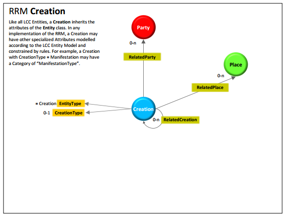
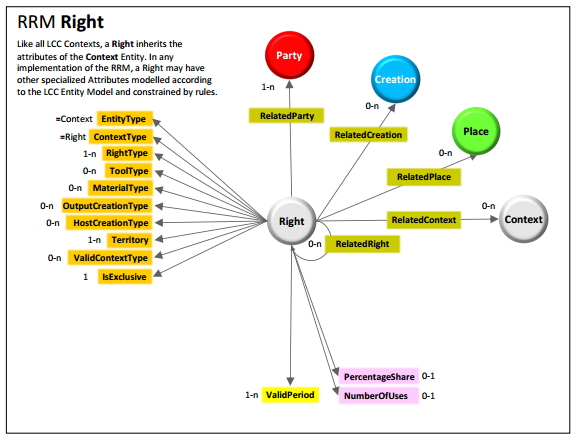

COALA Intellectual Property Specification
============


Contributors to this document:

- Tim Daubenschuetz: tim.daubenschuetz@gmail.com, tim@ascribe.io


## PLEASE READ THIS SECTION BEFORE READING THE DOCUMENT

This document is a work in progress! Some sections contain the key word "TODO" + a description on what is expected to be
written there. To everyone reading this: Feel free to take the time to conduct research in this area to write the
section yourself.

If your section contains information from external documents, please make sure to link to the
appropriate sources.

If your section contains lots of knowledge about a field that wasn't mentioned yet, please take the time to define the
field briefly to give the readers of this document a chance to on-board easily.

This document has a soft characters-per-line limit of 120 characters (Note that by including links, only the descriptor
counts). Please respect while writing.

As human beings are capable to recognize patterns easily, make sure to follow the other (here not explicitly mentioned)
text formating patterns as close as possible.

As an overall metric for this document:

    - Think practical
    - Think in technologies
    - Don't reinvent the wheel, take what's out there already and if so, give proper attribution
    - Write as if you had to implement this spec next week!


Thank you very much!


## General TODOs:

- In some cases synonyms for lingo was used. Remove all occurrences
- When releasing this document to the public, write an introductory section explaining what COALA is, why this document
  matters, what is left to do, what are COALA's general goals are and so on...
- Sometimes this document references internally to other sections ("as seen in the above section", ...). Using relative
  links, we should point to the sections, we're writing about


## Table of Contents

- TODO:
    - link to the individual headlines in a tree structure


## Abstract

- TODO:
    - tell the reader what this document is about and most importantly why they should care about the problem and
      read/implement this specification


## Introduction

This section provides context to the following COALA Intellectual Property Specification. It explains technological
concepts that can be used to model a generic, extensible protocol to manage digital rights.
They are described briefly, to give the reader a comprehensive overview of the field. To understand them in their full
spectrum, we advise the reader to study them further on their own. For each section sources on the topic are given.


### The LCC Framework

The [LCC Framework](http://www.linkedcontentcoalition.org/index.php/rights-data-network/lcc-framework) is a set of documents published by the [Linked Content Coalition](http://linkedcontentcoalition.org/) (short form: LCC)
to unify digital rights data management. The framework's key documents are:

- [Ten targets for the rights data network](http://doi.org/10.1000/290)
- [The LCC Entity Model](http://doi.org/10.1000/285)
- [The LCC Rights Reference Model](http://doi.org/10.1000/284)
- [The LCC Principles of identification](http://doi.org/10.1000/287)


In this introductory section, we'll go over each document summarizing their contents briefly to give context and
attribution for the following specification.


#### The LCC's ten targets

The LCC's goal is to enable the widest possible access to appropriate rights information and the automation to rights
trading, independent of commercial or free use. As a general guidance to fulfill their goals, they released a document,
called "[Ten targets for the rights data network](http://doi.org/10.1000/290)" that is composed of the following ten goals:

1. Every Party has a unique global identifier
2. Every Creation as a unique global identifier
3. Every Right has a unique global identifier
4. All identifiers have a URI representation to persistently and predictably resolve them within the Internet
5. Links between identifiers are system agnostic and need to be authorized by participating consortiums
6. Meta data is system agnostic and its schema has to be authorized by participating parties or consortiums
7. The provenance of rights has to be made explicit
8. Any participant is able to make standardized, machine-interpretable statements about rightholdings in creations
9. Conflicts in rights declarations should be automatically identified
10. Digital "fingerprints" or "watermarks" are linked to the registered Creation


For more in-depth information about the goals of the LCC, find the attached link in this section at the top.


**Sources:**

- [LCC: Ten targets for the rights data network](http://doi.org/10.1000/290), May 2016


#### The LCC Entity Model

*Note that knowing the definition of the LCC Entity model is not vital for understand the contents of this
specification. The LCC Entity model is a meta-model the LCC defined to model their actual ontology - the LCC Rights
Reference Model.*

The [LCC Entity Model](http://doi.org/10.1000/285) (short form: LCC EM) is a generic meta data model used by the LCC as a
"building block" to define more specific data models like the [LCC Rights Reference Model](http://doi.org/10.1000/284)
(short form: LCC RRM).
In a nutshell, the LCC Entity model specification defines a model called `Entity` that is composed of five attribute types:

- **Category:** Categorizes the Entity (e.g. Language=iso3166-1a2:EN ("English"))
- **Descriptor:** Names the Entity (e.g. Name="Andy Warhol")
- **Quantity:** Quantifies the Entity (e.g. Height=20cm)
- **Time:** Times the Entity (e.g. DateOfCreation=1999)
- **Link:** Links the Entity (e.g. "Andy Warhol" --- isCreator ---> "32 Campbell's Soup Cans")


In the LCC EM specification, all five of these attributes are represented as models as well. Using unidirectional links,
they make up the actual `Entity` model. An `Entity` itself is linked to other `Entities` bidirectionally, as can be seen
in the attached figure:


The `Entity` model's attributes are deliberately chosen to be generic so that more complex data models like the LCC RRM can be
built on top. For in-depth information follow the link to the PDF provided in the beginning of this section.


**Sources:**

- [LCC: Entity Model](http://doi.org/10.1000/285), May 2016


#### The LCC Rights Reference Model

The [LCC Rights Reference Model](http://doi.org/10.1000/284) is a formal definition for representing intellectual property
rights digitally. The LCC RRM document is written as a specification for an abstract logical data model, that is built
on top of the LCC EM and is composed of the following seven entities:

- **Party:** A Person or an organization (e.g. "Andy Warhol")
- **Creation:** Something created by a Party (e.g. "32 Campbell's Soup Cans")
- **Place:** A virtual or physical Place (e.g. "New York City, USA")
- **Right:** A set of permissions that entitle a Party to do something with a Creation (e.g. "Andy Warhol controls all
  rights to 32 Campbell's Soup Cans")
- **RightsAssignment:** A decision as a result of which a Right comes into existence (e.g. "According to the 1976 US
  Copyright Act, Andy Warhol controls all rights to 32 Campbell's Soup Cans", but also "I, Andy Warhol declare that
  "32 Campbell's Soup Cans" shall be published under the CreativeCommons free use license")
- **Assertion:** A claim made about the substance of a Right (e.g. "I, the Museum of Modern Art, New York, claim that
  Andy Warhol is the righteous creator of 32 Campbell's Soup Cans")
- **RightsConflict:** A statement of disagreement over a Right (e.g. "I, Malory, claim that Andy Warhol is NOT the
  righteous creator of 32 Campbell's Soup Cans")


*Note that for the sake of simplicity, the Entity `Context` was left out of the above described definition. In essence
though, it is just defined as a parent/categorizing class of Right, RightsAgreement, Assertion and RightsConflict and
has hence no significant value.*

As these seven entities are supposed to be building blocks of a global digital rights ontology, they are linked
unidirectional, as can be seen in the attached figure:


**Sources:**

- [LCC: Rights Reference Model](http://doi.org/10.1000/284), May 2016


#### The LCC Principles of Identification

- TODO:
    - Summarize briefly (as done in the other sections) what the document talks about, without going into to much detail


**Sources:**

- [LCC: Principles of identification](http://doi.org/10.1000/287), May 2016


### The Semantic Web

The Web is a universal place for sharing information globally. In most cases, this is done by human beings publishing
information in a human-readable way (say for example as an HTML page). While human-readable information is theoretically
possible to be read by machines, the task in practice is rather challenging and inefficient.
Think of an HTML page containing tabular data about the population of a country. Simply identifying that the first
column of the table is describing "the name of the country" and using that name to merge the data with other table's data
to establish new information is incredible difficult for a machine.
Additionally, reasoning about information that can be derived from such a table is nearly impossible for a machine,
without the necessary context given.

Hence, converting data into schemata that have semantic meaning to both humans as well as machine is really valuable for
the Web to advance. One technique to do so is called Resource Description Framework. It is briefly described in the
following section.


**Sources:**

- A. Granzotto (2009): Exploiting spatio–temporal linked data to improve backlinks retrieval, 2009


#### Resource Description Framework

[Resource Description Framework](https://www.w3.org/TR/rdf11-concepts/) (short form: RDF) is a framework for describing
entities on the Web. Since it is using the generalization of the Universal Resource Location (short form: URL), the
Universal Resource Identifier (short form: URI) as a scheme to address resources, it is exceptionally interoperatable
and extensible.

RDF's core data structure is a graph-based data model. This is achieved by constructing subsets of a graph with a set of
triples, each consisting of a **subject**, **predicate** and an **object**. A single set of triples is already an RDF
graph. Visualized a simple RDF graph could look like this:


Since RDF is mainly used on the World Wide Web, what this means in practice is that each element of a graph is
represented as a URI pointing to a resource that gives further meaning to the relationship of the graph. As an example
mentioned in the [Creative Commons Rights Expression Language](https://www.w3.org/Submission/ccREL/) (short form: ccREL) W3C submission:


In the example given in the figure above licensing information about Lawrence Lessig's blog is stated in a
machine-readable way. Mapped to the RDF-graph visualization given before, we can say that Lessig's blog is the
*subject*, to the *predicate* that it is licensed under the Creative Commons Attribution 3.0 license, the *object*.
In this case, ccREL is a schema provided by Creative Commons that allows defining context for machines on how to
interpret licensing information for documents on the web. ccREL itself is implemented using RDF Schema, which is
basically a vocabulary for describing properties and classes of RDF resources. By making usage of the [Web Ontology
Language](https://www.w3.org/TR/owl-features/) (short form: OWL), concepts from other RDF schemata can be included in a domain-specific RDF schema creating
a global ontology of semantically structured data.

Since RDF itself is more a concept, it's implementations vary - especially in terms of used data structures. Embedded
RDF in HTML pages, as well as the more puristic RDF/XML are likely one of the more popular spin offs. In 2014 with a
new version of RDF coming up (RDF 1.1), a new RDF compatible data structure was submitted called JSON-LD.
In essence, it fits some of the concepts of the semantic web (linked data to be specific) into the [Javascript Object
Notation](https://tools.ietf.org/html/rfc7159) (short form: JSON), which makes it much more approachable than comparable
implementations falling back on the much heavier syntax of XML for example. Since we're intending to port the LCC'
Rights Reference Model specification to RDF using JSON-LD, the next section will highlight some of its main features.


**Sources:**

- [Resource Description Framework](https://www.w3.org/TR/rdf11-concepts/), May 2016
- [W3C: Creative Commons Rights Expression Language](https://www.w3.org/Submission/ccREL/), May 2016


#### JSON Linked Data

[JSON-Linked Data](https://www.w3.org/TR/json-ld/) (short form: JSON-LD) is a data structure merging the concepts of the
[Resource Description Framework](https://www.w3.org/TR/rdf11-concepts/) (short form: RDF) with [JSON](https://tools.ietf.org/html/rfc7159).
Using the concept of a "context", it allows to provide additional mappings by linking JSON-object properties to RDF schemata
in an ontology.

Lets assume we have the following set of data:


```javascript
{
    "givenName": "Andy",
    "familyName": "Warhol",
    "birthDate": "1928-08-06"
}
```


Now, for a human it's obvious that this set of data is about a person named "Andy Warhol" who was born on the 6th
August 1928. For a machine that is lacking the intuition and _context_ of a human, resolving this representation is rather
difficult.

JSON-LD solves this problem by introducing the concept of a "context" into JSON documents. On a high level, this allows
to link data to already defined schemata.
In order to include "context" into a JSON-object a key called `@context`, needs to be included that defines or
references the schema of the underlying data. Using JSON-LD to define our previously mentioned example, it would look
like this:


```javascript
{
    "@context": "http://schema.org/Person",
    "givenName": "Andy",
    "familyName": "Warhol",
    "birthDate": "1928-08-06"
}
```


Using the JSON-LD-specific keyword `@context` - pointing to a resource that defines how our data should look like - a
JSON-LD parser could `GET http://schema.org/Person` the schema and validate the attached data against it.
Additionally - and this might be the greatest benefit of JSON-LD -, if some other application developer were to be
handling this kind of data for their users, they could rely on the same schema definition. In turn, this would unify data
representation across services, which is a **GREAT** improvement for the world (wide web).

Think of it like this: Twitter, Facebook, Github, Instagram - they all have the notion of a user model for example.
Some of them might name the key of the user's birthday `birthDay`, while others name it `dayOfBirth`, while again others
would name it `birth_day`. All those keys however, have the same semantic meaning for a user model, as they define when
the user was born. So if all services were to rely on a unified schema for defining their data models, applications that talk across services
would be so much more easier to implement. "Cross-Standard Links" (as the LCC calls it), would come for free actually.

Going back to the example, one question that remains though is: How does JSON-LD know how to map our self-defined key (`givenName`,
`familyName` and `birthDate`) names to the properties of schema.org's Person?
Well, turns out we didn't choose those key names randomly. They're already part of the schema.org's Person definition,
hence a JSON-LD parser is capable to map them automatically and then execute validation against it.

For more clarity, let's see how a JSON-LD parser would look at this example:

1. `GET http://schema.org/Person`
2. For each of the user-defined keys, check if they map to the keys provided in the schema
    2.1 If this is the case, traverse the schema until a leaf node (the JSON-LD specification calls this an
    `identifying blank node`) is found
    2.2 "Expand" the data, replacing a keys name with an URI to its more granular schema definition


To give a practical example, this is how our previously defined set of data would look like:


```javascript
{
    "http://schema.org/givenName": [
        {
            "@value": "Andy"
        }
    ],
    "http://schema.org/familyName": [
        {
            "@value": "Warhol"
        }
    ],
    "http://schema.org/birthDay": [
        {
            "@value": "1928-08-06"
        }
    ],
}
```


What we end up with is a much more verbose form of our set of data. In fact, the JSON-LD specification
gives certain forms names. The form that is shown above is called _expanded_ form, as it was expanded using Person's
schema.org definition defined in `@context`.
The form in the example we gave earlier (where we defined `@context`) is called _compacted_ form.

So essentially, what happens is that the JSON-LD parser assumes we defined the correctly named keys for Person already, so
when expanding the compacted version of our JSON-object, it just individually looks them up at
`http://schema.org/Person` and if they're defined, replaces them with more detailed URIs to their schema definition.
What we end up with is a automatically mapped set of data by simply using what is already out there.
Since every key of a given value now points to a leaf node of a schema ontology and since leaf nodes are only allowed to
define the most basic types (like string, boolean, number), the parser can then easily traverse the document and
validate each occurrence of `@value`.


##### Final thoughts

With this example, we've just shown you the tip of the ice berg.
JSON-LD has tremendous powers (Aliasing, Self-Referencing, Built-in types, Indexing, ...) to do all kinds of crazy things.
Since this specification will make use of JSON-LD heavily, we encourage to learn more about JSON-LD before continuing
reading this document. Useful links can be found in the **Sources** section below.
*As a side note: The authors of the JSON-LD RFC have done a tremendous job writing anapprochable specification.
It features great examples and is easy to read. :+1:*


**Sources:**

- [W3C Recommendation: JSON Linked Data 1.0](https://www.w3.org/TR/json-ld/), May 2016
- [Wikipedia: JSON-LD](https://en.wikipedia.org/w/index.php?title=JSON-LD&oldid=715712992), May 2016
- [Codeship: JSON-LD: Building Meaningful Data APIs](http://blog.codeship.com/json-ld-building-meaningful-data-apis/),
  May 2016


#### schema.org

- TODOs in this section:
    - Just describing schema.org is I think way to narrow here. This section should be about linked data on the world
      wide web in general. schema.org is just a regular player when it comes to linked data and RDF. Hell, there are even
      search engines that users can lookup schemas (http://wiki.dbpedia.org/). Obviously mention schema.org as a
      prefered source though.


schema.org is a collaborative initiative with the mission to create, maintain and promote schemata for structured data on
the Internet. It's vocabulary is defined as an ontology, connecting different concepts using links. It can be
used with different encodings, including RDFa, Microdata and _JSON-LD_.


##### Available Schemas

Schema.org includes the following schemata that could be helpful in defining a digital intellectual property
specification based on LCC's EM/RRM:

- [schema.org/Person](http://schema.org/Person): See LCC RRM `Party`
- [schema.org/Organization](http://schema.org/Organization): See LCC RRM `Party` (A `Person` can be member of an
  `Organization`)
- [schema.org/CreativeWork](http://schema.org/CreativeWork): See LCC RRM `Creation`
    - [schema.org/Article](http://schema.org/Article)
    - [schema.org/Blog](http://schema.org/Blog)
    - [schema.org/Book](http://schema.org/Book)
    - [schema.org/Clip](http://schema.org/Clip)
    - [schema.org/Dataset](http://schema.org/Dataset)
    - [schema.org/Game](http://schema.org/Game)
    - [schema.org/MediaObject](http://schema.org/MediaObject)
        - [schema.org/AudioObject](http://schema.org/AudioObject)
        - [schema.org/ImageObject](http://schema.org/ImageObject)
        - [schema.org/VideoObject](http://schema.org/VideoObject)
    - [schema.org/Movie](http://schema.org/Movie)
    - [schema.org/MusicComposition](http://schema.org/MusicComposition)
    - [schema.org/Painting](http://schema.org/Painting)
    - [schema.org/Photograph](http://schema.org/Photograph)
    - [schema.org/SoftwareApplication](http://schema.org/SoftwareApplication)
    - [schema.org/Thesis](http://schema.org/Thesis)
    - [schema.org/VisualArtwork](http://schema.org/VisualArtwork)
- [schema.org/Action](http://schema.org/Action)
    - [schema.org/AssessAction](http://schema.org/AssessAction): See LCC RRM `Assertion`
        - [schema.org/ReviewAction](http://schema.org/ReviewAction)
        - [schema.org/ReactAction](http://schema.org/ReactAction)
            - [schema.org/AgreeAction](http://schema.org/AgreeAction)
            - [schema.org/DisagreeAction](http://schema.org/DisagreeAction)
    - [schema.org/TradeAction](http://schema.org/TradeAction)
        - [schema.org/BuyAction](http://schema.org/BuyAction)
        - [schema.org/SellAction](http://schema.org/SellAction)
        - [schema.org/RentAction](http://schema.org/RentAction)
    - [schema.org/TransferAction](http://schema.org/TransferAction)
- [schema.org/Place](http://schema.org/Place): See LCC RRM `Place`


*A full list of all core schema.org schemata can be found [here](https://schema.org/docs/full.html).*


##### Extensibility of schema.org

As it is the goal of this specification to convert LCC's RRM to a linked data ontology, we need to be able to model
the seven main LCC RRM entities: Party, Creation, Place, Right, RightsAssignment, Assertion, RightsConflict.
While enumerating schema.org's schemata in the previous section, for schemata that have similarities to the LCC's
definition we already marked them. For clarity though, we're listing them in this section again to also highlight what
schema.org **doesn't** provide yet:


**What schema.org helps us with:**

- **LCC Party:** [schema.org/Organization](http://schema.org/Organization) and [schema.org/Person](http://schema.org/Person)
- **LCC Creation:** [schema.org/CreativeWork](http://schema.org/CreativeWork) and all its subschemata could be used
- **LCC Place:** [schema.org/Place](http://schema.org/Place)
- **LCC Assertion:** [schema.org/AssessAction](http://schema.org/AssessAction)


**What schema.org _doesn't_ help us with (yet?):**

- **LCC Right**
- **LCC RightsAssignment**
- **LCC RightsConflict**


So even though schema.org already helps us by defining some of the LCC models some do not even exist at all (specificatlly
Rights, RightsAssignment and RightsConflict). Although, this seems like a problem at first, it is not. schema.org's
schemata are easily extensible. schema.org [even encourages](http://schema.org/docs/extension.html) subclassing their 'core'
schemata into so called 'hosted' and 'external' extensions. In general, there are three types of schemata on schema.org:

- **Core:** A basic vocabulary for describing the kind of entities the most common web applications need
- **Hosted:** Subclassed models from Core that have their own namespace (e.g. http://health-lifesci.schema.org/) and
  were reviewed by the schema.org community. Hosted extensions should be application-agnostic
- **External:** Subclassed models from Core/Hosted that do have an application-specific namespace (e.g.
  http://schema.bigchaindb.com). External extensions may be application-specific


Applied to the contents of this specification, this would mean that application-agnostic schemata (so everything contained
in LCC RRM) would ideally become a Hosted extension, while application-specific schemata (data models that are specific for
a certain applications or services) would become External schemata.
Fortunately, using schema.org in this way it also complies with rule five and six of the ten LCC targets for the rights
data network, which say:

- Rule 5: Links between identifiers are system agnostic and need to be authorized by participating consortiums
- Rule 6: Meta data is system agnostic and its schema has to be authorized by participating parties or consortiums


**Sources:**

- [Schema.org](http://schema.org), May 2016
- [Schema.org: Full Hierarchy](http://schema.org/docs/full.html), May 2016
- [Schema.org: Schema.org Extension](http://schema.org/docs/extension.html), May 2016


### Interplanetary Linked Data

This section describes the functionality of Interplanetary Linked Data (short form: IPLD) and why it is useful in
working with immutable data stores and Linked Data.


#### Motivation to use IPLD

IPLD is an attempt to make Linked Data happen on immutable ledgers using hashes for linking (so called "merkle-links").
Let's assume we have the following set of data describing a person:


```javascript
{
    "givenName": "Andy",
    "familyName": "Warhol",
    "birthDate": "1928-08-06"
}
```


In addition, we have a set of data describing this person's work:


```javascript
{
    "name":"32 Campbell's Soup Cans",
    "dateCreated": "01-01-1962",
    "exampleOfWork": "https://en.wikipedia.org/wiki/Campbell%27s_Soup_Cans#/media/File:Campbells_Soup_Cans_MOMA.jpg"
}
```


As of now, both objects are not linked to each other, meaning there is no way to tell that Andy Warhol is the author of
"32 Campbell's Soup Cans". Now, we could use the already introduced Linked Data approach using JSON-LD. We'd have to
make both of the objects resolvable within the Internet, add `@id`s to their bodys as well as an `author` property to the
creation pointing to a location where the person object is resolvable.

The problem with this solution is though that we'd have to trust the hosts that make these objects resolvable. While
they'd return the correct objects at first, they'd be free to make any changes to the objects at any point, potentially
allowing for the exploitation of the system. Since there is no way for resolving actors to integrity-check the object
they're requesting, a host could return arbitrary data unnoticed at any time.
Additionally, internal linking within objects, as well as internal linking from URIs turns out to be challenging using
Linked Data protocols like JSON-LD. Hence in the next section, we're exploring a technology called Interplanetary Linked
Data that promises to solve these problems.


#### IPLD by Example

The following sections give a brief overview of the functionality of IPLD. We chose to demonstrate the technology by
demonstration as a [comprehensible specification of IPLD](https://github.com/ipfs/specs/tree/master/ipld) exists already.


##### Creation of Linked Objects

Using the two objects presented in the example of the previous section, we have to perform the following steps to
link them using IPLD:

1. Serialize the person's object to a canonical form of [Concise Binary Object Representation](http://cbor.io/) (short form: CBOR)


```python
In [1]: import ipld

In [2]: person = {
...:     "givenName": "Andy",
...:     "familyName": "Warhol",
...:     "birthDate": "1928-08-06"
...: }

In [3]: serialized_person = ipld.marshal(person)
Out[3]: b'\xa3ibirthDatej1928-08-06jfamilyNamefWarholigivenNamedAndy'
```

For the purpose of demonstration, we're using an already existent library called [py-ipld](https://github.com/bigchaindb/py-ipld). In this case
`ipld.marshal` does nothing more than serialize the `person` object using a [CBOR reference implementation](https://bitbucket.org/bodhisnarkva/cbor). As a result,
we get a byte array.


2. Hash the serialized byte array using [multihash](https://github.com/jbenet/multihash) and encode the hash to base58


```python
In [4]: ipld.multihash(serialized_person)
Out[4]: 'QmRinxtytQFizqBbcRfJ3i1ts617W8AA8xt53DsPGTfisC'
```


[Multihash](https://github.com/jbenet/multihash) is a protocol for differentiating outputs from various well-established cryptographic hash functions. What
this means is that every hash generated with multihash contains a [hexadecimal prefix](https://github.com/jbenet/multihash#table-for-multihash-v100-rc-semver), symbolizing which hash function has
been used for generating it. This is great since hash functions will often need to be upgraded. Additionally, it allows for
multiple hash functions to coexist within/across applications.

Now, since we have converted the person object to an IPLD object and since we also have its hash, we can link the creation
to its author.


3. Link the creation object to its creator using the base58 hash representation of the person


```python
In [5]: creation = {
    "name":"32 Campbell's Soup Cans",
    "dateCreated": "01-01-1962",
    "exampleOfWork": "https://en.wikipedia.org/wiki/Campbell%27s_Soup_Cans#/media/File:Campbells_Soup_Cans_MOMA.jpg",
    "author": { "/": "QmRinxtytQFizqBbcRfJ3i1ts617W8AA8xt53DsPGTfisC" }
}
```


Using what is called a "merkle-link" we're connecting the creation to a person by using the hash we've previously
created. Generally, a merkle-link can be schematized like this:


```javascript
Property = {
    "key": <String>
    "value": <MerkleLink>
}

MerkleLink = {
    "key": "/"
    "value" <String: multihash value>
}
```


To make this object resolvable as well, what's left to be done is to serialize it also to CBOR and multihash it.


4. Serialize the creation object to a canonical form of CBOR


```python
In [6]: serialized_creation = ipld.marshal(creation)
Out[6]: b"\xa4fauthor\xd9\x01\x02x.QmRinxtytQFizqBbcRfJ3i1ts617W8AA8xt53DsPGTfisCkdateCreatedj01-01-1962mexampleOfWorkx]https://en.wikipedia.org/wiki/Campbell%27s_Soup_Cans#/media/File:Campbells_Soup_Cans_MOMA.jpgdnamew32 Campbell's Soup Cans"
```


This case is special, in that the merkle-link contained in `creation` is being replaced and serialized using an [unassigned
CBOR tag (258)](https://www.iana.org/assignments/cbor-tags/cbor-tags.xhtml), to make the link retrievable more easily
when deserializing the object later on.


5. Hash the resulting serialized byte array using [multihash](https://github.com/jbenet/multihash) and encode the hash to base58


```python
In [7]: ipld.multihash(serialized_creation)
Out[7]: 'QmfMLNLyJZgvSPkNMvsJspRby2oqP6hWZ8Nd2PvKLhudmK'
```


##### Retrieval of Linked Objects

To further explore IPLD, let's assume that we've put these objects into some kind of database - actually let's just pretend it's
IPFS for now, their identifiers being the hashes we've created. What this allows us to do now, is using so called "merkle-paths",
to resolve any object within IPFS using its hash, but also dereference all its connecting edges by following the objects merkle-
links. Given the example above, the `author` of the creation can be found using this merkle-path:


```python
In [8]: ipld.resolve('/ipfs/QmfMLNLyJZgvSPkNMvsJspRby2oqP6hWZ8Nd2PvKLhudmK/author')
Out [8]:
{"givenName": "Andy",
 "familyName": "Warhol",
 "birthDate": "1928-08-06"}
```


As can be seen, both merkle-links (meaning hashes of objects) as well as an objects' properties can be used to traverse
the IPLD object. For addressing a network addresses format called [multiaddr](https://github.com/jbenet/multiaddr) is being used. This allows for the
construction of protocol-overarching paths to resources. Meaning that an IPLD object, resolvable on IPFS could point to an IPLD
object resolvable within other ledgers like BigchainDB, Bitcoin, ....


#### Evaluation of IPLD

In summary, IPLD is a promising new technology. This section aims to discuss both benefits and caveats of it:


- **Benefits:**
    - Cryptographic integrity-checking of data using upgradeable hash functions (multihash)
    - Addressability of content instead of "by location" through hashes
    - Inter-ledger/database resolvability of data through merkle-paths and multiaddr
    - Unification of object identifiers through canonicalized hashing strategy
    - Built-in immutability by using merkle-dag data structure
    - Future-proof due to usage of future-proof underlying concepts (multi-x)
    - Potentially wide compatibility, even down to the UNIX file system path
    - Lightweight protocol drafts and implementations
    - Deserialization to multitude of other data serialization formats (YML, JSON, XML, ...)
- **Caveats:**
    - Non-standardized protocols (multihash, multiaddr, ...)
        - [Overlap](https://interledger.org/five-bells-condition/spec.html#crypto-conditions-type-registry) with other to-be-standardized protocols
        - Breakage with exisiting and well-established protocols (e.g. URI vs. multiaddr)
    - Non-compliance with existing Linked Data ontology due to immutability
    - Opinionated CBOR serialization


#### Compatibility of IPLD and JSON-LD

Even though the naming and concept of IPLD was inspired by JSON-LD, the two concepts have disjoint sets of
functionality. This section highlights how much JSON-LD is possible with IPLD.


#### Self-identifying JSON-LD objects

As mentioned in one of the previous sections about JSON-LD already, a JSON-LD object can have a self-identifying link
that is added to the object using the `@id` property. This means that a JSON-LD object itself is able to express where
it's located at.
The like is true with IPLD. By complying to a canonicalized representation of CBOR and by multihashing this
representation, an IPLD object itself is also able to express where it can be resolved within the Internet - it's simply
Content-Addressing -, even though it cannot express the location it is stored under.
Trying to combine these two concepts however, is not possible since the `@id` JSON-LD identifier would need to be
replaced with the multihash of its object (itself containing that hash). The amount of processing required to solve this
task would be incredible, which would render the identification of objects incredibly inefficient economically speaking,
which is why a JSON-LD object using IPLD links cannot self-identify using the `@id` property. As mentioned though, this
is not a problem as objects generally identify themselves in the world of Content-Addressing.


**Sources:**

- [IPLD Specification Draft](https://github.com/ipfs/specs/tree/master/ipld), June 2016
- [IPLD Python Reference Implementation](https://github.com/bigchaindb/py-ipld), June 2016
- [Multihash Specification](https://github.com/jbenet/multihash), June 2016
- [Multiaddr Specification](https://github.com/jbenet/multiaddr), June 2016
- [Interledger: Crypto-Conditions](https://interledger.org/five-bells-condition/spec.html), June 2016
- [Concise Binary Object Representation](http://cbor.io/), June 2016
- [IANA: CBOR Tags Registry](https://www.iana.org/assignments/cbor-tags/cbor-tags.xhtml), June 2016


### The Web of Trust

- TODO: Explain briefly
- Point to initiatives going on
- https://github.com/WebOfTrustInfo/rebooting-the-web-of-trust
- http://xmlns.com/wot/0.1/
- http://www.weboftrust.info/


### Fingerprinting

Specifying the originality and provenance of a physical file is challenging. This is even more true for a digital file.
While a physical fake might easily be identified by for example using chemical procedures, the same is not true for
digital files. With ease they can be copied, mashup'ed, cropped and so on, meaning that by identifying one manifestation
of a work and computing an identifier based on that single manifestation, does not make the Internet a more transparent
place in regards to "who owns what" and "who created what".

The LCC is in line with this fact. In their document about the Ten Targets for a Global Rights Network, they talk about
cross-standard identifiers that can - if needed - be *transformed* into corresponding identifiers.

This section discusses a similar idea, namely existence of an arbitrary complex vector used to link all the
manifestations of a work to its registered representing object on an immutable ledger.

In this sense, every function that takes a digital asset as an input and yields a fixed length value (be it number,
string or float) as an output could potentially then be called a **Fingerprinting function**. In it's simplest form,
a hash function inspecting the arrangement of bytes in a digital asset. In more elaborate forms:

- [Image-match](https://github.com/ascribe/image-match): a simple Python module for finding approximate image matches
  from a corpus
- [pHash](http://www.phash.org/): A hash derived from various features of a digital asset
- [dejavu](https://github.com/worldveil/dejavu): A audio fingerprinting and recognition algorithm in Python
- TODO: List more libraries
    - Find popular ones that do fingerprinting for all kinds of media types


While a digital creation initially might only have a single fingerprint which was generated by feeding its bytes of an
initial manifestation to an arbitrary hashing function, more elaborate fingerprinting technologies could help identify
automatically the usage of Creations within the Internet. This, paired with the power of Linked Data assertions could
help identify all manifestations and usages of a work within the Internet by bundling them into a cluster/graph. Copies,
mash-ups and modified versions of the asset could easily/automatically be identified, paths easily located to the
original manifestation of the work and the author be fairly attributed and compensated.

As rightsholder information would be ubiquitously accessible, allowing rights users to aquire rights, involved players
in the system would be incentivized creating more elaborate fingerprinting mechanisms, increasing transparency in the
system further.


## Remodeling the LCC RRM using Linked Data

In this section we describe how LCC's Rights Reference Model can be modeled using JSON-LD, IPLD and schema.org. In other
words, we'll go over each model description given in the LCC Rights Reference Model document and discuss how the
respective model can be translated into Linked Data.


### General Approach

The section abstractly describes how to get from a LCC RRM model to a RDF-compatible JSON-LD/IPLD model. As mentioned
earlier already, with their document "[LCC: Entity Model](http://doi.org/10.1000/285)", they defined a generic model
to base their actual Rights Reference Model on. What this document in essence describes, is how to implement a data model
that is fully extendable using a multitude of linked entities. Using an RDF-based data structure in turn, means that
defining a base data structure for linking entities is not necessary anymore, as this is what RDF is all about already.
What this leaves us with is that in order to successfully redefine the LCC Rights Reference Model, what we're left to
are the following steps:

- Identify RDF schemata that map to respective entities defined in the LCC RRM specification
    - If appropriate RDF schemata are not available:
        - Compose own RDF types from multiple RDF schemata
        - Define own RDF schemata
- Define how entities are identified and resolved
- Resolve mismatches between the LCC RRM lingo and RDF schemata


### The LCC Place Model

In the LCC Framework, a Place describes a localizable or virtual place. It has the following property:

- **PlaceType:** Defining the type of a Place
    - `lcc:LocalizablePlace`: A Place in the universe that can be described using spatial coordinates
    - `lcc:VirtualPlace`: A non-localizable Place at which a resource may be located under


In addition, a Place can have the following outgoing reference to respective other entities:

- a self-referencing link (one-to-many)


Visualized the LCC RRM Place looks like this:


#### Proposed Transformation

Compared to schema.org's definition of a Place, the LCC RRM Place both describes a physical as well as a virtual Place.
In this specification though, we need to separate the two concepts explicitly upfront, to avoid confusions further in
the transformation process. Neither a URI, nor a IPLD merkle-link is able to represent a physical location which is why
in the context of this specification, they're links pointing to resources while the LCC Place model will solely be used
to point to a physical place.

For further reference, a:

- **LLC RRM Place or Place** will be used to describe a localizable Place, meaning a Place in the universe that can be
  described using spatial coordinates
- **Universal Resource Identifier** or **IPLD merkle-link** will be used to describe a virtual place at which a resource
  may be located under


This implies that a LCC RRM Place of `PlaceType == lcc:LocalizablePlace` will be transformed to a RDF Place, while a
LCC RRM Place of `PlaceType == lcc:VirtualPlace` will just be URIs or hashes in documents, linking in between data sets.

Using schema.org's Place, a transformation is straight forward (example taken from schema.org):


```javascript
// In JSON-LD
{
    "@type": "http://schema.org/Place",
    "geo": {
        "@type": "http://schema.org/GeoCoordinates",
        "latitude": "40.75",
        "longitude": "73.98"
    },
    "name": "Empire State Building"
}

// In IPLD
{
    "@type": { "/": "<hash pointing to RDF-Schema of Place>" },
    "geo": {
        "@type": { "/": "<hash pointing to RDF-Schema of GeoCoordinates>" },
        "latitude": "40.75",
        "longitude": "73.98"
    },
    "name": "Empire State Building"
}
```

Using the special `containsPlace` property, self-referencing links to other Places are possible.


### The LCC Party Model

A recommendation of the LCC is that the Party model must be able to represent any class of party, meaning:

- a rightsholder
- a licensor
- a administrator
- a user
- or any other participant doing something related to a right.


In the LCC RRM document a party has to have the following properties:

- **PartyType:** Defines whether the party is an individual or a group of individuals
- **DateOfBirth:** Only if `PartyType == 'lcc:Individual'`
- **DateOfDeath:** Only if `PartyType == 'lcc:Individual'`


Additionally, a Party can have the following outgoing references to respective other entities:

- a self-referencing link (one-to-many relationship)
- a link to a Place (one-to-many relationship)


Visualized the LCC Party model looks like this:


Another feature of the LCC RRM Party model is that it must only have a `DateOfBirth` and a `DateOfDeath` when its `PartyType`
is `lcc:Individual`. Other features are that it may have self-referencing links as well as links to LCC RRM Places. Note
that using the property `PartyType` an LCC RRM Party can both represent an individual as well as an organization.


#### Proposed Transformation

*Side note: In this chapter, we describe the transformation of the LCC RRM Party model to a JSON-LD/IPLD Person and/or
Organization very literally, as we want to provide reasoning for individual steps of the transformation. This will just be
the case for this chapter, as in essence the rationale for transforming other models is fairly similar.*

schema.org defines already both a [schema.org/Person](http://schema.org/Person) as well as a [schema.org/Organization](http://schema.org/Organization).
Hence, there is no need to define both concepts as a single model and differentiate using `PartyType`. To value Separation of
Concerns, lets first transform the LCC RRM Party model with `PartyType == 'lcc:Individual'`, then apply the discovered results
to `PartyType == 'lcc:Organization'`.


##### Transform LCC RRM Party to RDF Person

Using the minimum number of properties the LCC RRM describes, a `PartyType == 'lcc:Individual'` LCC RRM Party in JSON-LD/IPLD
using schema.org's Person could look like this:


```javascript
// In JSON-LD
{
    "@context": {
        "DateOfBirth": "http://schema.org/birthDate",
        "DateOfDeath": "http://schema.org/deathDate"
    },
    "@type": "http://schema.org/Person",
    "DateOfBirth": "1928-08-06",
    "DateOfDeath": "1987-02-22",
}

// In IPLD
{
    "@context": {
        "DateOfBirth": { "/": "<hash pointing to RDF-Schema of birthDate>" },
        "DateOfDeath": { "/": "<hash pointing to RDF-Schema of deathDate>" },
    },
    "@type": { "/": "<hash pointing to RDF-Schema of Person>" },
    "DateOfBirth": "1928-08-06",
    "DateOfDeath": "1987-02-22",
}
```


Now, obviously mapping `birthDate` and `deathDate` of schema.org's Person to LCC's `DayOfBirth` and `DayOfDeath` doesn't
make a lot of sense. Neither do they comply with the way JSON is usually formated (e.g. first letter is lower case), nor is
it necessary to reinvent the wheel on top of schema.org (by for example coming up with new names for properties). So for
simplicity purposes we simply get rid of the so called JSON-LD-'Aliasing', using the properties schema.org provides us with:


```javascript
// In JSON-LD
{
    "@type": "http://schema.org/Person",
    "@id": "https://en.wikipedia.org/wiki/Andy_Warhol",
    "birthDate": "1928-08-06",
    "deathDate": "1987-02-22",
}

// In IPLD
{
    "@type": { "/": "<hash pointing to RDF-Schema of Person>" },
    "@id": "https://en.wikipedia.org/wiki/Andy_Warhol",
    "birthDate": "1928-08-06",
    "deathDate": "1987-02-22",
}
```


In the example, we used Andy Warhol's Wikipedia page as his Party identifier (`@id`). Considering that fact that all
we need to provide is a resolvable URI or an IPLD merkle-link, a JSON-LD parser will validate this without complaining.
Ideally though, `@id` is a pointing to a location of the data itself, showing a JSON-LD parser where its resolvable within
the Internet. Since `https://en.wikipedia.org/wiki/Andy_Warhol`, does not return the given data, we'll have to do something
about this.

First off, lets look at some requirements various involved parties have given:


**JSON-LD:**

- an `@id`'s value must be represented as an [Internationalized Resource Identifier](https://tools.ietf.org/html/rfc3987) (short form: IRI), either absolute or relative


**LCC's ten targets for the rights data network:**

- A Party's identifier should be represented as an [International Standard Name Identifier](http://www.iso.org/iso/catalogue_detail?csnumber=44292) (short form: ISNI) linking to the [International Standard Name Hub](http://www.isni.org)
- A Party's identifier should have an [Universal Resource Identifier](https://tools.ietf.org/html/rfc1630) (short form: URI) representation, so that it can be resolved predictably and persistently within the Internet


**LCC's Principles of identification:**

- A Party should have at least one persistent unique public identifier that is both human- and machine-readable
- Has a Party multiple public identifiers, then there should be a way that enables one identifier to be automatically 'translated' to
  another
- A Party's identifier may have multiple designations (e.g. ISBN-10, ISBN-13, ISBN-A)
- A Party's identifier should have an [Universal Resource Identifier](https://tools.ietf.org/html/rfc1630) (short form: URI) representation
- A Party identifier's characters or elements have no intended meaning that could lead to misinterpretation by humans
- A Party identifier's characters or elements include no information about the Party itself or its registration date
- **TODO: There are even more requirements in this document that should be listed here!**


**Interplanetary Linked Data:**

- Any object is addressable using its [multihashed](https://github.com/jbenet/multihash) value (encoded in base58) value (encoded in base58)
    - By using multihash (and later "multibase" - prefixing base-encoding functions) different hash functions can
      interoperate and stay upgradeable


As we're proposing this practical specification based on the LCC Framework, JSON-LD and IPLD with the background of saving
all linked entity data on public ledgers (read: "Blockchains" or "Registries"), we'd like to add our own set of requirements:

- Elements of the Party's identifier may represent the public part of an asymmetric cryptographic key pair
    - If so, the public key should be represented using a unified way of encoding (as inspiration see [Bitcoin Address public key encoding](https://en.bitcoin.it/wiki/Technical_background_of_version_1_Bitcoin_addresses)
- A Party must only allowed to be issued when providing at least one valid public part of an asynchronous cryptographic key pair


As the combination of these requirements do not exist as a coherent system yet, we'll just pretend for the sake of completeness
that there is in fact a system that fulfills them all.
Hence for all following examples, we'll use an imaginary identity service that acts as a registry for the LCC RRM Party
data. It:

- lets users issue an identity that can be resolved using JSON-LD ([Content Negotiation](https://www.w3.org/Protocols/rfc2616/rfc2616-sec12.html) ) or IPLD
- lets users attach the public part of their key pairs to their identity.


Notable services for this type of use case could be:

- https://pgp.mit.edu/
- https://keybase.io/
- https://ipfs.io/
- https://ipdb.foundation/


Preferably, a decentralized, non-profit service is chosen.
Going back to the previous example and following the Linked Data JSON-LD approach would mean that we'd have to replace the
`@id` of the data set representing the Party of Andy Warhol ideally with an URI pointing to the data set itself - being
stored on an identity service:


```javascript
// In JSON-LD
{
    "@type": "http://linkedcontentcoalition.com/Identity",
    "@id": "https://identityservice.com/identities/14XgsoWd47KLJa6Ehu62j7Mugq38zX5umt",
    "givenName": "Andy",
    "familyName": "Warhol",
    "birthDate": "1928-08-06",
    "deathDate": "1987-02-22"
}
```


Using IPLD in contrast, any object can identify itself by being hashed, which means an `@id` property isn't necessary:


```javascript
// In IPLD
{
    "@type": { "/": "<hash pointing to RDF-Schema of Identity>" },
    "givenName": "Andy",
    "familyName": "Warhol",
    "birthDate": "1928-08-06",
    "deathDate": "1987-02-22"
}
```


As lots of the users' data will be saved on public ledgers - meaning the user is required to sign the meta data they're
submitting - we'll need to make sure to map their cryptographical identity to their registered identity.
Luckily, the [Friend of a Friend Project](http://www.foaf-project.org/) has us covered already by providing [an RDF
ontology for signing RDF documents using Public Key Cryptography](http://xmlns.com/wot/0.1/), called Web of Trust RDF.
Integrating this ontology into our identity model, it could look like this:

- TODO:
    - Give an code example how WOT could look like in an immutable ledger
    - Make sure that the *immutability* is not violated, the WOT ontology as of now only work with mutability


Two other requirements we yet need to resolve are the links proposed in the LCC RRM Party model. As mentioned previously,
there can be a one-to-many relationship from a LCC RRM Party to other LCC RRM Parties as well as a one-to-many relationship
between a LCC RRM Party and LCC RRM Places. Now, when studying the LCC RRM document, it becomes clear that theoretically
these requirements need to be fulfilled, as there could be use cases where:

- multiple Parties share a relationship (e.g. Party A and Party B created Creation C)
- Parties might provide Places as a meta data (think: their home location, a contact place or a billing address)
- multiple Parties may be bundled to an Organization


Hence, in this context, it makes sense to define these relationships as a one-to-many relationship.
Using RDF and JSON-LD however, explicitly defining a one-to-many relationship doesn't work out. Links need to be named
and usually express a very specific logical fact in the ontology. While it means that theoretically these relationships
would still be possible, usually in JSON-LD they're extended as needed, adjusting either the JSON-LD object itself or its
underlying RDF implementation.

To give some examples: say we want to specify a Person's home addresses. What we can do in this case is just use [schema.org/Person](http://schema.org/Person)'s
`homeLocation` and specify either [schema.org/Place](http://schema.org/Place)s or [schema.org/ContactPoint](http://schema.org/ContactPoint)s.
and express the link using a named property on Person that points to a location or hash where that object can be
resolved.
As another example, imagine we'd like to specify that Party A is a parent of Party B. This could be useful when trying
to express that usage rights of a Creation are transferred after the death of Party B, to the heir, Party A. Fortunately,
schema.org's Person has us covered again. A [schema.org/Person](http://schema.org/Person) has a property `parent`
(accepting values of type `Person) that maps perfectly.

Now, assume we wanted to define a relation, schema.org's Person doesn't provide us with yet. What we would need to do is
extend schema.org's Person defining our own RDF schema and then host it somewhere resolveable within the Internet (IPFS,
BigchainDB, a self-hosted webserver, ...).

Since we've now covered all the edge cases of converting a Person to a RDF schema identity, we can now proceed
transforming the `PartyType === lcc:Organization`.


##### Transform LCC RRM Party to RDF Organization

In essence, a LCC RRM Party of `PartyType == lcc:Organization` is a group of individuals represented by a single entity.
Using the minimum number of properties the LCC RRM document describes, a LCC RRM Party of `PartyType == lcc:Organization` in
JSON-LD using schema.org's Organization could look like this:


```javascript
// In JSON-LD
{
    "@context": "http://schema.org/",
    "@type": "Organization",
    "@id": "http://identityservice.com/organizations/w3c",
    "name": "World Wide Web Consortium",
    "founder": {
        "@type": "http://linkedcontentcoalition.com/Identity",
        "@id": "https://identityservice.com/identities/12bS2BTF4j8kkmNqoyQRwzKy76EXQWRVWJ",
    },
    "member": [
        {
            "@type": "http://linkedcontentcoalition.com/Identity",
            "@id": "https://identityservice.com/identities/152xhUAJBGEht9Jwerv1omFV82xaRcyzHH",
        },
        {
            "@type": "http://linkedcontentcoalition.com/Identity",
            "@id": "https://identityservice.com/identities/1Je5tHHkHcs1ioLZmiBFSuyiXdwd76xf4D",
        },
        {
            "@type": "http://linkedcontentcoalition.com/Identity",
            "@id": "https://identityservice.com/identities/1QDtDjNgBx6242VakTTkFMn5HmkibzrsR8",
        }
    ]
}
```

- TODO: Also define how the object would look like in IPLD
- TODO: This needs a lot of specing out. How can members of an organization collectively sign something they're
  submitting? Is there a single public key address assigned to an organization or does the organization just bundle
  members that act like they were in an organization but act independently?


### The LCC Creation Model

A LCC RRM Creation model describes something directly or indirectly made by human beings. According to the
specification, it has only a single required property:

- **CreationMode:** Can take the values `lcc:Manifestation` or `lcc:Work`
    - `lcc:Manifestation`: A perceivable Creation
    - `lcc:Work`: A distinct, abstract Creation whose existence is revealed through one or more manifestations


Additionally, a Creation can have the following outgoing references to respective other entities:

- a self referencing link (one-to-many)
- a link to a Place (one-to-many)
- a link to a Party (one-to-many)


Visualized, the LCC RRM Creation model looks like this:





#### Proposed Transformation

As mentioned in an earlier section already, schema.org covers the use case of Creation quite closely already. Not only
is the vocabulary of [schema.org/CreativeWork](http://schema.org/CreativeWork) quite extensive already, there is a
multitude of subtypes which are useful for defining specifics about a creation (e.g. [schema.org/Book](http://schema.org/Book)).
Using schema.org to define an LCC RRM Creation model (more specifically: a book) in JSON-LD could look like this
(example taken from schema.org)


```javascript
{
    "@context": "http://schema.org",
    "@id": "#trilogy",
    "@type": "Book", <-- Is a subtype of CreativeWork
    "hasPart": [
        {
            "@id": "#book3",
            "@type": [
                "Book",
                "PublicationVolume"
            ],
            "name": "The Return of the King",
            "datePublished": "20-10-1955",
            "locationCreated": "http://dbpedia.org/page/United_Kingdom",
            "isPartOf": "#trilogy",
            "inLanguage": "en",
            "volumeNumber": "3",
            "author": "https://identityservice.com/identities/1CUd9hYE768sMp2CmNNnAZuVmeBGmAGDMS",
            "copyrightHolder": "https://identityservice.com/identities/1CUd9hYE768sMp2CmNNnAZuVmeBGmAGDMS"
        },
        {
            "@id": "#book2",
            "@type": [
                "Book",
                "PublicationVolume"
            ],
            "name": "The Two Towers",
            "datePublished": "11-11-1954",
            "locationCreated": "http://dbpedia.org/page/United_Kingdom",
            "isPartOf": "#trilogy",
            "inLanguage": "en",
            "volumeNumber": "2",
            "author": "https://identityservice.com/identities/1CUd9hYE768sMp2CmNNnAZuVmeBGmAGDMS",
            "copyrightHolder": "https://identityservice.com/identities/1CUd9hYE768sMp2CmNNnAZuVmeBGmAGDMS"
        },
        {
            "@id": "#book1",
            "@type": [
                "Book",
                "PublicationVolume"
            ],
            "name": "The Fellowship of the Ring",
            "datePublished": "29-07-1954",
            "locationCreated": "http://dbpedia.org/page/United_Kingdom",
            "isPartOf": "#trilogy",
            "inLanguage": "en",
            "volumeNumber": "1",
            "author": "https://identityservice.com/identities/1CUd9hYE768sMp2CmNNnAZuVmeBGmAGDMS",
            "copyrightHolder": "https://identityservice.com/identities/1CUd9hYE768sMp2CmNNnAZuVmeBGmAGDMS"
        }
    ],
    "name": "Lord of the Rings",
    "inLanguage": "en",
    "genre": "fictional",
    "author": "https://identityservice.com/identities/1CUd9hYE768sMp2CmNNnAZuVmeBGmAGDMS",
    "copyrightHolder": "https://identityservice.com/identities/1CUd9hYE768sMp2CmNNnAZuVmeBGmAGDMS"
}
```

- TODO: We need to include how "fingerprinting" could play a role in linking different manifestions of a work together.


In this case, the LCC RRM Creation with `CreationMode == lcc:Work` would be the outer object, abstractly grouping a set
of LCC RRM Creations with `CreationMode == lcc:Manifestation`. A special property in this case is `hasPart`, which
allows reflectively linking to other Creations. As well as `locationCreated` a predicate specific to schema.org that
accepts a [schema.org/Place](http://schema.org/Place). By looking closely at it's like to dbpedia, we can conclude that
even though dbpedia itself defines `country` as its own type but features schema.org's Place as a possible type, which
is why the link we've provided is valid.

Note that we also defined a `copyrightHolder` in this case, which can be according to schema.org a Person or
Organization. Additionally, schema.org's Book schema also lets us define `license`, which in this case we'd like to
avoid. Licensing of Creation should strictly be handled using the LCC RRM Right, hence including licensing information
in the LCC RRM Creation must be ignored.

As this example should be sufficient for showing how straight forward the transformation of an LCC RRM Creation model to
a RDF-based model is, we can continue with transforming the LCC RRM Right.


### The LCC Right Model

In the LCC RRM document, the Right model is by far the most interconnected. A minimum set of required properties
includes:

- **RightType:** The type of the Right (e.g. all uses, copy, play, stream, license, copyright, administration,
  lcc:RightSet - a container grouping Rights)
- **ToolType:** The type of medium that must be employed in exercising the Right (e.g. only watch on mobile phone)
- **MaterialType:** The type of material that may be employed in execising the right (e.g. a type of cover material for
  a book - as a rule of thumb: brush:tool as paint:material)
- **ValidContextType:** A type of context in which the Right must be exercised (e.g. in flight, in public, commercial
  use, academic research)
- **IsExclusive:** Indicating wether the Right is exclusive to the Rightsholder (e.g. true, false)
- **PercentageShare:** The percentage share of the Rights controlled (e.g. 100%, 51%)
- **NumberOfUses:** The number of uses permitted by the Right (e.g. 3 uses, 5 uses, unlimited uses?)
- **ValidPeriod:** The period during which the Right is valid. (e.g. 2015-2016)


TODO: Note that the LCC RRM specification features three more properties which are not included for the following reasons:

- **HostCreationType:** Unclear what it is and if it's necessary in the world of RDF
- **OutputCreationType:** Uncleare what it is
- **Territory:** Described in the document as a base type (e.g. string). Should be linked to a Place though.


In addition, a LCC RRM Right can have the following outgoing references to respective other entities:

- a self-referencing link (one-to-many)
- a link to a Party (one-to-many)
- a link to a Creation (one-to-many)
- a link to a Place (one-to-many)
- a link to a RightsAssignment (one-to-many)
- a link to a Assertion (one-to-many)
- a link to a RightsConflict (one-to-many)


Visualized, the LCC RRM Rights model looks like this:





##### Additional Types of Rights

The LCC Rights Reference Model additionally specifies three types of LCC RRM Rights that each implement non-trivial
functionality:

- **SourceRight:** A Right from which another Right is derived (This allows to create for (unneccesary?)
  Right-ontologies
- **SuperSededRight:** A Right that is rendered invalid by another Right
- **RightSet:** A collection of Rights all bundeled under a single Right


For putting Rights onto a global registry, handling a RightSet poses a problem. Essentially, the transfer of multiple
assets on a decentralized ledger cannot be guaranteed and especially not synchronized.

- TODO: Tim: I talked to Dimi about this, and we were trying to figure this out with cryptoconditions, but it seems that at
  this stage it is not possible.


Both a SourceRight, as well as a SuperSeededRight would easily be represented using an ontology, but would still
complicate ownership logic on a blockchain greatly, which is why we've decided to leave them out of this specification.


##### The Notion of Ownership

As can be drawn from the LCC RRM specification, a LCC RRM Right is LCC RRM Party-specific. In a sense that, imagine
digital creators would like to distribute rights to a multitude of interested LCC RRM Parties. The following steps would
be required:

1. Register their Party as described in a previous sections
2. Register their Creation as described in a previous section and like it to their Party ID
3. Register a number of Rights, tailored towards the interested Party
4. Register a RightAssignment to assign the Rights to the interested Parties


What this implies is that while Parties and Creations (there are exceptions: Copyright transfer) are strictly limited
to the act of registration, a LCC RRM Right actually has properties of ownership, allowing it to be transferred (via
a LCC RRM RightsAssignment) from one LCC RRM Party to another.

Furthermore, a LCC RRM Creation is not limited to a single LCC RRM Right. In fact, there can be as many LCC RRM Rights
attached to a Creation as a LCC RRM Party wants. Since licensing information is stored in a LCC RRM Right though, note
that a LCC RRM Right that has for example a CreativeCommons license attached to it cannot be transferred, as the LCC RRM
Creation is then owned collectively by everyone under the terms the license states. Still there could be other LCC RRM Rights
attached to that LCC RRM Creation defining additional rights (additional as in: rights that grand more freedom in the usage
of the LCC RRM Creation than everybody already has with the CreativeCommons license).


#### Proposed Transformation

Transforming the LCC RRM Rights model poses some challenges:

- A LCC RRM Right object can both represent copyright as well as licensing information
- In the LCC RRM specification, a LCC RRM Right can be a SourceRight, SuperSeededRight as well as a RightSet.


In order to allow for Rights to be atomicly transferrable units, we hence decided to ignore these requirements for now
and purely focus on the right being a transferrable container for specific licensing information.

Since we weren't able to find an appropriate RDF schema to model the LCC RRM Right, we're proposing a schema that
consolidates the requirements given in:

- [LCC: Rights Reference Model](http://doi.org/10.1000/284)
- [W3C: Open Digital Rights Language](https://www.w3.org/TR/odrl/)
- [W3C: Creative Commons Rights Expression Language](https://www.w3.org/Submission/ccREL/)


```javascript
{
    "@context": {
        "creation": "http://creativecommons.org/ns#Work"
    },
    "@type": "Right",
    "@id": "...",
    "creation": "http://...",
    "license": "http://..."

```


As can be seen, a LCC RRM Right is basically just a link between a creation and a license. In fact, this modeling could
even be simplified using Creative Commons Rights Expression Language (short form: ccREL) without aliasing.


```javascript
{
    "@context": "http://creativecommons.org/ns#",
    "@type": "License",
    "@id": "URL where work/LCC RRM Creation is located",
    "license": "http://..."

```


Even it doesn't seem like it, in both examples, the `license` property can point to any license that exists and not only
licenses by Creative Commons. In fact, Creative Commons probably should have generalized their ccREL more and then build
a Creative Commons-specific RDF schema on top of it. Instead they chose to do it the opposite way.

Since license are usually documents with pages of text, intended for humans to read,
pointing to a license must be done by using technology that allows for content addressing (e.g. IPFS).

Another point to be discussed in this section is why none of the recommended properties described in the LCC RRM were
used in the proposed transformation. The answer to this is that all the listed properties can also be expressed in a
custom legal contract that is linked to in the LCC RRM Right model. In essence, the few keywords mentioned outline words
that are clarified in a license for a machine to be interpretable.
As they are though way to less to give a machine an understanding of what the human-readable license is about, only
including a few didn't make any sense to us. When the time is ready, of course human and machine readable licenses could
be linked in the LCC RRM Right model. For now though, it is not a priority.


### The LCC RightsAssignment Model

According to the LCC RRM specification a LCC RRM RightsAssignment describes an event. A LCC RRM RightsAssignment can
have the following types (property name: `RightsAssignment`):

- **RightsLaw:** Representing a law by which rights come into existence (e.g. the US Copyright Act of 1976)
- **RightsPolicy:** Representing an event by which a Party assigns rights to another Party without requiring an
  agreement of the later (e.g. security level for user access of a computer system)
- **RightsAgreement:** Representing an agreement between to Parties over a right (e.g. a license, a publishing
  agreement, ...)


In addition, the LCC recommends the RightsAssignment to have three statuses (property name: `RightsAssignmentStatus`):

- `lcc:Offer`: An open RightAssignment the Assignee can accept or reject
- `lcc:Request`: A request of an Assigner to an Assignee to register a specific RightsAssignment
- `lcc:Executed`: A actual transfer of a LCC RRM Right from a Party to another Party


The LCC RRM RightsAssignment has the following outgoing references:

- a link to a LCC RRM Party (one-to-many)
- a link to a LCC RRM Right (one-to-many)


Visualized, the LCC RRM RightsAssignment model looks like this:


#### Proposed Transformation

An appropriate transformation for the LCC RRM RightsAssignment model could potentially be found by looking at schemata
for asset transfers. As this specification's scope is to make digital rights manageable on an immutable ledger though,
we're not interested in defining this type of schema, as we think a immutable ledger must have this operation already
build in from the start. Furthermore, we decided to leave out any complexities that could be introduced having
RightsAssignment types. A RightsAssignment will have a single type that corresponds to the type `RightsAssignment` and
for now only one `RightsAssignmentStatus` that is of value `lcc:Executed`.

A concern we'd like to address however, is the concept of assigning rights using more specific legal terms. What this is
enabling is that in a RightsAssignment a specific contract for a transfer of rights can be specified.

As said before, by assuming that every immutable ledger implements the concept of asset transfer, a minimal transformed
LCC RRM RightsAssignment would look like this (this represent the payload of the ledger-specific transfer):

- TODO: Define this as JSON-LD


```javascript
{
   "rdf:contract": "link to IPFS"
}
```

- TODO: There is probably a better way to phrase this. I mean, who knows what a cryptocondition is...

Now obviously, this contract is executed by default as soon as a RightsAssignment is made. However, an immutable ledger
could fall back on escrow mechanisms using cryptographical conditions to represent a state of acceptance or rejection.


### The LCC Assertion Model

TODO:
    - See other introductory sections of LCC models. Use same structure to describe the model


#### Proposed Transformation


### The LCC RightsConflict Model

TODO:
    - See other introductory sections of LCC models. Use same structure to describe the model


#### Proposed Transformation


## Blockchainify Linked Data

- TODO:
    - Briefly: What is a blockchain
    - By blockchaining every set of linked data of an ontology, a simple claim system is established
    - By requiring the signature of every set of linked data submitted to a blockchain, data is linked to the submitters
      identity. Since the submitter's identity has a certain trust in the ontology, the submitter transfers the trust of
      himself + the trust all people that signed his key gave him onto the data he has submitted

      - e.g. I claim that I am Andy Warhol and I've created 32 Campbell's Soup Cans
      Well guess, what - Nobody signed by freshly created identity. Also, Andy Warhol is not alive anymore. Sure I can
      submit this information to the blockchain and show to the world on ascribe that I'm the creator, but everyone will
      be able to tell that I'm very likely NOT Andy Warhol and that 32 Campbell's Soup Cans is NOT my creation
    - Super difficult question: When pointing to data that is not on a blockchain, what to do then? Discard? Allow it
      (but careful because data from outside is subject to change)
        - Imagine identities would be stored on a non blockchain. Using the given definition for a Creation, I'd go
          ahead and link it to the identity that is maybe stored on me.tim.com also exposing my public key. Now imagine
          someone gets access to tim.com and just changes my public key to a public key they they private key. Can they
          then make valid claims in my name?
    - When saving data into an immutable ledger, do we even need a RightsAssignment? A RightsAssignment could just be
      the transfer of a (divided) Right (very much like the SPOOL protocol)

    - Updated opinion: A RightsAssignment is a transfer on a ledger. It can contain contract data, a cryptocondition
      could be used to model an accept/reject state for example


## Future

This specification outlined how the LCC Framework can be used to define an RDF ontology on top of immutable data stores
to manage digital rights. As the goal is to make rights modeling an open international standard and implement the
outcome there is a number of events that need to follow this specification, which are outlined here in sequential order:


- Define a working RDF schema based on this specification
- Include or build open source communities around it
- Using the RDF schema, implement this specification
- Identify a standards commite to send this to
- Take the RDF schema, take the proposed transformations here and put them in a format of a standard proposal


Thanks for reading!
