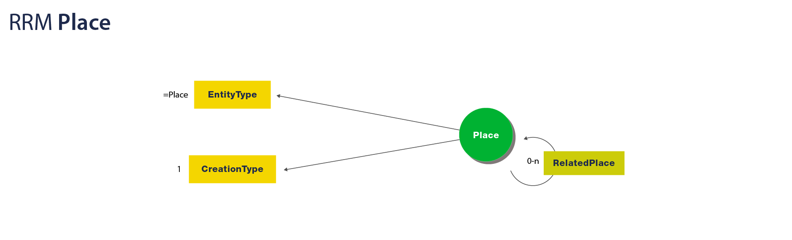
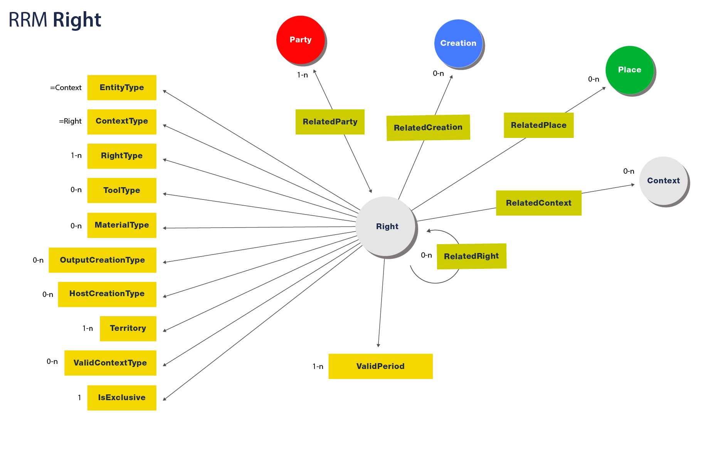
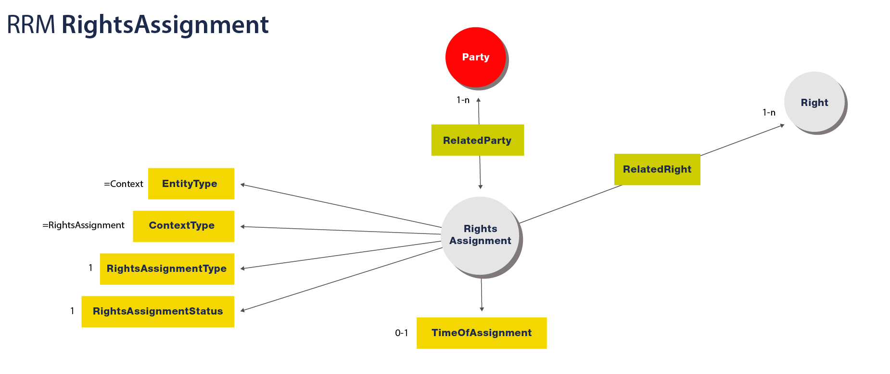

# COALA Intellectual Property Specification


Contributors to this document, in alphabetical order:

- Tim Daubenschuetz: tim.daubenschuetz@gmail.com, tim@ascribe.io
- Greg McMullen: greg@ipdb.foundation, gmcmullen@gmail.com
- Brett Sun: brett@bigchaindb.com


## TL;DR! I DON'T HAVE TIME FOR ALL OF THIS!

Want a summary? We've got you covered with presentations:

- [COALA IP (extended)](presentations/COALA%20IP%20-%20long.pdf)
- [COALA IP](presentations/COALA%20IP%20-%20short.pdf)


## READ THIS FIRST

This document is a work in progress. Some sections contain the keyword "TODO" and a description of
what is required. Feel free to research an unfinished area and write the section yourself.

If your contribution contains information from external sources, please link to those sources.

If your contribution relies on a field that wasn't previously explained, please provide an overview
of the field to give other readers the necessary background.

This document has a soft limit of 100 characters-per-line. Respect the limit! For links, only the
descriptor counts. The URI doesn't count.

Make sure to follow the existing styles for formatting as closely as possible.

Don't be shy! Make sure to give us your questions, suggestions or feedback.

As an overall guideline for contributions to this document:

- Think practical.
- Think in technologies.
- Don't reinvent the wheel. Use what's already out there and give proper attribution.
- Write as if you had to implement next week.


## General TODOs:

- Improve consistency in use of defined terms. Synonyms for technical terms should be replaced
  with the standard term throughout.
- Before releasing this document to the public, write an introductory section explaining what COALA
  is, what its general goals are, why this document matters, what is left to do, and so on...
- Sometimes this document references internally to other sections ("as seen in the above section",
  ...). Using relative links, we should point to the sections we're writing about


## Table of Contents

- TODO:
    - link to the individual headlines in a tree structure


## Abstract

Content creators on the internet are getting a raw deal. They get a fraction of the revenue earned
by hosting and distribution platforms, even though their work is what keeps these sites filled with
traffic-driving content. It's hard for a creative to make a living. Licensing is hard: the user
experience is bad, with lawyers and middlemen extracting the most value. In many areas, more money
goes to the distributors than to the creators. Even though many consumers would be happy to pay the
people who made the content they love, they aren't given the chance–instead, they are surveilled and
served ads. It doesn't have to be this way.

The [Coalition of Automated Legal Applications — Intellectual Property](http://coala.global/working-groups/)
(COALA IP) group was formed to address these problems. COALA IP's goal is to establish free, open,
and easy-to-use methods of recording attribution and related metadata about works, assigning or
licensing rights, mediating disputes, and authenticating claims by others. We believe there should
be a global standard at the data level, without the need for centralized control.

This document details an approach of representing intellectual property claims on distributed
ledgers (or blockchains). It is an effort to transform the [Linked Content Coalition](http://www.linkedcontentcoalition.org/)
(LCC)'s implementation-agnostic [Rights Reference Model](http://www.linkedcontentcoalition.org/phocadownload/framework/The%20LCC%20Rights%20Reference%20Model%20v1.0.pdf)
(RRM) into a free and open standard by outlining technologies that could be leveraged for an
implementation. This document aims to represent the interests of all involved stakeholders:
creators, rightsholders, distributors, consumers, developers, and so on.

COALA IP's vision will be realized through three key efforts:

1. Authoring a guide to provide an overview of the field and the need for a technical specification
   to represent intellectual property rights on distributed ledgers (see [Introduction](#introduction));
1. Defining a technology-specific, but ledger-agnostic, free and open messaging and communication
   protocol for intellectual property rights and licensing transactions (see [Implementing the
   RRM](#coala-ip-implementing-the-lcc-rrm-with-linked-data); and
1. Building a community to define a minimally-viable set of data for the description of intellectual
   property rights and licensing agreements.


## Introduction

This section describes the technological concepts used in this document to model a generic and
extensible protocol for managing digital rights. Each write-up is meant only as a brief overview; to
gain a more comprehensive understanding, we encourage you to explore the reference materials
provided as embedded links or in the *Sources* subsections.


### The LCC Framework

The [LCC Framework](http://www.linkedcontentcoalition.org/index.php/rights-data-network/lcc-framework)
is a set of documents published by the [Linked Content Coalition](http://linkedcontentcoalition.org/)
(LCC) to "unify digital rights data management." The key documents include:

- [The LCC Manifesto and Ten Targets for the Rights Data Network](#the-lccs-ten-targets)
- [The LCC Entity Model](#the-lcc-entity-model)
- [The LCC Rights Reference Model](#the-lcc-rights-reference-model)
- [The LCC Principles of Identification](#the-lcc-principles-of-identification)


#### The LCC's Ten Targets

The LCC's foremost goals are to enable, for all parties, the widest possible access to accurate
rights information, as well as the automation of rights licensing and assignment for both
commercial and free use. The LCC released the "[LCC Ten Targets for the Rights Data Network](http://doi.org/10.1000/290)"
as a general guide toward achieving these goals. It asks for the following:

1. Every Party has a unique global identifier;
1. Every Creation has a unique global identifier;
1. Every Right has a unique global identifier;
1. All identifiers are associated with a [URI](https://www.w3.org/Addressing/URL/uri-spec.html) that
   will persistently resolve them within the internet;
1. Links between identifiers are platform agnostic and non-proprietary
1. Metadata is platform agnostic or interoperable; mappings should be available to translate
   between schemata authorized by multiple parties;
1. The provenance of rights has to be made explicit;
1. Any participant has the ability to make standardized, machine-readable statements about
   rightsholdings in creations;
1. Conflicts in rights declarations should be automatically identifiable; and
1. Registered Creations are associated with corresponding digital "fingerprints" or "watermarks".


For more in-depth information about the goals of the LCC, see the "[LCC Ten Targets for the Rights
Data Network](http://doi.org/10.1000/290)".


**Sources:**

- [LCC: Manifesto and Ten Targets for the Rights Data Network](http://doi.org/10.1000/290), May 2016


#### The LCC Entity Model

*Note: You don't need to know the LCC Entity Model to understand the rest of this document. The
Entity Model is a meta-model used by the LCC to model their higher-level [Rights Reference Model](#the-lcc-rights-reference-model).*

The [LCC Entity Model](http://doi.org/10.1000/285) (LCC EM) specification defines an `Entity` model
composed of five attribute types:

- **Category:** A broad category the Entity belongs to (e.g. `Language=iso3166-1a2:EN ("English")`)
- **Descriptor:** The name of the Entity (e.g. `Name="Andy Warhol"`)
- **Quantity:** A numeric value related to the Entity (e.g. `Height=20cm`)
- **Time:** A time or date related to the Entity (e.g. `DateOfCreation=1999`)
- **Link:** A link to another Entity (e.g. `"Andy Warhol"` ––isCreator––> `"32 Campbell's Soup
  Cans"`)


These attributes are each represented as sub-models in the specification and, together with
unidirectional links, make up the actual `Entity` model. An entity can be linked to
other entities bidirectionally, as the attached figure shows:


The attributes of the `Entity` model are designed to be generic to allow for more complex data
models (e.g. the [LCC RRM](#the-lcc-rights-reference-model)) to be built on top.


**Sources:**

- [LCC: Entity Model](http://doi.org/10.1000/285), May 2016


#### The LCC Rights Reference Model

The [LCC Rights Reference Model](http://doi.org/10.1000/284) (LCC RRM) is a formal framework of
representing intellectual property rights. The RRM describes a high-level data model built on top
of the [LCC Entity Model](#the-lcc-entity-model), composed of the following entity types:

- **Party:** A person or an organization (e.g. "Richard Prince", "American Apparel", or "Sky
  Ferreira")
- **Creation:** Something created by a Party (e.g. "Untitled Instagram Portrait")
- **Place:** A virtual or physical location (e.g. "New York City" or "http://www.newyorkcity.com")
- **Right:** A set of permissions that entitle a Party to do something with a Creation (e.g.
  production and sale of t-shirts bearing the Creation)
- **RightsAssignment:** A decision by a Party resulting in the existence of a Right (e.g. "Richard
  Prince grants American Apparel the right to produce and sell t-shirts bearing Untitled Instagram
  Portrait in North America")
- **Assertion:** A claim made about the substance of a Right (e.g. "Richard Prince claims he has
  copyright to Untitled Instagram Portrait", or "Sky Ferreira claims she has copyright to Untitled
  Instagram Portrait")
- **RightsConflict:** A statement of disagreement over a Right (e.g. "Sky Ferreira and Richard
  Prince both claim copyright to Untitled Instagram Portrait")


*Note: For the sake of simplicity, the `Context` type has been left out. It is defined by the RRM
only as a parent/categorizing class of Right, RightsAgreement, Assertion, and RightsConflict and
holds no significant value on its own.*

These seven entity types are the building blocks of a global digital rights ontology. They can be
linked to each other through specific, unidirectional relationships. The figure below specifies the
total possible relationships between `Entities`:


**Sources:**

- [LCC: Rights Reference Model](http://doi.org/10.1000/284), May 2016


#### The LCC Principles of Identification

- TODO:
    - Summarize briefly (as done in the other sections) what the document talks about, without going
      into too much detail


**Sources:**

- [LCC: Principles of identification](http://doi.org/10.1000/287), May 2016


### The Semantic Web

The world wide web (web) is an information space for sharing information through linked documents.
The web is mostly used by humans, with information published and accessed in human-readable formats
(e.g. a webpage). Although machines are, in theory, capable of understanding this kind of
information, in practice, this is usually difficult and inefficient. For example, while humans may
easily understand a webpage with a table listing national populations, a machine would likely not
understand or be able to deduce new information–even the appropriate context was given by naming a
column as "Country Population".

To solve this, the semantic web introduces methods of publishing information in formats that are
capable of holding semantic meaning for both humans and machines. This allows humans to publish
human-readable information in a way that is also understandable to machines. The key underlying
building block of these formats is the [Resource Description Framework](#the-resource-description-framework-rdf).


**Sources:**

- A. Granzotto (2009): Exploiting spatio–temporal linked data to improve backlinks retrieval


#### The Resource Description Framework (RDF)

The [Resource Description Framework](https://www.w3.org/TR/rdf11-concepts/) is a framework for
describing ontologies. It uses the [Universal Resource Identifier](https://tools.ietf.org/html/rfc3986)
(URI), a generalization of the [Universal Resource Location](https://tools.ietf.org/html/rfc1738)
(URL), to address resources. This allows RDF to be exceptionally interoperable and extensible.

RDF's core data structure is a graph-based model that uses sets of triplets to construct graph
subsets. Each triplet consists of a **subject**, **predicate**, and **object**. In its smallest
form, an RDF graph can be just a single triplet. Visualized, it would look like this:


Each node would usually be expressed as an URI to a resource that provides further details about the
node's relationship to the graph.

The following example was used in the [Creative Commons Rights Expression Language](https://www.w3.org/Submission/ccREL/)
(ccREL) W3C submission:


```
<rdf:RDF xmlns:rdf="http://www.w3.org/1999/02/22-rdf-syntax-ns#"
        xmlns:xhtml="http://www.w3.org/1999/xhtml/vocab#">
    <rdf:Description rdf:about="http://www.lessig.org/blog/">
        <xhtml:license rdf:resource="http://creativecommons.org/licenses/by/3.0/" />
    </rdf:Description>
</rdf:RDF>
```


This example triplet states licensing information about Lawrence Lessig's blog in a machine-readable
way. Lessig's blog (the *subject*) is licensed (the *predicate*) under a [Creative Commons
Attribution 3.0](https://creativecommons.org/licenses/by/3.0/) license (the *object*). Provided by
Creative Commons, ccREL is just one example of a context-providing schema that is built on top of
RDF. Others, such as the [Web Ontology Language](https://www.w3.org/TR/owl-features/) (OWL), also
exist.

RDF itself includes multiple implementations, each varying in their underlying data structures.
Embedding RDF in HTML pages and RDF/XML syntax are two of the more popular implementations, albeit
with relatively heavy syntaxes and learning curves. In 2014, alongside the release of RDF 1.1, a new
RDF-compatible, [Javascript Object Notation](https://tools.ietf.org/html/rfc7159) (JSON)-based data
structure was accepted by the W3C: [JSON-LD](#json-linked-data). JSON-LD fit the semantic web's
[Linked Data](#linked-data) concept into the widely popular JSON format and provided a much more
approachable format to work with RDF.


**Sources:**

- [Resource Description Framework](https://www.w3.org/TR/rdf11-concepts/), May 2016
- [W3C: Creative Commons Rights Expression Language](https://www.w3.org/Submission/ccREL/), May 2016


#### Linked Data

- TODO:
    - A brief section describing the concept of Linked Data
    - Suggested Resources:
        - https://www.w3.org/standards/semanticweb/data


#### JSON Linked Data

[JSON-Linked Data](https://www.w3.org/TR/json-ld/) (JSON-LD) is a data structure that merges the
concepts of [linked](#linked-data) and interoperable data into the [JSON](https://tools.ietf.org/html/rfc7159)
format with [RDF](#the-resource-description-framework-rdf) support. In the context of RDF, JSON-LD
allows users to link a JSON object's properties to a corresponding RDF schema through the concept of
a `context`.

Assume we have the following set of data, modelling a user:


```javascript
{
    "givenName": "Andy",
    "familyName": "Warhol",
    "birthDate": "1928-08-06"
}
```


For a human, it's obvious this is about a person named Andy Warhol, born August 6, 1928. However,
for a machine, which lacks the intuition and *context* of a human, resolving this representation
into the same conclusion is difficult.

JSON-LD solves this problem by introducing `context` to JSON documents. On a high level, this allows
data to be linked to already defined schemata. Adding a special `@context` key to the document
provides a reference to the schema of the underlying data. Transforming our previous example to use
JSON-LD:


```javascript
{
    "@context": "http://schema.org/Person",
    "givenName": "Andy",
    "familyName": "Warhol",
    "birthDate": "1928-08-06"
}
```


Upon seeing this data, a JSON-LD parser could use the `@context` property and send a `GET` to
`http://schema.org/Person` to receive the defined schema and perform validation. If another
application developer were to handle this data, they could rely on the same schema definition
rather than their own. Over time, as more and more services use JSON-LD, data representations across
services would begin to unify to improve cross-service data interoperability.

Take, for example, our previous user model. Right now, each application or service might use their
own model definitions: one site could choose `birthday`, while another uses `day_of_birth` or
`birthDay`, to represent the user's birthday. These models might also be of different formats: some
could be in `YYYY-MM-DD` while others `DD-MM-YYYY`. Despite all of them containing the same semantic
meaning, custom logic would have to be written to not only handle the mapping between the different
keys, but also to convert their values to a standard format.

JSON-LD's `context` solves these problems by allowing for:

1. A unified mapping of keys that comply to base schemata; and
1. Value validation for [primitive data types](https://www.w3.org/TR/rdf11-concepts/#section-Datatypes).


To see how `context` achieves this, we need to explain how JSON-LD magically maps our example's
self-defined keys (`givenName`, `familyName` and `birthDate`) to their matching properties on the
`Person` schema. If you look at the [`Person` definition](http://schema.org/Person), you'll notice
that we didn't choose random keys–these keys were already part of the schema definition. Because of
this, JSON-LD parsers are able to automatically map and validate our example model's properties
against their schema definitions.

For more clarity, let's see how a JSON-LD parser would look at our example:

1. Notice `@context` contains `http://schema.org/Person`
1. `GET http://schema.org/Person`
1. For each of the model's keys, check if they map to any keys provided in the schema
    1. For each matched key, traverse the schema until the matching URI is found
    1. "Expand" the data, replacing keys' names with URIs to their more granular schema definitions


Continuing with our example, this is the result after expansion:


```javascript
{
    "http://schema.org/givenName": [
        {
            "@value": "Andy"
        }
    ],
    "http://schema.org/familyName": [
        {
            "@value": "Warhol"
        }
    ],
    "http://schema.org/birthDay": [
        {
            "@value": "1928-08-06"
        }
    ],
}
```


The JSON-LD parser notices that the model contains keys matching the `Person` schema, and uses
`http://schema.org/Person` to replace these matches with their more detailed schema definition URIs.
The result, termed as ["Expanded Document Form"](https://www.w3.org/TR/json-ld/#expanded-document-form),
is an automatically mapped set of data that uses an already available schema where each key points
to the predicate node of an RDF triplet. Using this form, the parser can easily traverse the
document and validate each of ocurrence of `@value`, as leaf nodes are only allowed to define the
most basic types (e.g. string, boolean, integer, etc.).

As the rest of this document relies heavily on JSON-LD, we encourage you to learn more by reviewing
the **Sources** below.

**Sources:**

- [W3C Recommendation: JSON Linked Data 1.0](https://www.w3.org/TR/json-ld/), May 2016
- [Wikipedia: JSON-LD](https://en.wikipedia.org/w/index.php?title=JSON-LD&oldid=715712992), May 2016
- [Codeship: JSON-LD: Building Meaningful Data APIs](http://blog.codeship.com/json-ld-building-meaningful-data-apis/),
  May 2016


#### Schema.org

- TODOs in this section:
    - Just describing schema.org is too narrow here. This section should be about linked
      data on the world wide web in general. schema.org is just a regular player when it comes to
      linked data and RDF. There are even search engines that users can lookup schemas
      (http://wiki.dbpedia.org/). Obviously mention schema.org as a preferred source though.


Schema.org is a collaborative initiative with the mission to create, maintain and promote schemata
for structured data on the internet. Its schemata are defined through ontologies, with concepts
connected to each other through links. A number of encoding formats are supported, including RDFa,
Microdata, and [JSON-LD](#json-linked-data).


##### Available Schemata

Schema.org includes the following *core* schemata that are closely related to LCC RRM's entity
types:

- [schema.org/Place](http://schema.org/Place): [LCC RRM `Place`](#the-rrm-place-entity)
- [schema.org/Person](http://schema.org/Person): [LCC RRM `Party`](#the-rrm-party-entity)
- [schema.org/Organization](http://schema.org/Organization): [LCC RRM `Party`](#the-rrm-party-entity)
  (A `Person` can be a member of an `Organization`)
- [schema.org/CreativeWork](http://schema.org/CreativeWork): [LCC RRM `Creation`](#the-rrm-creation-entity)
    - [schema.org/Article](http://schema.org/Article)
    - [schema.org/Blog](http://schema.org/Blog)
    - [schema.org/Book](http://schema.org/Book)
    - [schema.org/Clip](http://schema.org/Clip)
    - [schema.org/Dataset](http://schema.org/Dataset)
    - [schema.org/Game](http://schema.org/Game)
    - [schema.org/MediaObject](http://schema.org/MediaObject)
        - [schema.org/AudioObject](http://schema.org/AudioObject)
        - [schema.org/ImageObject](http://schema.org/ImageObject)
        - [schema.org/VideoObject](http://schema.org/VideoObject)
    - [schema.org/Movie](http://schema.org/Movie)
    - [schema.org/MusicComposition](http://schema.org/MusicComposition)
    - [schema.org/Painting](http://schema.org/Painting)
    - [schema.org/Photograph](http://schema.org/Photograph)
    - [schema.org/SoftwareApplication](http://schema.org/SoftwareApplication)
    - [schema.org/Thesis](http://schema.org/Thesis)
    - [schema.org/VisualArtwork](http://schema.org/VisualArtwork)
- [schema.org/Action](http://schema.org/Action)
    - [schema.org/AssessAction](http://schema.org/AssessAction): [LCC RRM `Assertion`](#the-rrm-assertion-entity)
        - [schema.org/ReviewAction](http://schema.org/ReviewAction)
        - [schema.org/ReactAction](http://schema.org/ReactAction)
            - [schema.org/AgreeAction](http://schema.org/AgreeAction)
            - [schema.org/DisagreeAction](http://schema.org/DisagreeAction)
    - [schema.org/TradeAction](http://schema.org/TradeAction)
        - [schema.org/BuyAction](http://schema.org/BuyAction)
        - [schema.org/SellAction](http://schema.org/SellAction)
        - [schema.org/RentAction](http://schema.org/RentAction)
    - [schema.org/TransferAction](http://schema.org/TransferAction): [LCC RRM 'RightsAssignment'](#the-rrm-rights-assignment-entity)

*The full list of all core schemata is available at [schema.org/docs/full.html](https://schema.org/docs/full.html).*

In summary:

- **What schema.org helps us with:**
    - **LCC Place:** [schema.org/Place](http://schema.org/Place)
    - **LCC Party:** [schema.org/Person](http://schema.org/Person) and [schema.org/Organization](http://schema.org/Organization)
    - **LCC Creation:** [schema.org/CreativeWork](http://schema.org/CreativeWork) and all its
      subschemata
    - **LCC RightsAssignment:** [schema.org/TransferAction](http://schema.org/TransferAction)
    - **LCC Assertion:** [schema.org/ReviewAction](http://schema.org/ReviewAction)
- **What schema.org *doesn't* help us with (yet?):**
    - **LCC Right**
    - **LCC RightsConflict**


##### Extensibility of schema.org

Despite an exhaustive list of schemata provided by schema.org, we still have a few use cases that
have not been covered: the missing `Right` and `RightsConflict` entity types, as well as any
additional RRM properties that have not been defined in the existing schemata. Thankfully,
schema.org was designed with extensibility in mind–we can modify existing, and even create new,
schemata to fit our needs. Schema.org even encourages others to subclass the *core* schemata into
"*hosted*" and "*external*" extensions, making available three types of schemata:

- **Core:** A set of basic vocabulary for describing the kind of entities needed by most web
  applications;
- **Hosted:** Application-agnostic schemata deriving from *core* which have their own namespace on
  schema.org (e.g. http://health-lifesci.schema.org/) and are reviewed by the schema.org community;
  and
- **External:** Schemata from *core* or *hosted* which have an application-specific namespace (e.g.
  http://schema.coala.global) and may be application-specific


In the context of COALA IP, any application-agnostic schemata, including all [schemata derived from
the LCC RRM](#coala-ip-implementing-the-lcc-rrm-with-linked-data), would become a *hosted*
extension. Fortunately, leveraging schema.org in this way maintains compliance with rules five and
six of the [LCC's "Ten Targets"](#the-lccs-ten-targets):

- **Rule 5**: Links between identifiers are system agnostic and must be authorized by participating
  consortiums.
- **Rule 6**: Metadata is system agnostic and its schema must be authorized by participating parties
  or consortiums.


**Sources:**

- [Schema.org](http://schema.org), May 2016
- [Schema.org: Full Hierarchy](http://schema.org/docs/full.html), May 2016
- [Schema.org: Schema.org Extension](http://schema.org/docs/extension.html), May 2016


### Interplanetary Linked Data

This section describes the functionality of [Interplanetary Linked Data](https://github.com/ipld/specs/tree/master/ipld)
(IPLD) and its use when working with immutable data stores and [Linked Data](#linked-data). IPLD is
an attempt to put Linked Data on distributed ledgers by using hashes as content-addressed links, a
technique referred to as "Merkle Links." Merkle links provide a number of interesting properties,
foremost of which is the ability to cryptographically check the data referred to by a link.

#### Motivation for IPLD

If we go back to our Andy Warhol example:


```javascript
{
    "givenName": "Andy",
    "familyName": "Warhol",
    "birthDate": "1928-08-06"
}
```

Let's add a set of data describing one of his works:


```javascript
{
    "name":"32 Campbell's Soup Cans",
    "dateCreated": "01-01-1962",
    "exampleOfWork": "https://en.wikipedia.org/wiki/Campbell%27s_Soup_Cans#/media/File:Campbells_Soup_Cans_MOMA.jpg"
}
```

Note that neither object contains a link to the other. There is no way for someone to tell that Andy
Warhol is the creator of "32 Campbell's Soup Cans" from just the data alone. We could solve this by
using [JSON-LD](#json-linked-data): we could make both of the objects resolvable on the internet,
add `@id`s to the objects' bodies, and add an `author` property to the creation object that points
to the person object's location.

However, this result runs into the problem of implicitly trusting the hosts that make these objects
resolvable. Hosts might return the correct objects at first, but that could change. Even worse,
resolving actors have no way of checking the integrity of an object they're requesting; a host could
return arbitrary, or even wrong, data that will stay undetected by the resolver. IPLD solves these
problems by using a hash-based, content-addressed linking format.


#### IPLD by Example

For these examples, we use [py-ipld](https://github.com/bigchaindb/py-ipld), an existing Python
implementation of IPLD, to handle IPLD specifics and data transformations. Other implementations,
such as [js-ipld](https://github.com/ipld/js-ipld) also exist.


##### Creation of Linked Objects

We can use IPLD to link the person and creation objects discussed earlier with the following steps:

1. Serialize the person object to its canonical [Concise Binary Object Representation](http://cbor.io/)
   (CBOR) form:


    ```python
    In [1]: import ipld

    In [2]: person = {
    ...:     "givenName": "Andy",
    ...:     "familyName": "Warhol",
    ...:     "birthDate": "1928-08-06"
    ...: }

    In [3]: serialized_person = ipld.marshal(person)
    Out[3]: b'\xa3ibirthDatej1928-08-06jfamilyNamefWarholigivenNamedAndy'
    ```

    `ipld.marshal` serializes the `person` object to a CBOR byte array, using the [CBOR reference
    implementation](https://bitbucket.org/bodhisnarkva/cbor).


1. Hash the serialized byte array using [multihash](https://github.com/jbenet/multihash), encoding
   the hash to base58:


    ```python
    In [4]: ipld.multihash(serialized_person)
    Out[4]: 'QmRinxtytQFizqBbcRfJ3i1ts617W8AA8xt53DsPGTfisC'
    ```


1. Now that we've derived an IPLD hash from the person object, we can use it to define an author for
   the creation:


    ```python
    In [5]: creation = {
        "name":"32 Campbell's Soup Cans",
        "dateCreated": "01-01-1962",
        "exampleOfWork": "https://en.wikipedia.org/wiki/Campbell%27s_Soup_Cans#/media/File:Campbells_Soup_Cans_MOMA.jpg",
        "author": { "/": "QmRinxtytQFizqBbcRfJ3i1ts617W8AA8xt53DsPGTfisC" }
    }
    ```


    We've now connected the creation to its author by using a person's hash value for the `author`
    property, creating our first "Merkle Link." Generally, merkle links can be schematized as:


    ```javascript
    Property = {
        ...
        [<String>]: <MerkleLink>
    }

    MerkleLink = {
        "/": <String: multihash value>
    }
    ```


1. Finally, to obtain a resolvable hash for the creation, we repeat the first two steps. First
   serialize the creation object its canonical CBOR form:


    ```python
    In [6]: serialized_creation = ipld.marshal(creation)
    Out[6]: b"\xa4fauthor\xd9\x01\x02x.QmRinxtytQFizqBbcRfJ3i1ts617W8AA8xt53DsPGTfisCkdateCreatedj01-01-1962mexampleOfWorkx]https://en.wikipedia.org/wiki/Campbell%27s_Soup_Cans#/media/File:Campbells_Soup_Cans_MOMA.jpgdnamew32 Campbell's Soup Cans"
    ```


    And then hash the resulting serialized byte array using multihash and a base58 encoding:


    ```python
    In [7]: ipld.multihash(serialized_creation)
    Out[7]: 'QmfMLNLyJZgvSPkNMvsJspRby2oqP6hWZ8Nd2PvKLhudmK'
    ```


    *Note: The creation's CBOR form replaced the original merkle link contained in `author` with an
    [unassigned CBOR tag (258)](https://www.iana.org/assignments/cbor-tags/cbor-tags.xhtml) to make
    the link more easily retrievable on deserialization.*


##### Retrieval of Linked Objects

To further explore IPLD, let's assume we've put these objects into a data store and try to retrieve
them. We'll use [IPFS](https://ipfs.io/) for the data store as its identifiers are compatible with
our previously created hashes.

We can use paths of merkle links ("Merkle Paths") to resolve any object within IPFS from their hash
value, as well as further de-reference any nested merkle links in the dereferenced object. Given the
example above, the `author` of the creation could be found through this merkle path:


```python
In [8]: ipld.resolve('/ipfs/QmfMLNLyJZgvSPkNMvsJspRby2oqP6hWZ8Nd2PvKLhudmK/author')
Out [8]:
{"givenName": "Andy",
 "familyName": "Warhol",
 "birthDate": "1928-08-06"}
```


IPLD resolves any merkle link, in this case the creation's author, to the actual object before any
further dereferences are made, allowing the creation and traversal of merkle links to feel similar
to Unix paths or accessing properties in nested objects. To link across network addresses, we can
use [multiaddr](https://github.com/jbenet/multiaddr) to construct resource paths across protocols.
Such links would allow an IPLD object to maintain resolvable links even if those links point to
separate ledgers (e.g. [IPFS](https://ipfs.io/), [BigchainDB](https://www.bigchaindb.com/),
[Ethereum](https://www.ethereum.org/), [Bitcoin](https://bitcoin.org/en/), etc.).


#### Evaluation of IPLD

In summary, IPLD looks to be a promising new data format suited for our needs, albeit with a few
cavets:

- **Benefits:**
    - Provides cryptographic integrity checks of data using upgradable hash functions (multihash);
    - Uses content-addressed storage instead of location addressed storage (merkle links vs. [URLs](https://tools.ietf.org/html/rfc1738));
    - Enables cross-ledger/database links ([multiaddr](https://github.com/jbenet/multiaddr) and
      merkle paths);
    - Unifies object identifiers through a canonicalized hashing strategy;
    - Imposes immutability through the underlying [merkle-dag](https://github.com/ipld/specs/tree/master/ipld#what-is-a-merkle-graph-or-a-merkle-dag)
      data structure;
    - Future-proofs underlying concepts ([multi-x](https://github.com/multiformats));
    - Enables wide compatibility, even down to the UNIX file system path; and
    - Deserializes to a multitude of other data serialization formats (YAML, JSON, etc.).
- **Caveats:**
    - Non-standardized protocols ([multi-x](https://github.com/multiformats));
        - [Overlaps](https://interledger.org/five-bells-condition/spec.html#crypto-conditions-type-registry)
          with other protocols that are being standardized
        - Breaks with existing and well-established protocols (e.g. [URI](https://tools.ietf.org/html/rfc3986)
          vs. [multiaddr](https://github.com/jbenet/multiaddr))
    - Does not comply with most existing Linked Data ontologies due to immutability constraints; and
    - Uses an opinionated [CBOR](http://cbor.io/) serialization strategy.


#### Compatibility of IPLD and JSON-LD

Although the naming and concept of IPLD was inspired by [JSON-LD](#json-linked-data), the two have
different sets of functionality. In particular, while the two can be used together, IPLD imposes a
number of limitations on JSON-LD's feature set.


##### Self-identifying JSON-LD Objects

With an `@id`, JSON-LD objects are able to maintain a self-identifying link and directly express
their resolvable location to users. However, the same is impossible for IPLD objects: as IPLD
objects are designed to be retrieved only by the canonical hash of their data, this hash cannot be
included as part of the pre-hashed data (trying to do so would amount to solving a cryptographic
puzzle). To avoid this, we use an [empty `@id`](https://www.w3.org/TR/json-ld/#base-iri) on IPLD
objects to resolve these objects to their current document bases (i.e. their resolvable,
content-addressed location on IPFS, etc.).


**Sources:**

- [IPLD Specification Draft](https://github.com/ipld/specs/tree/master/ipld), June 2016
- [IPLD Python Reference Implementation](https://github.com/bigchaindb/py-ipld), June 2016
- [Multihash Specification](https://github.com/jbenet/multihash), June 2016
- [Multiaddr Specification](https://github.com/jbenet/multiaddr), June 2016
- [Concise Binary Object Representation](http://cbor.io/), June 2016
- [IANA: CBOR Tags Registry](https://www.iana.org/assignments/cbor-tags/cbor-tags.xhtml), June 2016


### The Web of Trust

- TODO: Explain briefly
- Point to initiatives going on
- https://github.com/WebOfTrustInfo/rebooting-the-web-of-trust
- http://xmlns.com/wot/0.1/
- http://www.weboftrust.info/


### Fingerprinting

Determining the originality and provenance of a creation is challenging. This is true of physical
creations, but even more so for digital creations which face the challenges of being perfectly
copyable as well as easily modifiable. Although computers are good at determining perfect copies,
they struggle if subtle modifications, such as compressing image quality or cropping an image, are
made–even if a human would have no difficulties in making a connection.

The LCC takes these problems into account. In their ["Ten Targets" document](#the-lccs-ten-targets),
they propose cross-standard identifiers that can, if needed, be *transformed* into alternative
identifiers. This section discusses a similar idea: the existence of an arbitrarily complex graph
that can be used to link all the alternative identifiers of a single work to a single identifier on
a global rights registry.

Any function that takes a digital asset as an input and yields a fixed-length value could
potentially be used as a **fingerprinting function**. This could be as simple as a hash function
that inspects the arrangement of bytes in a digital asset and returns a integer, but there are more
elaborate versions:

- [Image-match](https://github.com/ascribe/image-match): An approximate image match algorithm
  implemented in Python;
- [pHash](http://www.phash.org/): A hashing method using various features of a digital asset;
- [dejavu](https://github.com/worldveil/dejavu): An audio fingerprinting and recognition algorithm
  implemented in Python;
- And many more


While a manifestation of a digital creation may initially only have a single fingerprint generated
by an arbitrary hashing function, more elaborate fingerprinting schemes could later be used to help
automatically identify other occurrences of the creation on the internet. Paired with Linked Data,
fingerprinting schemes would allow an arbitrarily complex graph to store and track all the
information related to the use of a work: copies, remixes, mash-ups, and modified versions could all
be identified automatically as paths in the graph. A traversal up a path would reveal the original
instance of the work and possibly identify the creator as well as an opportunity for compensation.

Based on this, as rights information becomes more transparent and rights easily licensable by users,
participants in the system would be incentivized to create more elaborate fingerprinting systems to
further increase transparency.


### The Interledger Protocol

- TODO:
    - This section should briefly explain what Interledger and the Interledger Protocol is about and
      how COALA IP could potentially use it.


## COALA IP: Implementing the LCC RRM with Linked Data

In this section we describe how the [LCC Rights Reference Model](##the-lcc-rights-reference-model)
can be modelled into a [Linked Data](#linked-data) representation by using [schema.org](#schemaorg)
as a building block. We go over each entity described in the RRM and discuss their translations into
[JSON-LD](#json-linked-data) and [IPLD](#interplanetary-linked-data). Linked Data, JSON-LD, and IPLD
have been chosen as they offer a number of advantageous properties for modelling global intellectual
property claims on distributed ledgers; for more information, see their respective sections above.

**Note**: The JSON-LD and IPLD models given in this section are not meant to be used directly. They
may also grow outdated with time. These models are primarily provided as simple examples for how a
given transformation may be implemented; consequently, they may be more incomplete and abstract than
a production-ready implementation. For the reference implementation of these models, see the
[reference JSON-LD / IPLD entity schemata](./data-structure).


### What Linked Data Gives Us Out of the Box

As a building block of the RRM, the LCC first defined a generic, linkable [Entity Model](#the-lcc-entity-model)
whose entities could be combined to create an extendable data model for intellectual property.
However, by implementing into a [Linked Data](#linked-data)-based data structure, we can ignore
these basic entities as Linked Data already provides us with the linkable base data
structure–[RDF](#the-resource-description-framework-rdf).


### General Approach

Our approach to implementing the RRM is as follows:

1. Identify existing RDF-compatible schemata that map to RRM entities;
     - If no appropriate schemata exists:
         - Compose new RDF types from existing schemata; or
         - Define entirely new schemata
1. Define how entities can be identified and resolved;
1. Resolve any mismatches between the RRM terminology and chosen RDF-compatible schemata; and
1. Modify the chosen schemata's semantics for use on a distributed ledger, if necessary.


A slight speed bump in the schematization process comes when we try to maintain support for generic
links between entities. The RRM defines the existence of links in a generic, one-to-many (i.e. `0 -
n`) manner. However, RDF and Linked Data require these links to be explicitly named so as to express
specific facts within their ontologies. For example, schema.org's schemata often include a finite
set of links that can be mapped to the RRM's links, but cannot directly support the possibly
infinite number of links allowed by the RRM. To overcome this limitation, users can extend the [base
schemata we've provided](./data-structure) with their own requirements (see [User
Extensions](#user-extensions)).


### The RRM `Place` Entity

In the LCC RRM, a Place describes a localizable or virtual place. It contains the following
property:

- **PlaceType:** Defines the type of a Place; one of:
    - `lcc:LocalizablePlace`: A Place in the physical universe locatable by spatial coordinates; or
    - `lcc:VirtualPlace`: A non-localizable Place at which a resource may be located


In addition, a Place can have the following outgoing links to other entities:

- Links to other Places (`0 - n`; one-to-many): *RelatedPlace*


Visualized, an RRM Place looks like:





#### Proposed Transformation

In contrast to schema.org's definition of a [Place](http://schema.org/Place), an RRM `Place` is able
to describe both physical and virtual places. To avoid confusion in the transformation process of
later entities, we explicitly separate the two concepts here. We use an:

- **RRM Place** to describe a localizable, or physical, place in the universe that can be described
  by spatial coordinates; and an
- **Universal Resource Identifier** or **IPLD merkle link** to describe a virtual place where a
  resource may be found.


With schema.org's Place, the transformation of a *localizable* Place is straight-forward (example
adapted from schema.org):


```javascript
// In JSON-LD
{
    "@type": "http://schema.org/Place",
    "geo": {
        "@type": "http://schema.org/GeoCoordinates",
        "latitude": "40.75",
        "longitude": "73.98"
    },
    "name": "Empire State Building"
}

// In IPLD
{
    "@type": { "/": "<hash pointing to RDF-Schema of Place>" },
    "geo": {
        "@type": { "/": "<hash pointing to RDF-Schema of GeoCoordinates>" },
        "latitude": "40.75",
        "longitude": "73.98"
    },
    "name": "Empire State Building"
}
```

To support links to other Places, one can use either of the two pre-defined properties on
schema.org's Place–`containsPlace` or `containedInPlace`–or extend the schema with their own
properties.


### The RRM `Party` Entity

The LCC recommends a `Party` to be capable of representing any of the following classes of parties:

- Rightsholders;
- Licensors;
- Administrators;
- Users; or
- Any other participants related to rights.


RRM `Party`s must have the following properties:

- **PartyType:** Defines if the `Party` is an individual (`lcc:Individual`) or a group of
  individuals (`lcc:Organization`);
- **DateOfBirth:** `Party`'s date of birth; only if `PartyType == 'lcc:Individual'`; and
- **DateOfDeath:** `Party`'s date of death; only if `PartyType == 'lcc:Individual'`.


Additionally, a `Party` can have the following outgoing links to other entities:

- Links to other `Party`s (`0 - n`; one-to-many): *RelatedParty*
- Links to `Place`s (`0 - n`; one-to-many): *RelatedPlace*


Visualized, an RRM `Party` looks like:


#### Proposed Transformation

*Note: We describe the transformation of a RRM `Party` into a JSON-LD/IPLD Person and Organization
very literally here, so as to provide reasoning for the steps taken in the transformation. Other
entities omit similar descriptions and focus on providing rationale for the transformations that are
specific to them.*

Schema.org makes both a [Person](http://schema.org/Person) and an [Organization](http://schema.org/Organization)
available; hence, there is no need to define either concept as a single model differentiated by
`PartyType`. To keep the transformation simple, let us first transform an `Party` with `PartyType ==
'lcc:Individual'` and then apply the learnings to an `Party` with `PartyType == 'lcc:Organization'`.


##### Transformation of RRM `Party` to an RDF Person

Using the minimum number of properties described in the RRM, an RRM `Party` with `PartyType ==
'lcc:Individual'` could be modelled with mappings to schema.org/Person like so:


```javascript
// In JSON-LD
{
    "@context": {
        "DateOfBirth": "http://schema.org/birthDate",
        "DateOfDeath": "http://schema.org/deathDate"
    },
    "@type": "http://schema.org/Person",
    "DateOfBirth": "1928-08-06",
    "DateOfDeath": "1987-02-22"
}

// In IPLD
{
    "@context": {
        "DateOfBirth": { "/": "<hash pointing to RDF-Schema of birthDate>" },
        "DateOfDeath": { "/": "<hash pointing to RDF-Schema of deathDate>" }
    },
    "@type": { "/": "<hash pointing to RDF-Schema of Person>" },
    "DateOfBirth": "1928-08-06",
    "DateOfDeath": "1987-02-22"
}
```


While there is nothing technically wrong with the above, you may notice that schema.org/Person
already contains the `birthDate` and `deathDate` properties. Rather than reinventing the wheel and
remapping `DayOfBirth` and `DayOfDeath` to these properties, we can remove the aliasing and use the
properties directly on our model. This gets us:


```javascript
// In JSON-LD
{
    "@type": "http://schema.org/Person",
    "@id": "https://en.wikipedia.org/wiki/Andy_Warhol",
    "birthDate": "1928-08-06",
    "deathDate": "1987-02-22"
}

// In IPLD
{
    "@type": { "/": "<hash pointing to RDF-Schema of Person>" },
    "@id": "https://en.wikipedia.org/wiki/Andy_Warhol",
    "birthDate": "1928-08-06",
    "deathDate": "1987-02-22"
}
```


In the example, we've used Andy Warhol's Wikipedia page as his identifier (`@id`). As an `@id` value
is only required to be a well-formed URI or IPLD merkle-link, a JSON-LD parser would validate this
without complaining; however, `@id` would ideally point to a location that holds the JSON-LD data
itself. Unfortunately, this functionality isn't supported by
Wikipedia–`https://en.wikipedia.org/wiki/Andy_Warhol` doesn't return a JSON-LD representation–and we
have to look for another solution.

To start, lets look at some limitations and requirements derived from the LCC, JSON-LD, IPLD, and
immutable ledgers:


- [**LCC's Ten Targets**](#the-lccs-ten-targets):
    - A Party's identifier should be linked to the [International Standard Name Identifier](http://www.iso.org/iso/catalogue_detail?csnumber=44292)
      (ISNI) hub.
    - A Party's identifier should have an URI representation, so that it can be resolved predictably
      and persistently within the Internet.
- [**LCC's Principles of Identification**](#the-lcc-principles-of-identification):
    - A Party should be associated with at least one persistent unique public identifier that is
      both human- and machine-readable.
    - If a Party is associated with multiple public identifiers, there should be a way to
      automatically transform one identifier to another.
    - A Party's identifier can have multiple designations (e.g. ISBN-10, ISBN-13, ISBN-A, etc.).
    - A Party's identifier should have an URI representation.
    - A Party's identifier should not have any intended meaning that could be misinterpreted by
      humans.
    - A Party's identifier should not include any information about the Party itself or its
      registration date.
    - **TODO: There are even more requirements in this document that should be listed here!**
- [**JSON-LD**](#json-linked-data):
    - An `@id` value must be represented as an absolute or relative
      [Internationalized Resource Identifier](https://tools.ietf.org/html/rfc3987) (IRI).
- [**IPLD**](#interplanetary-linked-data):
    - Any object must be addressable using its [multihashed](https://github.com/jbenet/multihash)
      value.
- **Immutable Ledgers**:
    - Elements of the Party's identifier must be capable of representing the public part of an
      asymmetric cryptographic key-pair.
        - Any public key represented in this way must also be representable by a unified encoding
          method (see [Bitcoin's public key addressing](https://en.bitcoin.it/wiki/Technical_background_of_version_1_Bitcoin_addresses)).
    - A Party can only be created when at least one valid cryptographic key-pair is provided.

Unfortunately, there are no currently available systems that are able to fulfill all of these
requirements and become a registry for RRM `Party` data. However, let's pretend, for the sake of
completeness, that we have access to such an identity service—preferably a decentralized
not-for-profit service!–in the following examples. It will let users:

- Issue an identity that can be resolved using JSON-LD (with [Content Negotiation](https://www.w3.org/Protocols/rfc2616/rfc2616-sec12.html))
  or IPLD; and
- Attach the public part of their key-pairs to their identity.


Services that could be extended to support our use case include:

- https://pgp.mit.edu/
- https://keybase.io/
- https://ipfs.io/
- https://ipdb.foundation/


Equipped with this identity service, we can go back to our example's JSON-LD representation and
replace its `@id` value with an URI pointing to the dataset (the dataset itself living on the
identity service):


```javascript
// In JSON-LD
{
    "@type": "http://coalaip.schema/Identity",
    "@id": "<URI pointing to this object>",
    "givenName": "Andy",
    "familyName": "Warhol",
    "birthDate": "1928-08-06",
    "deathDate": "1987-02-22"
}
```


On IPLD, we use an empty `@id` to identify an object by its own hash. Thus, we get:


```javascript
// In IPLD
{
    "@type": { "/": "<hash pointing to RDF-Schema of Identity>" },
    "@id": "",
    "givenName": "Andy",
    "familyName": "Warhol",
    "birthDate": "1928-08-06",
    "deathDate": "1987-02-22"
}
```


And finally, to complete the transformation, we include support for the possible outgoing links of
an RRM `Party`: links to other `Party`s (*RelatedParty*) and links to `Place`s (*RelatedPlace*). To
give some context, a few potential use cases for these links include:

- Multiple `Party`s sharing a relationship (e.g. `Party` A and `Party` B created `Creation` C);
- `Party`s providing Places as part of their metadata (e.g. home location, contact place, or billing
  address); or
- Multiple `Party`s being bundled together as an Organization.


A few linking possibilities are already covered by schema.org, such as a Person's home address
(schema.org/Person's `homeLocation`; specifying a Place) or parents (schema.org/Person's `parent`;
specifying a `Party`). If one wanted to use relations that schema.org hadn't already provided,
schema.org/Person could be extended with new properties.


##### Transformation of RRM `Party` to an RDF Organization

An RRM `Party` with `PartyType == lcc:Organization` describes a single entity representing a group
of individuals. Using the minimum number of properties listed in the RRM, an `lcc:Organization`
`Party` could look like this as a schema.org/Organization:


```javascript
// In JSON-LD
{
    "@type": "http://schema.org/Organization",
    "@id": "http://identityservice.com/organizations/w3c",
    "name": "World Wide Web Consortium",
    "founder": {
        "@type": "http://linkedcontentcoalition.com/Identity",
        "@id": "https://identityservice.com/identities/12bS2BTF4j8kkmNqoyQRwzKy76EXQWRVWJ",
    },
    "member": [
        {
            "@type": "http://linkedcontentcoalition.com/Identity",
            "@id": "https://identityservice.com/identities/152xhUAJBGEht9Jwerv1omFV82xaRcyzHH",
        },
        {
            "@type": "http://linkedcontentcoalition.com/Identity",
            "@id": "https://identityservice.com/identities/1Je5tHHkHcs1ioLZmiBFSuyiXdwd76xf4D",
        },
        {
            "@type": "http://linkedcontentcoalition.com/Identity",
            "@id": "https://identityservice.com/identities/1QDtDjNgBx6242VakTTkFMn5HmkibzrsR8",
        }
    ]
}
```

- TODO: Also define how the object would look like in IPLD.
- TODO: This needs a lot of speccing out. How can members of an organization collectively sign
  something they're submitting? Is there a single public key address assigned to an organization or
  does the organization just bundle members that act like they were in an organization but act
  independently?


### The RRM `Creation` Entity

An RRM `Creation` entity describes creations that are directly or indirectly made by human beings.
The specification proposes a single required property:

- **CreationMode:** Defines the mode of the `Creation`; one of:
    - `lcc:Manifestation`: A perceivable manifestation of a `Work`; or
    - `lcc:Work`: A distinct, abstract `Creation` whose existence is revealed through one or more
      `Manifestation`s.


Additionally, a `Creation` can have the following outgoing links to other entities:

- Links to other `Creation`s (`0 - n`; one-to-many): *RelatedCreation*
- Links to `Place`s (`0 - n`; one-to-many): *RelatedPlace*
- Links to `Party`s (`0 - n`; one-to-many): *RelatedParty*


Visualized, an RRM `Creation` looks like:


#### Proposed Transformation

Schema.org's existing schemata already covers a large number of the `Creation`'s use cases. Not only
is the vocabulary of [schema.org/CreativeWork](http://schema.org/CreativeWork) quite extensive,
there are also a number of subtypes that can be used for specific creation mediums or types (e.g.
[schema.org/Book](http://schema.org/Book)). However, one distinction to highlight is how an RRM
`Creation` encompasses both the perceivable `Manifestation`s and abstract `Work`s. Transforming to
JSON-LD, we get:


```javascript
// A Creation object and its Manifestations in JSON-LD
// Note: We assume that the data will be put on an immutable ledger and so all links must point
//       "backwards"
{
    "@graph": [
        {
            "@id": "#creation",
            "@type": "http://coalaip.schema/Creation",
            "name": "Lord of the Rings",
            "author": "<URI pointing to the author Person>"
        },
        {
            "@id": "#digitalManifestation",
            "@type": "http://coalaip.schema/Manifestation",
            "name": "The Fellowship of the Ring",
            "creation": "#creation",
            "digital_work": "<URI pointing to file>",
            "fingerprints": [
                "Qmbs2DxMBraF3U8F7vLAarGmZaSFry3vVY5zytuN3BxwaY",
                "<multihash/fingerprint value>"
            ],
            "locationCreated": "<URI pointing to a Place>"
        },
        {
            "@id": "#physicalManifestation",
            "@type": "http://coalaip.schema/Manifestation",
            "name": "The Fellowship of the Ring",
            "creation": "#creation",
            "datePublished": "29-07-1954",
            "locationCreated": "<URI pointing to a Place>"
        }
    ]
}
```


A similar result can be achieved for IPLD, although split into multiple different schemata
linked with hashes:


```javascript
// A Creation object in IPLD
{
    "@type": { "/": "<hash pointing to RDF-Schema of Creation (can be any subtype of CreativeWork)>" },
    "name": "Lord of the Rings",
    "author": { "/": "<hash pointing to the author Person>" }
}

// A a digital Manifestation of the Creation in IPLD
{
    "@type": { "/": "<hash pointing to RDF-Schema of Manifestation>" },
    "name": "The Fellowship of the Ring",
    "creation": { "/": "<hash pointing to the Creation>" },
    "digital_work": { "/": "<hash pointing to a file on e.g. IPFS>" },
    "fingerprints": [
        "Qmbs2DxMBraF3U8F7vLAarGmZaSFry3vVY5zytuN3BxwaY",
        "<multihash/fingerprint value>"
    ],
    "locationCreated": { "/": "<URI pointing to a Place>" }
}

// A a physical Manifestation of the Creation in IPLD
{
    "@type": { "/": "<hash pointing to RDF-Schema of Manifestation>" },
    "name": "The Fellowship of the Ring",
    "creation": { "/": "<hash pointing to the Creation>" },
    "datePublished": "29-07-1954",
    "locationCreated": { "/": "<URI pointing to a Place>" }
}
```


Note that a distinction has been made between `Work`s (typed as "coalaip.schema/Creation"s) and
`Manifestation`s (typed as "coalaip.schema/Manifestation"s). Both physical and digital
manifestations can be represented, with digital manifestations containing a link to an example of
the work as well as possibly being associated with a set of fingerprints.


### The RRM `Right` Entity

In comparison to all other RRM entity types, the `Right` is by far the most interconnected. A
minimal set of required properties include:

- **RightType:** Defines the type of `Right` (e.g. all uses, license, copy, play, stream,
  administration, an `lcc:RightSet`, etc.);
- **ToolType:** Defines the type of medium that must be employed when exercising the `Right` (e.g.
  only watch on mobile phone or only use a brush to produce manifestations). `ToolType`s are not
  consumed as part of exercising the `Right`;
- **MaterialType:** Defines the type of material that may be employed when exercising the right
  (e.g. only use watercolour paint to produce manifestations). `MaterialType`s are consumed during
  the exercising of a `Right` and become part of the result;
- **ValidContextType:** Defines the type of context in which the `Right` may be exercised (e.g. in
  flight, public, commercial use, academic research, etc.);
- **IsExclusive:** Indicates whether the `Right` is exclusive to the rightsholder (e.g. `true` or
  `false`);
- **PercentageShare:** Defines the percentage share of the `Right` controlled (e.g. 51%, 100%,
  etc.);
- **NumberOfUses:** Defines the number of uses permitted by the `Right` (e.g. 3, 5, unlimited uses,
  etc.);
- **ValidPeriod:** Defines the period during which the `Right` is valid. (e.g. 2015-2016); and
- **Territory:** Defines the Place where the `Right` may be exercised (e.g. North America).


*Note: For the sake of simplicity, we ignore the HostCreationType and OutputCreationType.*

In addition, a `Right` can have the following outgoing links to other entities:

- Links to other `Right`s (`0 - n`; one-to-many): *RelatedRight*
- Links to `Party`s (`0 - n`; one-to-many): *RelatedParty*
- Links to `Creation`s (`0 - n`; one-to-many): *RelatedCreations*
- Links to `Place`s (`0 - n`; one-to-many): *RelatedPlace*
- Links to `RightAssignment`s (`0 - n`; one-to-many): *RelatedContext*
- Links to `Assertion`s (`0 - n`; one-to-many): *RelatedContext*
- Links to `RightsConflict`s (`0 - n`; one-to-many): *RelatedContext*


*Note: The `Context` entity has been expanded to its non-`Right` subclasses: `RightsAssignment`s,
`Assertion`s, and `RightsConflict`s.*

Visualized, an RRM `Right` looks like:





#### Additional Types of `Right`s

The RRM specifies three special types of `Right`s intended for specific use cases:

- `lcc:SourceRight`: A `Right` from which another `Right` is allowed by or created from;
- `lcc:SupersededRight`: A `Right` to invalidate a referenced `Right`; and
- `lcc:RightSet`: A collection of `Right`s bundled as a single `Right`.


For now, we've decided to leave these special types out of the specification:

- `lcc:SourceRight` and `lcc:SupersededRight`: Although both can be easily represented with an
  ontology, they would greatly complicate the ownership logic of an immutable ledger.
- `lcc:RightSet`: In the context of putting `Right`s onto a global registry, this is specifically a
  problem: most decentralized ledgers cannot guarantee, and especially synchronize, the concurrent
  transfer of multiple assets.
    - TODO: This may eventually become possible with cryptoconditions


##### The Notion of Ownership

FIXME:
As RRM `Right`s are specific to the RRM `Party` they're provided for, any digital creator that wants
to distribute a `Manifestation`'s `Right`s to a multitude of interested `Party`s must take the
following steps:

1. Register their `Party` identifier on a global registry;
1. Register their `Creation` on a global registry and link it to their `Party` identifier;
1. Register `Manifestation`s to the `Creation` on a global registry;
1. Register any number of `Right`s tailored to interested `Party`s on a global registry; and
1. Register `RightAssignment`s to assign these `Right`s to interested `Party`s.


This highlights that `Right`s are not strictly limited to only registrations. `Right`s contain
properties of ownership and can be transferred from one `Party` to another via `RightsAssignment`s.

`Manifestation`s are not limited to a single `Right`. `Party`s are able to attach as many `Right`s
as necessary to a `Manifestation`. There are a few edge cases to consider when licensing information
is stored:

- Specific licenses can imply an agreement between the issuer of the `Right` and the commons; to
  handle this intention to grant `Right`s to literally everyone, a special `Party` symbolizing the
  commons could be created to receive and hold such `Right`s. Following the assignment of this
  `Right`, other, arbitrary, transfers of `Right`s of the license to specific Persons or must be
  disallowed. Finally, `Party`s must also be disallowed from attaching new `Right`s with licenses
  that conflict with the "commons license" to the `Manifestation`.
- TODO: Maybe there are more edge cases like this. If so, enumerate and discuss/propose solutions.


#### Proposed Transformation

Transforming the RRM `Right` entity poses some challenges. According to the RRM specification, a
`Right` can:

- Represent both copyright as well as licensing information; and
- Be a `lcc:SourceRight`, `lcc:SuperSeededRight`, or `lcc:RightSet`.


In order for `Right`s to be atomically transferrable units, we ignore the special requirements of
the `lcc:RightSet` and focus on modelling `Right`s to be transferrable containers of specific
licensing information. To the best of our knowledge, there are no existing RDF schemata for creating
such containers, so we propose the following to satisfy the consolidated requirements of:

- [LCC: Rights Reference Model](http://doi.org/10.1000/284);
- [W3C: Open Digital Rights Language](https://www.w3.org/TR/odrl/); and
- [W3C: Creative Commons Rights Expression Language](https://www.w3.org/Submission/ccREL/).


```javascript
// In JSON-LD
{
    "@type": "http://coalaip.schema/Right",
    "@id": "<URI pointing to this object>",
    "usages": "all|copy|play|stream|...",
    "territory": "<URI pointing to a Place>",
    "context": "inflight|inpublic|commercialuse...",
    "exclusive": true|false,
    "numberOfUses: "1, 2, 3, ...",
    "share": "1, 2, 3, ..., 100",
    "validFrom": { "@type": "http://schema.org/Date" },
    "validTo": { "@type": "http://schema.org/Date" },
    "manifestation": "<URI pointing to the Manifestation object>",
    "license": "<URI pointing to a license on an immutable ledger>"
}
```


The `Right` can be seen as the link between a `Manifestation` and its licenses. To prevent
undetected changes to these linked licenses, the licenses would ideally be stored on an immutable
ledger or content-addressed storage layer. With this in mind, the implementation in IPLD (on IPFS)
is favoured:


```javascript
// In IPLD
{
    "@type": { "/": "<hash pointing to RDF-Schema of Right>" },
    "usages": "all|copy|play|stream|...",
    "territory": { "/": "<hash pointing to a Place>" },
    "context": "inflight|inpublic|commercialuse...",
    "exclusive": true|false,
    "numberOfUses: "1, 2, 3, ...",
    "share": "1, 2, 3, ..., 100",
    "validFrom": { "/": "<hash pointing to RDF-Schema of Date" },
    "validTo": { "/": "<hash pointing to RDF-Schema of Date" },
    "manifestation": { "/": "<hash pointing to the a Manifestation>" },
    "license": { "/": "<hash pointing to the license>" }
}
```


[RRM `Right`s can be linked to `Party`s through cryptographic ownership](#the-notion-of-ownership).
Only the individuals or organizations with access to the underlying `Right` entity on a ledger are
able to repurpose the `Right` by, for example, initiating a `RightsAssignment` to a another `Party.`
Ownership transactions (i.e. RRM `RightsAssignment`s) of every form (e.g. transfers, loans
consignments, etc.) must be stored in an ordered fashion to maintain the chain of provenance for
each right.


### The RRM `RightsAssignment` Entity

According to the RRM, a `RightsAssignment` describes an event that results in the existence or
non-existence of a `Right.` Depending on the type, a `RightsAssignment` may be linked from an
assigning `Party` ("Assigner") to a receiving `Party` ("Assignee"). From the RRM, a
`RightsAssignment` can have the following properties:

- **RightsAssignmentType**: Defines the type of `RightsAssignment`; one of:
    - **RightsLaw:** Represents the creation of a `Right` by law (e.g. the US Copyright Act of 1976);
    - **RightsPolicy:** Represents the assignment of a `Right` from an authorized `Party` to another
      `Party` without requiring the latter's agreement (e.g. security level for user access of a
      computer system); or
    - **RightsAgreement:** Represents an agreement between two `Party`s regarding a `Right` (e.g. a
      license, publishing agreement, etc.).
- **RightsAssignmentStatus**: Defines the status of the `RightsAssignment`; one of:
    - `lcc:Offer`: An open `RightsAssignment` proposed by a prospective Assigner;
    - `lcc:Request`: An open `RightsAssignment` proposed by a prospective Assignee; or
    - `lcc:Executed`: An executed assignment of rights.
- **RightsAssignmentTime**: Defines the the at which the `RightsAssignment` was made.


The RRM `RightsAssignment` can have the following outgoing references:

- Links to `Party`s (`0 - n`; one-to-many): *RelatedParty*
- Links to `Right`s (`0 - n`; one-to-many): *RelatedRight*


Visualized, an RRM `RightsAssignment` looks like:





#### Proposed Transformation

Based on our expectation that `Right`s will be registered to immutable ledgers, we expect the
following requirements to be met by every ledger capable of transferring `Right`s:

- Assets are only transferrable if cryptographic key-pair signatures are used on the transaction
  level;
- Asset transactions must be able to contain a JSON-serializable payload;
- Assets' provenance chains must be easily comprehensible for any user;
- Asset divisibility must be defined during registration;
- Transactions must support IPLD as well as [Crypto-Conditions](https://interledger.org/five-bells-condition/spec.html);
- Transfer transactions must support different modes, including:
    - Transfers from a group of individuals to a single individual (and vice-versa);
    - Transfers that are only claimable during a certain time span ("timelock conditions"); and
    - Transfers that are only claimable by an individual or group that knows a certain secret key
      ("hashlock conditions");


With these assumptions, we can model a minimally transformed RRM `RightsAssignment` to be part of a
transfer-transaction's payload on a ledger, and automatically include links to related `Party`s and
information about the `RightAssignment`'s status:


```javascript
// In JSON-LD
{
    "@type": "http://coalaip.schema/Transfer(Payload?)",
    "contract": "<URI pointing to a contract on a ledger>"
}
```


and in IPLD:

```javascript
// In IPLD
{
    "@type": { "/": "<hash pointing to RDF-Schema of Transfer(Payload?)>" },
    "contract": { "/": "<hash pointing to a contract>" }
}
```


Although not required, we include the `contract` property to allow a `RightsAssignment` to more
specifically frame the transferred rights (e.g. with additional clauses). A `Party` can only
transfer the `Right`s they own, so a transfer of `Right`s will contain only the permissions that are
available in the original `Right` or previous transfer-transactions.


### The RRM `Assertion` Entity

Entities under the COALA IP ontology are registered by independent users, rather than trusted
central authorities (such as rightsholders) or decentralized networks (such as the Bitcoin network)
that are able to provide guarantees for the validity of the data. As the ontology may potentially be
exposed to an open internet and its users, we must assume that some records will contain inaccurate
or even fraudulent claims. To counteract this, the RRM recommends the implementation of an
`Assertion` entity that evaluates the truthiness of claims made by participating `Party`s. These
`Assertion`s provide a healing mechanism that can be used by interpreters of the data to retrieve
trustable results.

The RRM's minimum set of required properties include:

- **TruthValue**: Indicates the "truthiness" of the claim; and
- **ValidPeriod**: Defines the time period during which the claim is maintained (e.g from 01.01.2011
  to 01.01.2015).


Additionally, an RRM `Assertion` can have the following outgoing references:

- Links to `Party`s (`0 - n`; one-to-many): *Asserter*
- Links to `Creation`s (`0 - n`; one-to-many): *SubjectOfAssertion*
- Links to `Rights`s (`0 - n`; one-to-many): *SubjectOfAssertion*
- Links to `RightsAssignment`s (`0 - n`; one-to-many): *SubjectOfAssertion*
- Links to `Assertion`s (`0 - n`; one-to-many): *SubjectOfAssertion*
- Links to `RightsConflict`s (`0 - n`; one-to-many): *SubjectOfAssertion*


*Note: Differing slightly from the RRM, we have added `Creation`s as a possible
`SubjectOfAssertion.` The `Context` entity has also been expanded into its subclasses: `Right`s,
`RightsAssignment`s, `Assertion`s, and `RightsConflict`s.*

Visualized, an RRM `Assertion` entity looks like:


#### Proposed Transformation

Our transformation proposes that assertions should be made directly on an entity itself rather than
the single properties within an entity.

Think about the following scenario:

> Andy Warhol decides to use the COALA IP protocol to register his work on a blockchain. He
  registers "32 Campbell's Soup Cans," one of his works, as a `Creation` and attaches a poster as a
  `Manifestation`. He then assigns a `Right` to the poster, defining the licensing terms of
  purchase, by creating and attaching the `Right` to the `Manifestation`. Mistakenly, as Andy is not
  really good with computers—they were never really his type of medium—he also accidentally
  registers a `Creation` of Edvard Munch's "The Scream" under his name.

Visually, this is what's been registered:


This creates an awkward situation: we've stored our ontology on a blockchain that supports IPLD and
content-addressed storage, so, in contrast to a traditional SQL database, we can't correct the
mistaken transactions by simply reverting them. The only action we can take is to append more
information to the blockchain–we can validate the truthiness of specific statements by appending
`Assertion`s.

`Assertion`s are applied towards entire entities and evaluate whether an asserting `Party`
("Asserter") agrees or disagrees with the claim made by the entity.

```javascript
// In IPLD
{
    "@type": { "/": "<hash pointing to RDF-Schema of Assertion>" },
    "truth": "false",
    "asserter": { "/": "<hash pointing to a Party>" },
    "subject": {
        "/": "<IPLD hash pointing to Creation: The Scream's author property>"
        // e.g. /ipdb/<hash_of_creation>/author
    }
}

// and

{
    "@type": { "/": "<hash pointing to RDF-Schema of Assertion>" },
    "truth": "true",
    "asserter": { "/": "<hash pointing to a Party>" },
    "subject": {
        "/": "<IPLD hash pointing to Creation: 32 Campbell's Soup Cans's author property>"
    }
}
```


We end up with the following:


As a recommendation, we add that using IPLD with `Assertion`s is ideal, as it enforces the
immutability of an asserted object (as well as the assertion itself); with IPLD, objects cannot be
silently changed after-the-fact as any changes will cause their IPLD hashes to also change.


### The RRM `RightsConflict` Entity

TODO:

- See other introductory sections of LCC entities. Use same structure to describe the entity


#### Proposed Transformation

TODO:

- See other introductory sections of LCC entities. Use same structure to do the transformation


### User Extensions

TODO:

- Explain how users could extend the given entities with their own properties


## Future

This document has outlined general technologies and guidelines on using the LCC Framework as the
basis of an RDF ontology for managing digital rights with immutable data stores. As the goal is to
implement an open standard for rights management, a number of efforts are to follow:

- Define a production-ready RDF-compatible schema based on the proposed transformations
- Complete a reference implementation using the RDF-compatible schema
- Include or build open source communities around COALA IP
- Identify a standards committee to work with
- Reformat the proposed transformations and their resulting schemata to that of a standard proposal


Thank you for reading!
