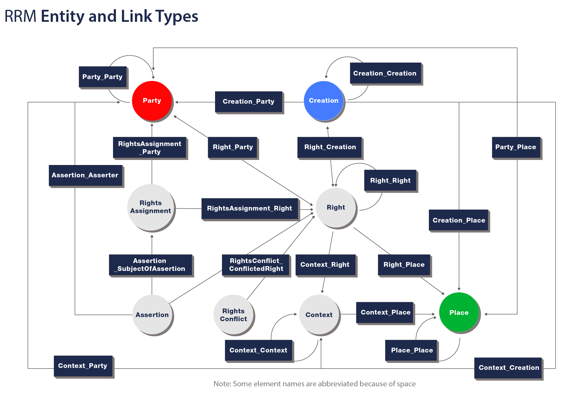
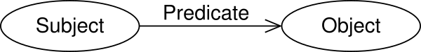
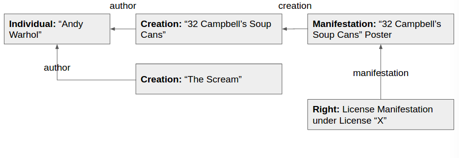
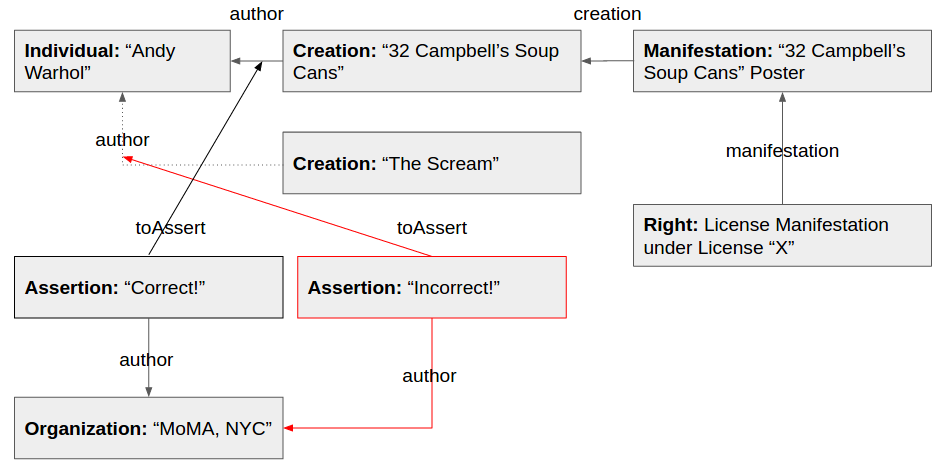

# COALA Intellectual Property Specification


Contributors to this document, in alphabetical order:

- Tim Daubenschuetz: tim.daubenschuetz@gmail.com, tim@ascribe.io
- Greg McMullen: greg@ipdb.foundation, gmcmullen@gmail.com
- Brett Sun: brett@bigchaindb.com


## TL;DR! I DON'T HAVE TIME FOR ALL OF THIS!

Want a summary? We've got you covered with presentations:

- [COALA IP (extended)](presentations/COALA%20IP%20-%20long.pdf)
- [COALA IP](presentations/COALA%20IP%20-%20short.pdf)

Don't be shy! Make sure to give us your questions, suggestions or feedback.

Thank you!


## READ THIS FIRST

This document is a work in progress. Some sections contain the keyword "TODO" and a description of
what is required. Feel free to research an unfinished area and write the section yourself.

If your contribution contains information from external sources, please link to those sources.

If your contribution relies on a field that wasn't previously explained, please provide an overview
of the field to give other readers the necessary background.

This document has a soft limit of 100 characters-per-line. Respect the limit! For links, only the
descriptor counts. The URI doesn't count.

Make sure to follow the existing styles for formatting as closely as possible.

As an overall guideline for contributions to this document document:

- Think practical.
- Think in technologies.
- Don't reinvent the wheel. Use what's already out there and give proper attribution.
- Write as if you had to implement next week.


## General TODOs:

- Improve consistency in use of defined terms. Synonyms for technical terms should be replaced
  with the standard term throughout.
- Before releasing this document to the public, write an introductory section explaining what COALA
  is, what its general goals are, why this document matters, what is left to do, and so on...
- Sometimes this document references internally to other sections ("as seen in the above section",
  ...). Using relative links, we should point to the sections we're writing about


## Table of Contents

- TODO:
    - link to the individual headlines in a tree structure


## Abstract

Content creators on the internet are getting a raw deal. They get a fraction of the revenue earned
by hosting and distribution platforms, even though their work is what keeps these sites filled
with traffic-driving content. It's hard for a creative to make a living. Licensing is hard: the
user experience is bad, and lawyers and middlemen extract the most value. In many areas, more money
goes to the distributors than to the creators. Even though many consumers would be happy to pay the
people who made the content they love, they aren't given the chance. Instead, they are surveilled
and served ads based on their data profiles. It doesn't have to be this way.

The Coalition Of Automated Legal Applications — Intellectual Property Group (COALA IP) group was
formed to address these problems. COALA IP is working to design and implement a free and open
specification for representing and licensing intellectual property. COALA IP's goal is to establish
open, free, and easy-to-use ways to record attribution information and other metadata about works,
assign or license rights, mediate disputes, and authenticate claims by others. We believe there
should be a global standard at the data level, without the need for centralized control.

This document details the COALA IP approach to representing intellectual property on distributed
ledgers (or blockchains). It's an effort to transform the implementation-agnostic Rights Reference
Model (RRM) of the Linked Content Coalition (LCC) into a free and open standard. It outlines
technologies that could be leveraged for the implementation and structure of a specification for
everyone involved: creators, rightsholders, distributors, consumers, developers, and so on. The
protocol will be technology-specific, but ledger-agnostic.

COALA IP's vision will be realized through three key efforts:

1. Building a community to define a minimally-viable set of data for the description of
   intellectual property rights and licensing agreements;
1. Authoring a guide—this document—to provide an overview of the field and the need for a technical
   specification to represent intellectual property rights on distributed ledgers; and
1. Defining a free and open messaging and communication protocol for intellectual property rights
   and licensing transactions.


## Introduction

This section provides context for the COALA Intellectual Property (COALA IP) specification. It
describes the technological concepts used to model a generic, extensible protocol for managing
digital rights. It is meant to give the reader an overview of the concepts; for a more comprehensive
understanding, we encourage the reader to explore the reference material throughout the document.


### The LCC Framework

The [LCC Framework](http://www.linkedcontentcoalition.org/index.php/rights-data-network/lcc-framework)
is a set of documents published by the [Linked Content Coalition](http://linkedcontentcoalition.org/)
(LCC) to "unify digital rights data management". The key documents are:

- [The LCC Manifesto and Ten Targets for the Rights Data Network](http://doi.org/10.1000/290)
- [The LCC Entity Model](http://doi.org/10.1000/285)
- [The LCC Rights Reference Model](http://doi.org/10.1000/284)
- [The LCC Principles of identification](http://doi.org/10.1000/287)


#### The LCC's Ten Targets

The LCC's goal is to enable the widest possible access to accurate rights information and the
ability to automate the licensing and assignment of rights, whether for commercial or free use.
The LCC released the "[LCC Ten Targets for the Rights Data Network](http://doi.org/10.1000/290),"
as a general guide toward achieving the following goals:

1. Every Party has a unique global identifier;
1. Every Creation has a unique global identifier;
1. Every Right has a unique global identifier;
1. All identifiers have a [URI](https://www.w3.org/Addressing/URL/uri-spec.html) to persistently resolve them within the internet;
1. Links between identifiers are platform agnostic and non-proprietary
1. Metadata is platform agnostic or interoperable, and schema should have mappings to
   translate between schema that have been authorized by relevant parties;
1. The provenance of Rights has to be made explicit;
1. Any participant has the ability to make standardized, machine-readable statements about
   rightholdings in creations;
1. Conflicts in rights declarations should be automatically identifiable; and
1. Registered Creations have links to corresponding digital "fingerprints" or "watermarks".


For more in-depth information about the goals of the LCC, see
the "[LCC Ten Targets for the Rights Data Network](http://doi.org/10.1000/290)".


**Sources:**

- [LCC: Manifesto and Ten Targets for the Rights Data Network](http://doi.org/10.1000/290), May 2016


#### The LCC Entity Model

*Note: You don't need to know the LCC Entity Model to understand this specification. The Entity
Model is a meta-model used by the LCC to model their ontology, the LCC Rights Reference Model.*

The [LCC Entity Model](http://doi.org/10.1000/285) (LCC EM) is a generic data model the LCC uses to
define more specific data models, like the [LCC Rights Reference Model](http://doi.org/10.1000/284)
(LCC RRM). The LCC EM specification defines an `Entity` model composed of five attribute types:

- **Category:** A broad category the Entity belongs to (e.g. Language=iso3166-1a2:EN ("English"))
- **Descriptor:** The name of the Entity (e.g. Name="Andy Warhol")
- **Quantity:** A numeric value related to the Entity (e.g. Height=20cm)
- **Time:** A time or date related to the Entity (e.g. DateOfCreation=1999)
- **Link:** Links the Entity to another Entity (e.g. "Andy Warhol" ---isCreator---> "32 Campbell's
  Soup Cans")


These attributes are each represented as models in the specification and, together with
unidirectional links, make up the actual `Entity` model. An `Entity` can be linked to
other `Entities` bidirectionally, as the attached figure shows:


The attributes of the `Entity` model are designed to be generic so more complex data models like
the LCC RRM can be built on top.


**Sources:**

- [LCC: Entity Model](http://doi.org/10.1000/285), May 2016


#### The LCC Rights Reference Model

The [LCC Rights Reference Model](http://doi.org/10.1000/284) (LCC RRM) is a formal framework for
the representation of intellectual property rights. The LCC RRM specification describes an abstract
logical data model built on top of the LCC Entity Model, and is composed of the following `Entity`
types:

- **Party:** A person or an organization (e.g. "Richard Prince", "American Apparel", or "Sky
  Ferreira")
- **Creation:** Something created by a Party (e.g. "Untitled Instagram Portrait")
- **Place:** A virtual or physical location (e.g. "New York City" or "http://www.newyorkcity.com")
- **Right:** A set of permissions that entitle a Party to do something with a Creation (e.g.
  production and sale of t-shirts bearing the Creation)
- **RightsAssignment:** A decision by a Party resulting in the existence of a right (e.g. "Richard
  Prince grants American Apparel the right to produce and sell t-shirts bearing Untitled Instagram
  Portrait in North America")
- **Assertion:** A claim made about the substance of a Right (e.g. "Richard Prince says he has copyright in Untitled Instagram Portrait", or "Sky Ferreira says she has copyright in Untitled Instagram Portrait")
- **RightsConflict:** A statement of disagreement over a Right (e.g. "Sky Ferreira and Richard Prince both claim copyright in Untitled Instagram Portrait")


*Note: For the sake of simplicity, the `Context` type was left out of the above list. It is defined only as a parent/categorizing class of Right, RightsAgreement, Assertion, and RightsConflict. It holds no significant value on its own.*

These seven `Entity` types are the building blocks of a global digital rights ontology. They can
be linked to each other through specific, unidirectional relationships. The figure below specifies
the total possible relationships between `Entities`:





**Sources:**

- [LCC: Rights Reference Model](http://doi.org/10.1000/284), May 2016


#### The LCC Principles of Identification

- TODO:
    - Summarize briefly (as done in the other sections) what the document talks about, without going
      into too much detail


**Sources:**

- [LCC: Principles of identification](http://doi.org/10.1000/287), May 2016


### The Semantic Web

The world wide web (web) is an information space for sharing information in linked documents.
The web is mostly used by humans, publishing and accessing information in human-readable formats,
like a webpage. In theory, machines are capable of understanding this kind of information, but in
practice machines find this difficult and are inefficient at doing it. For example, a webpage
with a table listing the populations of a number of countries is easy for a human to understand, but
even if the first column is called "The Name of a Country", it is difficult for a machine to
understand and to deduce new information from it. It's even harder for machines to reason from this
kind of information if context is not provided.

The semantic web is about publishing information in data schemata that hold semantic meaning for
both humans and machines. This allows humans to publish human-readable information in a way that
machines can understand too. Doing so would likely prove to be of great value in advancing the web.
One of the key building blocks of the semantic web, the Resource Description Framework, is
described in the following section.


**Sources:**

- A. Granzotto (2009): Exploiting spatio–temporal linked data to improve backlinks retrieval


#### The Resource Description Framework (RDF)

[Resource Description Framework](https://www.w3.org/TR/rdf11-concepts/) is a framework for
describing entities on the web. It uses the Universal Resource Identifier (URI), a generalization
of the Universal Resource Location (URL), to address resources. This makes RDF exceptionally
interoperable and extensible.

RDF's core data structure is a graph-based data model that uses sets of triplets to construct
subsets of the graph. Each triplet consists of a **subject**, **predicate**, and an **object**. In
its smallest form, a set containing a single triplet is already an RDF graph. Visualized, a simple
RDF graph could look like this:





Each node of the graph is usually represented as a URI pointing to a resource, providing further
details about its relationship to the graph.

The following example was used in the [Creative Commons Rights Expression Language](https://www.w3.org/Submission/ccREL/) (ccREL)
W3C submission:


```
<rdf:RDF xmlns:rdf="http://www.w3.org/1999/02/22-rdf-syntax-ns#"
        xmlns:xhtml="http://www.w3.org/1999/xhtml/vocab#">
    <rdf:Description rdf:about="http://www.lessig.org/blog/">
        <xhtml:license rdf:resource="http://creativecommons.org/licenses/by/3.0/" />
    </rdf:Description>
</rdf:RDF>
```


This example RDF states licensing information about Lawrence Lessig's blog in a
machine-readable way. Lessig's blog (the *subject*) is licensed (the *predicate*)
under a Creative Commons Attribution 3.0 license (the *object*). ccREL is a schema provided by
Creative Commons that allows defining context for machines on how to interpret licensing information
for documents on the web. ccREL itself is implemented using RDF Schema, which is a
vocabulary for describing properties and classes of RDF resources. By using the [Web
Ontology Language](https://www.w3.org/TR/owl-features/) (OWL), concepts from other RDF
schemata can be included in a domain-specific RDF schema, creating a global ontology of semantically
structured data.

ccREL is just one example of a context-providing schema built on top of RDF. RDF
implementations vary, especially in terms of used data structures. Embedded
RDF in HTML pages and RDF/XML syntax are two of the more popular implementations of RDF, albeit with
relatively heavy syntax and learning curves. In 2014, with RDF 1.1 coming up, a new RDF-compatible,
JSON-based data structure was accepted by the W3C: JSON-LD. It fits the semantic web concept of
linked data into [Javascript Object Notation](https://tools.ietf.org/html/rfc7159) (JSON), which
makes it much more approachable than comparable implementations. We plan to port the LCC RRM
specification to RDF using JSON-LD, so we will explore its main features in the next section.


**Sources:**

- [Resource Description Framework](https://www.w3.org/TR/rdf11-concepts/), May 2016
- [W3C: Creative Commons Rights Expression Language](https://www.w3.org/Submission/ccREL/), May 2016


#### Linked Data

- TODO:
    - A brief section describing the concept of Linked Data
    - Suggested Resources:
        - https://www.w3.org/standards/semanticweb/data


#### JSON Linked Data

[JSON-Linked Data](https://www.w3.org/TR/json-ld/) (JSON-LD) is a data structure that merges the
concepts of the [Resource Description Framework](https://www.w3.org/TR/rdf11-concepts/) with
[JSON](https://tools.ietf.org/html/rfc7159). Using the concept of a `context`, it allows users to
link a JSON object's property to the corresponding RDF schemata in an ontology.

Assume we have the following set of data:


```javascript
{
    "givenName": "Andy",
    "familyName": "Warhol",
    "birthDate": "1928-08-06"
}
```


For a human it's obvious this is about a person named Andy Warhol, born August 6, 1928.
For a machine that lacks the intuition and *context* of a human,
resolving this representation into the same conclusion is difficult.

JSON-LD solves this problem by introducing `context` into JSON documents. On a high level, this
allows data to be linked to already defined schemata. Adding a special `@context` key to the
document provides a reference to the schema of the underlying data. Transforming our previous
example to use JSON-LD would result in:


```javascript
{
    "@context": "http://schema.org/Person",
    "givenName": "Andy",
    "familyName": "Warhol",
    "birthDate": "1928-08-06"
}
```


Upon seeing this data, a JSON-LD parser could use the `@context` property and send a `GET` to
`http://schema.org/Person` to receive the defined schema and perform validation. If another
application developer were to handle this data, they could rely on the same schema definition
rather than their own. Over time, as more and more services use JSON-LD, data representations across
services would begin to unify to improve cross-service data interoperability.

Right now, each application or service has its own model for representing users. For example, one
site might use `birthday` as the key for the user's birthday, while others use `day_of_birth` or
`birthDay`. The sites may even use different formats for the value of the key, with some using
`YYYY-MM-DD` and another using `DD-MM-YYYY`. Custom logic would have to be written to handle mapping
the different keys to each other, but also to convert their values to a standard format even though
they all have the same semantic meaning. They all describe when a person was born.

JSON-LD solves these problems by introducing a `context` to each data model allowing for:

1. A unified mapping of keys by complying to base schemata
1. Value-validation on a [primitive data types level](https://www.w3.org/TR/rdf11-concepts/#section-Datatypes)


Going back to the Andy Warhol example, we need to explain how JSON-LD magically maps our
self-defined keys (`givenName`, `familyName` and `birthDate`) to the properties of schema.org's
`Person`. If you look at schema.org's `Person` definition, you'll see we didn't choose random key
names. Names were already part of the definition. In this case, a JSON-LD parser can automatically
map and execute validation against these properties by using the schema definition.

For more clarity, let's see how a JSON-LD parser would look at this example:

1. Notice `@context` contains `http://schema.org/Person`
1. `GET http://schema.org/Person`
1. For each of the user-defined keys, check if they map to any keys provided in the schema
    1. If this is the case, traverse the schema until a leaf node (the JSON-LD specification calls
       this an `identifying blank node`) is found
    1. "Expand" the data, replacing keys' names with URIs to their more granular schema definitions


Continuing with this example, here is what our previously defined set of data would look like after
expansion:


```javascript
{
    "http://schema.org/givenName": [
        {
            "@value": "Andy"
        }
    ],
    "http://schema.org/familyName": [
        {
            "@value": "Warhol"
        }
    ],
    "http://schema.org/birthDay": [
        {
            "@value": "1928-08-06"
        }
    ],
}
```


We end up with a much more verbose form of our data. In the JSON-LD specification it's called
*expanded* form, as the original object's been expanded with a `@context`. The original object's
form, still with an `@context`, is defined by the specification as *compacted* form.

The JSON-LD parser assumes we've defined the correctly named keys for a `Person` and uses
`http://schema.org/Person` to replace each of our properties with their more detailed schema
definition URIs. The result is an automatically mapped set of data that uses an already available
schema. Each key of a given value now points to a left node on a schema ontology. Leaf nodes are
only allowed to define the most basic types, such as string, boolean, integer, and so on, so the
parser can easily traverse the document and validate each occurrence of `@value`.


##### Final Thoughts

This example is just the tip of the iceberg. JSON-LD has tremendous power. It can be used for
aliasing, self-referencing, built-in types, indexing, and more.

The rest of this document will rely heavily on JSON-LD, so we encourage you to learn more about it
by reviewing the **Sources** section below.

**Sources:**

- [W3C Recommendation: JSON Linked Data 1.0](https://www.w3.org/TR/json-ld/), May 2016
- [Wikipedia: JSON-LD](https://en.wikipedia.org/w/index.php?title=JSON-LD&oldid=715712992), May 2016
- [Codeship: JSON-LD: Building Meaningful Data APIs](http://blog.codeship.com/json-ld-building-meaningful-data-apis/),
  May 2016


#### Schema.org

- TODOs in this section:
    - Just describing schema.org is too narrow here. This section should be about linked
      data on the world wide web in general. schema.org is just a regular player when it comes to
      linked data and RDF. There are even search engines that users can lookup schemas
      (http://wiki.dbpedia.org/). Obviously mention schema.org as a preferred source though.


Schema.org is a collaborative initiative with the mission to create, maintain and promote schemata
for structured data on the internet. Its vocabulary is defined as an ontology, connecting different
concepts using links. It can be used with different encodings, including RDFa, Microdata, and
*JSON-LD*.


##### Available Schemas

Schema.org includes the following schemata that are closely related to LCC RRM's `Entity` types.
Potentially, these could be used later to help define the COALA IP specification:

- [schema.org/Person](http://schema.org/Person): See LCC RRM `Party`
- [schema.org/Organization](http://schema.org/Organization): See LCC RRM `Party` (A `Person` can be
  a member of an `Organization`)
- [schema.org/CreativeWork](http://schema.org/CreativeWork): See LCC RRM `Creation`
    - [schema.org/Article](http://schema.org/Article)
    - [schema.org/Blog](http://schema.org/Blog)
    - [schema.org/Book](http://schema.org/Book)
    - [schema.org/Clip](http://schema.org/Clip)
    - [schema.org/Dataset](http://schema.org/Dataset)
    - [schema.org/Game](http://schema.org/Game)
    - [schema.org/MediaObject](http://schema.org/MediaObject)
        - [schema.org/AudioObject](http://schema.org/AudioObject)
        - [schema.org/ImageObject](http://schema.org/ImageObject)
        - [schema.org/VideoObject](http://schema.org/VideoObject)
    - [schema.org/Movie](http://schema.org/Movie)
    - [schema.org/MusicComposition](http://schema.org/MusicComposition)
    - [schema.org/Painting](http://schema.org/Painting)
    - [schema.org/Photograph](http://schema.org/Photograph)
    - [schema.org/SoftwareApplication](http://schema.org/SoftwareApplication)
    - [schema.org/Thesis](http://schema.org/Thesis)
    - [schema.org/VisualArtwork](http://schema.org/VisualArtwork)
- [schema.org/Action](http://schema.org/Action)
    - [schema.org/AssessAction](http://schema.org/AssessAction): See LCC RRM `Assertion`
        - [schema.org/ReviewAction](http://schema.org/ReviewAction)
        - [schema.org/ReactAction](http://schema.org/ReactAction)
            - [schema.org/AgreeAction](http://schema.org/AgreeAction)
            - [schema.org/DisagreeAction](http://schema.org/DisagreeAction)
    - [schema.org/TradeAction](http://schema.org/TradeAction)
        - [schema.org/BuyAction](http://schema.org/BuyAction)
        - [schema.org/SellAction](http://schema.org/SellAction)
        - [schema.org/RentAction](http://schema.org/RentAction)
    - [schema.org/TransferAction](http://schema.org/TransferAction)
- [schema.org/Place](http://schema.org/Place): See LCC RRM `Place`

-*A full list of all core schema.org schemata can be found [here](https://schema.org/docs/full.html).*


In summary:

- **What schema.org helps us with:**
    - **LCC Party:** [schema.org/Organization](http://schema.org/Organization) and
      [schema.org/Person](http://schema.org/Person)
    - **LCC Creation:** [schema.org/CreativeWork](http://schema.org/CreativeWork) and all its
      subschemata could be used
    - **LCC Place:** [schema.org/Place](http://schema.org/Place)
    - **LCC Assertion:** [schema.org/AssessAction](http://schema.org/AssessAction)
- **What schema.org *doesn't* help us with (yet?):**
    - **LCC Right**
    - **LCC RightsAssignment**
    - **LCC RightsConflict**


*A full list of all core schema.org schemata can be found [here](https://schema.org/docs/full.html).*


##### Extensibility of schema.org

Although some of the `Entity` types do not yet exist in schema.org (specifically Rights,
RightsAssignment and RightsConflict), the schema.org schemata are easily extensible. We can
create our own schemata to fit the needs of LCC. Schema.org [even encourages](http://schema.org/docs/extension.html)
others to subclass their *core* schemata into what it calls "*hosted*" and "*external*" extensions.
There are three basic types of schemata on schema.org:

- **Core:** A basic vocabulary for describing the kind of entities most common web applications
  need.
- **Hosted:** Subclassed models from Core which have their own namespace on schema.org (e.g.
  http://health-lifesci.schema.org/) and are reviewed by the schema.org community. Hosted schemata
  should be application-agnostic.
- **External:** Subclassed models from Core or Hosted which have an application-specific namespace (e.g.
  http://schema.coala.global). External schemata may be application-specific.


Applied to the context of the COALA IP specification, application-agnostic schemata (including all
of LCC RRM) would ideally become a *hosted* extension. Application-specific schemata, data models
that are specific for a specific application or service, would become *external* schemata.
Fortunately, leveraging schema.org in this way maintains compliance with rules
five and six of the LCC's "Ten Targets":

- Rule 5: Links between identifiers are system agnostic and need to be authorized by participating
  consortiums.
- Rule 6: Metadata is system agnostic and its schema has to be authorized by participating parties
  or consortiums.


**Sources:**

- [Schema.org](http://schema.org), May 2016
- [Schema.org: Full Hierarchy](http://schema.org/docs/full.html), May 2016
- [Schema.org: Schema.org Extension](http://schema.org/docs/extension.html), May 2016


### Interplanetary Linked Data

This section describes the functionality of Interplanetary Linked Data (IPLD) and its use in working
with immutable data stores and Linked Data.

#### Motivation for IPLD

IPLD is an attempt to put Linked Data on distributed ledgers using hashes for linking, a technique
referred to as "Merkle links".

Let's go back to our Warhol example:


```javascript
{
    "givenName": "Andy",
    "familyName": "Warhol",
    "birthDate": "1928-08-06"
}
```

In addition, we have a set of data describing one of his works:


```javascript
{
    "name":"32 Campbell's Soup Cans",
    "dateCreated": "01-01-1962",
    "exampleOfWork": "https://en.wikipedia.org/wiki/Campbell%27s_Soup_Cans#/media/File:Campbells_Soup_Cans_MOMA.jpg"
}
```

Note that neither object contains a link to the other. There is no way to tell that Andy Warhol
is the creator of "32 Campbell's Soup Cans." We could use JSON-LD to create a link between the
objects by making both of the objects resolvable on the internet. We could do this by adding `@id`s
to the objects' bodies, and an `author` property to the creation that points to a resolvable
location of the person object.

The problem is we have to trust the hosts that make these objects resolvable. Hosts might return
the correct objects at first, but that could change. Since there is no way for resolving actors to
check the integrity of the object they're requesting, a host could return arbitrary data and the
actor wouldn't know. In addition, internal linking within objects or internal linking from URIs
is challenging using linked data protocols like JSON-LD.

The rest of this section explores the features of IPLD that promise to solve these problems.


#### IPLD by Example

The following sections give a brief overview of IPLD's functionality. More information is available
in the [IPLD specification draft](https://github.com/ipfs/specs/tree/master/ipld).


##### Creation of Linked Objects

We can us IPLD to link the person and creation objects discussed earlier with the following steps:

1. Serialize the person's object to a canonical form of [Concise Binary Object Representation](http://cbor.io/)
   (CBOR):


    ```python
    In [1]: import ipld

    In [2]: person = {
    ...:     "givenName": "Andy",
    ...:     "familyName": "Warhol",
    ...:     "birthDate": "1928-08-06"
    ...: }

    In [3]: serialized_person = ipld.marshal(person)
    Out[3]: b'\xa3ibirthDatej1928-08-06jfamilyNamefWarholigivenNamedAndy'
    ```

    For this demonstration, we use [py-ipld](https://github.com/bigchaindb/py-ipld), an
    existing Python library, to handle IPLD specifics and data transformations. In this
    case, `ipld.marshal` is used to serialize the `person` object using a [CBOR
    reference implementation](https://bitbucket.org/bodhisnarkva/cbor). The result is a byte array.


1. Hash the serialized byte array using [multihash](https://github.com/jbenet/multihash) and encode
   the hash to base58


    ```python
    In [4]: ipld.multihash(serialized_person)
    Out[4]: 'QmRinxtytQFizqBbcRfJ3i1ts617W8AA8xt53DsPGTfisC'
    ```


    [Multihash](https://github.com/jbenet/multihash) is a protocol for differentiating outputs from
    various well-established cryptographic hash functions. It adds a
    [hexadecimal prefix](https://github.com/jbenet/multihash#table-for-multihash-v100-rc-semver)
    to each hash generated indicate the hash function used. This lets users identify the hash
    functions in the future in case of upgrades, and allows for multiple hash functions to coexist
    within and across applications.


1. Now that we have derived an IPLD from the person object, we can link it to the creation as its
   author:


    ```python
    In [5]: creation = {
        "name":"32 Campbell's Soup Cans",
        "dateCreated": "01-01-1962",
        "exampleOfWork": "https://en.wikipedia.org/wiki/Campbell%27s_Soup_Cans#/media/File:Campbells_Soup_Cans_MOMA.jpg",
        "author": { "/": "QmRinxtytQFizqBbcRfJ3i1ts617W8AA8xt53DsPGTfisC" }
    }
    ```


    We've now connected the creation to a person by using the person's hash value, thereby creating
    a "Merkle link". Generally, Merkle links can be schematized like this:


    ```javascript
    Property = {
        ...
        [<String>]: <MerkleLink>
    }

    MerkleLink = {
        "/": <String: multihash value>
    }
    ```


1. Finally, to make this creation object resolvable, we repeat the first two steps. We serialize the creation
   object to a canonical form of CBOR:


    ```python
    In [6]: serialized_creation = ipld.marshal(creation)
    Out[6]: b"\xa4fauthor\xd9\x01\x02x.QmRinxtytQFizqBbcRfJ3i1ts617W8AA8xt53DsPGTfisCkdateCreatedj01-01-1962mexampleOfWorkx]https://en.wikipedia.org/wiki/Campbell%27s_Soup_Cans#/media/File:Campbells_Soup_Cans_MOMA.jpgdnamew32 Campbell's Soup Cans"
    ```


    Note this is a special case, with the Merkle link contained in `creation` replaced by
    an [unassigned CBOR tag (258)](https://www.iana.org/assignments/cbor-tags/cbor-tags.xhtml) to
    make the link more easily retrievable on deserialization.


1. Hash the resulting serialized byte array using [multihash](https://github.com/jbenet/multihash)
   and encode the hash to base58:


    ```python
    In [7]: ipld.multihash(serialized_creation)
    Out[7]: 'QmfMLNLyJZgvSPkNMvsJspRby2oqP6hWZ8Nd2PvKLhudmK'
    ```


##### Retrieval of Linked Objects

To further explore IPLD, let's assume we've put these objects into a data store. We'll use IPFS
since its identifiers are compatible with the hashes we created previously.

We can use paths of Merkle links (Merkle paths) to resolve any object within IPFS using its hash
value, and also further de-reference any of the object's connecting edges by following its Merkle
links. Given the example above, the `author` of the creation could be found through this Merkle
path:


```python
In [8]: ipld.resolve('/ipfs/QmfMLNLyJZgvSPkNMvsJspRby2oqP6hWZ8Nd2PvKLhudmK/author')
Out [8]:
{"givenName": "Andy",
 "familyName": "Warhol",
 "birthDate": "1928-08-06"}
```


IPLD resolves any Merkle link, in this case the creation's author, with the actual object,
making traversing a Merkle link feel similar to regular property access in objects. To link
across network addresses, we can use [multiaddr](https://github.com/jbenet/multiaddr), which
allows the construction of resource paths to reach across protocols. Doing so
would allow an IPLD object to maintain resolvable links even if its Merkle links point to
separate ledgers (e.g. IPFS, BigchainDB, Bitcoin, etc).


#### Evaluation of IPLD

In summary, IPLD is a promising new technology, with a few cavets:

- **Benefits:**
    - Provides cryptographic integrity checks of data using upgradable hash functions (multihash).
    - Uses content addressed storage instead of location addressed storage (compare to URL).
    - Enables cross-ledger/database resolvability of data (multiaddr and merkle-paths).
    - Unifies object identifiers through a canonicalized hashing strategy.
    - Imposes immutability by using a merkle-dag data structure.
    - Future-proofs underlying concepts (multi-x).
    - Enables wide compatibility, even down to the UNIX file system path.
    - Relies on lightweight protocol drafts and implementations.
    - Deserializes to a multitude of other data serialization formats (YAML, JSON, XML, etc).
- **Caveats:**
    - Non-standardized protocols (multi-x).
        - [Overlaps](https://interledger.org/five-bells-condition/spec.html#crypto-conditions-type-registry)
          with other protocols that are being standardized.
        - Breaks with exisiting and well-established protocols (e.g. URI vs. multiaddr).
    - Does not comply with existing linked data ontologies due to immutability.
    - Opinionated CBOR serialization.


#### Compatibility of IPLD and JSON-LD

Although the naming and concept of IPLD was inspired by JSON-LD, the two have different sets of
functionality. This section highlights the limitations imposed on JSON-LD by IPLD.


#### Self-identifying JSON-LD Objects

JSON-LD objects can maintain a self-identifying link using the `@id` property. This allows the
object to directly express its location. The same is impossible for IPLD objects. Since IPLD objects
are supposed to only be retrieved by the corresponding hash of the their data, the hash itself
cannot be part of the object as it would be a very difficult to solve cryptographic puzzle. The
amount of processing required would be incredible, rendering the identification of objects extremely
inefficient. Instead, we prevent JSON-LD objects with IPLD links from self-identifying themselves
using an `@id` property. This is not usually a problem as objects can also identify themselves
through content addressing.


**Sources:**

- [IPLD Specification Draft](https://github.com/ipfs/specs/tree/master/ipld), June 2016
- [IPLD Python Reference Implementation](https://github.com/bigchaindb/py-ipld), June 2016
- [Multihash Specification](https://github.com/jbenet/multihash), June 2016
- [Multiaddr Specification](https://github.com/jbenet/multiaddr), June 2016
- [Interledger: Crypto-Conditions](https://interledger.org/five-bells-condition/spec.html), June
  2016
- [Concise Binary Object Representation](http://cbor.io/), June 2016
- [IANA: CBOR Tags Registry](https://www.iana.org/assignments/cbor-tags/cbor-tags.xhtml), June 2016


### The Web of Trust

- TODO: Explain briefly
- Point to initiatives going on
- https://github.com/WebOfTrustInfo/rebooting-the-web-of-trust
- http://xmlns.com/wot/0.1/
- http://www.weboftrust.info/


### Fingerprinting

Determining the originality and provenance of a physical object is challenging, but there are
almost always subtle differences between an original physical object and copies. Digital files
can be copied perfectly, down to the bit. Furthermore, it is difficult for a computer to determine
that two files actually represent the same photograph or song if the files are different sizes or
other subtle modifications have been made, while a human would have no difficulty making the
connection.

The LCC takes these problems into account. In their "Ten Targets" document, they propose
cross-standard identifiers that can, if needed, be *transformed* into alternative identifiers. This
section discusses a similar idea: the existence of an arbitrarily complex vector that can be used
to link all the alternative identifiers of a single work to a single identifier on a global
rights registry.

Any function that takes a digital asset as an input and yields a fixed-length value could
potentially be used as a **fingerprinting function**. This could be as simple as a hash function
that inspects the arrangement of bytes in a digital asset and returns a integer, but there are more
elaborate versions:

- [Image-match](https://github.com/ascribe/image-match): An approximate image match algorithm
  implemented in Python.
- [pHash](http://www.phash.org/): A hashing method using various features of a digital asset.
- [dejavu](https://github.com/worldveil/dejavu): An audio fingerprinting and recognition algorithm
  implemented in Python.
- TODO: List more libraries
    - Find popular ones that do fingerprinting for all kinds of media types


While a manifestation of a digital creation may initially only have a single fingerprint generated
by an arbitrary hashing function, more elaborate fingerprinting schemes could later be used to help
automatically identify other occurrences of the creation on the internet. Paired with linked data,
fingerprinting schemes could allow the storage and tracking of all information about the use of a
work in an arbitrarily complex graph. Copies, remixes, mash-ups, and modified versions of the work
could be identified automatically as paths in the graph. Traversing these paths would reveal the
original instance of the work, possibly identifying the creator and providing opportunities for
compensation.

As rights information becomes more transparent and users can easily license the rights they want
to obtain, participants in the system would be incentivized to create more elaborate fingerprinting
systems to further increase transparency.


### The Interledger Protocol

- TODO:
    - This section should briefly explain what Interledger and the Interledger Protocol is about and
      how COALA IP could potentially use it.
    - Same formalities as in all the sections before apply.


## COALA IP: Remodeling the LCC RRM with Linked Data

In this section we describe how the LCC RRM can be modeled using JSON-LD, IPLD, and schema.org.
We will go over each model description given in the LCC Rights Reference
Model document and discuss how the respective model can be translated into Linked Data.


### What Linked Data Gives Us Out of the Box

As a building block of RRM, the LCC first defines a generic, linkable Entity Model whose entities
can be combined to create an extendable data model for intellectual property. However, by
using an RDF-based data structure, we can skip the transformation of these basic entities as RDF
already provides us with a base data structure for linking entities.


### General Approach

The section describes how to get from a LCC RRM model to a RDF-compatible JSON-LD/IPLD
model. As discussed, the "[LCC: Entity Model](http://doi.org/10.1000/285)" defines a generic model
as a base for the Rights Reference Model. The document describes how to implement a fully
extensible data model using a multitude of linked entities. Using an RDF-based data structure
means that defining a base data structure for linking entities is not necessary—this is what RDF
is all about.

To redefine the LCC's Rights Reference Model, we propose the following:

- Identify RDF schemata that map to entities defined in the LCC RRM specification.
    - If appropriate RDF schemata are not available:
        - Compose new RDF types from multiple RDF schemata; and
        - Define new RDF schemata.
- Define how entities are identified and resolved.
- Resolve mismatches between the LCC RRM terminology and RDF schemata.


A slight speed bump in the transformation process is ensuring support for links between entities.
The RRM defines the existance of links in a generic manner, as one-to-many (i.e. `0 - n`)
links. RDF and Linked Data require these links to be explicitly named so as to express specific
facts within their ontologies. For example: schema.org's schemata often include a finite
set of links that can be mapped to the RRM's links, but cannot directly support the possibly
infinite number of links required by the RRM. However, we can overcome this limitation
by extending the base JSON-LD schemata, or its underlying RDF implementation. Extensions
could be hosted by schema.org as a *hosted* extension, or by others as *extended* extensions.


### The LCC Place `Entity`

In the LCC RRM, a Place describes a localizable or virtual place. It contains the following
property:

- **PlaceType:** Defines the type of a Place; is one of:
    - `lcc:LocalizablePlace`: A Place in the physical universe that can be located by spatial
      coordinates
    - `lcc:VirtualPlace`: A non-localizable Place at which a resource may be located at


In addition, a Place can have the following outgoing links to other entities:

- Links to other Places (`0 - n`; one-to-many): *RelatedPlace*


Visualized, an RRM Place looks like:


#### Proposed Transformation

Compared to schema.org's definition of a Place, the LCC RRM Place can describe both a physical and
a virtual Place. In this specification, we need to separate the two concepts explicitly to avoid
confusion later in the transformation process. Neither a URI nor a IPLD Merkle link is able to
represent a physical location, which is why in the context of this specification, these will be
links pointing to resources, while the LCC Place model will be used
only to refer to a physical place.

For reference:

- **LLC RRM Place or Place** will be used to describe a localizable Place, meaning a physical Place
  in the universe that can be described using spatial coordinates.
- **Universal Resource Identifier** or **IPLD Merkle link** will be used to describe a virtual
  place where a resource can be found.


With schema.org's Place, the transformation of a *localizable* Place to RDF is straight forward
(example adapted from schema.org):


```javascript
// In JSON-LD
{
    "@type": "http://schema.org/Place",
    "geo": {
        "@type": "http://schema.org/GeoCoordinates",
        "latitude": "40.75",
        "longitude": "73.98"
    },
    "name": "Empire State Building"
}

// In IPLD
{
    "@type": { "/": "<hash pointing to RDF-Schema of Place>" },
    "geo": {
        "@type": { "/": "<hash pointing to RDF-Schema of GeoCoordinates>" },
        "latitude": "40.75",
        "longitude": "73.98"
    },
    "name": "Empire State Building"
}
```

To support links to other Places, one can use either of the two already-defined properties on a
schema.org Place: `containsPlace` or `containedInPlace`, or extend the schema with their own
properties.


### The LCC Party `Entity`

The LCC recommends that a Party should be able to represent any of the following classes of parties:

- Rightsholders;
- Licensors;
- Administrators;
- Users; or
- Any other participants related to rights.


RRM Parties must have the following properties:

- **PartyType:** Defines if the Party is an individual or a group of individuals;
- **DateOfBirth:** Party's date of birth; only if `PartyType == 'lcc:Individual'`; and
- **DateOfDeath:** Party's date of death; only if `PartyType == 'lcc:Individual'`.


Additionally, a Party can have the following outgoing links to other entities:

- Links to other Parties (`0 - n`; one-to-many): *RelatedParty*
- Links to Places (`0 - n`; one-to-many): *RelatedPlace*


Visualized, an RRM Party looks like:


#### Proposed Transformation

*Note: We will describe the transformation of a RRM Party into a JSON-LD/IPLD Person and
Organization very literally, so as to provide reasoning for the steps taken in the
transformation. This will only be the case for this `Entity`, as the rationale for transforming
later `Entity` types will be similar.*

Schema.org makes both a [schema.org/Person](http://schema.org/Person) and an [schema.org/Organization](http://schema.org/Organization)
available; hence, there is no need to define either concept as a single model differentiated by
`PartyType`. To keep the transformation of the `Entity` into an RDF schema simple, let us first
transform a RRM Party with `PartyType == 'lcc:Individual'` and then apply the learnings to an RRM
Party with `PartyType == 'lcc:Organization'`.


##### Transformation of RRM Party to an RDF Person

Using the minimum number of properties described in the RRM, an RRM Party with `PartyType ==
'lcc:Individual'` could look like this as a schema.org Person:


```javascript
// In JSON-LD
{
    "@context": {
        "DateOfBirth": "http://schema.org/birthDate",
        "DateOfDeath": "http://schema.org/deathDate"
    },
    "@type": "http://schema.org/Person",
    "DateOfBirth": "1928-08-06",
    "DateOfDeath": "1987-02-22"
}

// In IPLD
{
    "@context": {
        "DateOfBirth": { "/": "<hash pointing to RDF-Schema of birthDate>" },
        "DateOfDeath": { "/": "<hash pointing to RDF-Schema of deathDate>" }
    },
    "@type": { "/": "<hash pointing to RDF-Schema of Person>" },
    "DateOfBirth": "1928-08-06",
    "DateOfDeath": "1987-02-22"
}
```


While there's nothing technically wrong with the above, you may notice on a close inspection of
schema.org/Person that the schema already contains the `birthDate` and `deathDate` properties.
Rather than reinventing the wheel and remapping `DayOfBirth` and `DayOfDeath` to these properties,
we can remove the aliasing and use the properties directly defined on schema.org/Person. This gets
us:


```javascript
// In JSON-LD
{
    "@type": "http://schema.org/Person",
    "@id": "https://en.wikipedia.org/wiki/Andy_Warhol",
    "birthDate": "1928-08-06",
    "deathDate": "1987-02-22"
}

// In IPLD
{
    "@type": { "/": "<hash pointing to RDF-Schema of Person>" },
    "@id": "https://en.wikipedia.org/wiki/Andy_Warhol",
    "birthDate": "1928-08-06",
    "deathDate": "1987-02-22"
}
```


In the example, we've used Andy Warhol's Wikipedia page as his Party identifier (`@id`). As an `@id`
value is only required to be a resolvable URI or IPLD merkle-link, a JSON-LD parser would validate
this without complaining; however, `@id` would ideally point to the location of the data itself to
show the JSON-LD parser where it could be resolved within the internet. Unfortunately, Wikipedia
doesn't support this, so that `https://en.wikipedia.org/wiki/Andy_Warhol` doesn't return the required
data, which is why we'll have to look for another solution.

To start off with, lets look at some limitations and requirements derived from the RRM and JSON-LD /
IPLD:


- **LCC's Ten Targets:**
    - A Party's identifier should be linked to the [International Standard Name Identifier](http://www.iso.org/iso/catalogue_detail?csnumber=44292)
      (ISNI) hub.
    - A Party's identifier should have an URI representation, so that it can be resolved predictably
      and persistently within the Internet.
- **LCC's Principles of identification:**
    - A Party should have at least one persistent unique public identifier that is both human- and
      machine-readable.
    - If a Party has multiple public identifiers, there should be a way to automatically
      transform one identifier to another.
    - A Party's identifier can have multiple designations (e.g. ISBN-10, ISBN-13, ISBN-A, etc.).
    - A Party's identifier should have an URI representation.
    - A Party's identifier should not have any intended meaning that could be misinterpreted by
      humans.
    - A Party's identifier should not include any information about the Party itself or its
      registration date.
    - **TODO: There are even more requirements in this document that should be listed here!**
- **JSON-LD:**
    - An `@id` value must be represented as an absolute or relative
      [Internationalized Resource Identifier](https://tools.ietf.org/html/rfc3987) (IRI).
- **IPLD:**
    - Any object must be addressable using its [multihashed](https://github.com/jbenet/multihash)
      value (encoded in base58).
        - Multihash allows different hash functions to interoperate and stay upgradeable.
- And finally, our own requirements to allow for any linked entity data to be put on public ledgers
  (e.g. blockchains or registries):
    - Elements of the Party's identifier can represent the public part of an asymmetric cryptographic
      key-pair.
        - If so, the public key should be represented by a unified encoding method. See
        [Bitcoin's public key addressing](https://en.bitcoin.it/wiki/Technical_background_of_version_1_Bitcoin_addresses).
    - A Party can only be created when at least one valid cryptographic key-pair is provided.

Currently there is no system that is able to fulfill all of these requirements
and become a registry for RRM Party data. Let's pretend, for the sake of completeness, that we have
access to such an identity service in the following examples—preferably a decentralized
not-for-profit service! It will let users:

- Issue an identity that can be resolved using JSON-LD ([Content Negotiation](https://www.w3.org/Protocols/rfc2616/rfc2616-sec12.html))
  or IPLD; and
- Attach the public part of their key pairs to their identity.


Services that could be extended to support our use case include:

- https://pgp.mit.edu/
- https://keybase.io/
- https://ipfs.io/
- https://ipdb.foundation/


Equipped with this identity service, we can go back to the example's JSON-LD representation and
replace its `@id` value with an URI pointing to the dataset (the dataset itself living on the
identity service):


```javascript
// In JSON-LD
{
    "@type": "http://coalaip.schema/Identity",
    "@id": "<URI pointing to this object>",
    "givenName": "Andy",
    "familyName": "Warhol",
    "birthDate": "1928-08-06",
    "deathDate": "1987-02-22"
}
```


On IPLD, we remove the `@id` property. Not only are we restricted from using self-referencing
links in IPLD, but such links are unnecessary, as any object is able to
identify itself by its own hash. Thus, we get:


```javascript
// In IPLD
{
    "@type": { "/": "<hash pointing to RDF-Schema of Identity>" },
    "givenName": "Andy",
    "familyName": "Warhol",
    "birthDate": "1928-08-06",
    "deathDate": "1987-02-22"
}
```


Finally, to complete the transformation, we need to include support for the possible outgoing links
of an RRM Party: links to other Parties (*RelatedParty*) and links to Places (*RelatedPlace*). To
give some context, a few potential use cases for these links include:

- Multiple Parties sharing a relationship (e.g. Party A and Party B created Creation C);
- Parties providing Places as part of their metadata (e.g. home location, contact place, or billing
  address); or
- Multiple Parties being bundled together as an Organization.


A few linking possibilities are already covered by schema.org, such as a Person's home address
(schema.org/Person's `homeLocation`; specifying a Place) or parents (schema.org/Person's `parent`;
specifying a Party). If we wanted to define relations that schema.org hadn't already provided, we
could also extend schema.org/Person with our own RDF schema.


##### Transformation of RRM Party to an RDF Organization

An RRM Party with `PartyType == lcc:Organization` describes a single entity representing a group of
individuals. Using the minimum number of properties listed in the RRM, the `Entity` type could look
like this as an schema.org Organization.


```javascript
// In JSON-LD
{
    "@type": "http://schema.org/Organization",
    "@id": "http://identityservice.com/organizations/w3c",
    "name": "World Wide Web Consortium",
    "founder": {
        "@type": "http://linkedcontentcoalition.com/Identity",
        "@id": "https://identityservice.com/identities/12bS2BTF4j8kkmNqoyQRwzKy76EXQWRVWJ",
    },
    "member": [
        {
            "@type": "http://linkedcontentcoalition.com/Identity",
            "@id": "https://identityservice.com/identities/152xhUAJBGEht9Jwerv1omFV82xaRcyzHH",
        },
        {
            "@type": "http://linkedcontentcoalition.com/Identity",
            "@id": "https://identityservice.com/identities/1Je5tHHkHcs1ioLZmiBFSuyiXdwd76xf4D",
        },
        {
            "@type": "http://linkedcontentcoalition.com/Identity",
            "@id": "https://identityservice.com/identities/1QDtDjNgBx6242VakTTkFMn5HmkibzrsR8",
        }
    ]
}
```

- TODO: Also define how the object would look like in IPLD.
- TODO: This needs a lot of specing out. How can members of an organization collectively sign
  something they're submitting? Is there a single public key address assigned to an organization or
does the organization just bundle members that act like they were in an organization but act
independently?


##### Allowing Parties to Sign Metadata

As we envision future identity registries built on top of public ledgers, we need to ensure
that users are able to include a cryptographic identity with any registered identities, allowing
them to sign any submitted metadata. Luckily, the [Friend of a Friend Project](http://www.foaf-project.org/)
has already thought about this and provide the [Web of Trust RDF ontology](http://xmlns.com/wot/0.1/)
for signing RDF documents with public-key cryptography. Integrating this ontology into our identity
model, we could get something like:

- TODO:
    - Give an code example how WOT could look like in an immutable ledger.
    - Make sure that the *immutability* is not violated, the WOT ontology as of now only work with
      mutability.


### The LCC Creation `Entity`

An RRM Creation model describes something directly or indirectly made by human beings. According
to the specification, it has a single required property:

- **CreationMode:** Describes the mode of creation; one of:
    - `lcc:Manifestation`: A perceivable manifestation of a `Work`; or
    - `lcc:Work`: A distinct, abstract Creation whose existence is revealed through one or more
      manifestations.


Additionally, a Creation can have the following outgoing links to other entities:

- Links to other Creations (`0 - n`; one-to-many): *RelatedCreation*
- Links to Places (`0 - n`; one-to-many): *RelatedPlace*
- Links to Parties (`0 - n`; one-to-many): *RelatedParty*


Visualized, an RRM Creation looks like:


#### Proposed Transformation

Schema.org's existing schemata already covers a large number of the RRM Creation's use cases.
Not only is the vocabulary of [schema.org/CreativeWork](http://schema.org/CreativeWork)
quite extensive, there are also a number of subtypes that can be used to define specifics about a
creation (e.g. [schema.org/Book](http://schema.org/Book)). However, one distinction to highlight is
how an RRM Creation has two `CreationMode`s: one for perceivable Creations (called `Manifestation`s)
and one for abstract Creations (called `Work`s). Transforming to JSON-LD, we get:


```javascript
// A Creation object and its Manifestations in JSON-LD
// Note: We assume that the data will be put on an immutable ledger and so all links must point
//       "backwards"
{
    "@graph": [
        {
            "@id": "#creation",
            "@type": "http://coalaip.schema/Creation",
            "name": "Lord of the Rings",
            "author": "<URI pointing to the author Person>"
        },
        {
            "@id": "#digitalManifestation",
            "@type": "http://coalaip.schema/Manifestation",
            "name": "The Fellowship of the Ring",
            "creation": "#creation",
            "digital_work": "<URI pointing to file>",
            "fingerprints": [
                "Qmbs2DxMBraF3U8F7vLAarGmZaSFry3vVY5zytuN3BxwaY",
                "<multihash/fingerprint value>"
            ],
            "locationCreated": "<URI pointing to a Place>"
        },
        {
            "@id": "#physicalManifestation",
            "@type": "http://coalaip.schema/Manifestation",
            "name": "The Fellowship of the Ring",
            "creation": "#creation",
            "datePublished": "29-07-1954",
            "locationCreated": "<URI pointing to a Place>"
        }
    ]
}
```


A similar result can be achieved for IPLD, although split into multiple different schemata
linked with hashes:


```javascript
// A Creation object in IPLD
{
    "@type": { "/": "<hash pointing to RDF-Schema of Creation (can be any subtype of CreativeWork)>" },
    "name": "Lord of the Rings",
    "author": { "/": "<hash pointing to the author Person>" }
}

// A a digital Manifestation of the Creation in IPLD
{
    "@type": { "/": "<hash pointing to RDF-Schema of Manifestation>" },
    "name": "The Fellowship of the Ring",
    "creation": { "/": "<hash pointing to the Creation>" },
    "digital_work": { "/": "<hash pointing to a file on e.g. IPFS>" },
    "fingerprints": [
        "Qmbs2DxMBraF3U8F7vLAarGmZaSFry3vVY5zytuN3BxwaY",
        "<multihash/fingerprint value>"
    ],
    "locationCreated": { "/": "<URI pointing to a Place>" }
}

// A a physical Manifestation of the Creation in IPLD
{
    "@type": { "/": "<hash pointing to RDF-Schema of Manifestation>" },
    "name": "The Fellowship of the Ring",
    "creation": { "/": "<hash pointing to the Creation>" },
    "datePublished": "29-07-1954",
    "locationCreated": { "/": "<URI pointing to a Place>" }
}
```


Note that a distinction has been made between works (typed as `Creation`s)
and manifestations (typed as `Manifestation`s). Both physical and digital manifestations can be
represented, with digital manifestations including a set of fingerprints as well as a link pointing
to an example of the work. In the future, we plan to subtype both a `Creation` and a
`Manifestation` type from schema.org's CreativeWork to allow the easy addition of properties.


#### The Copyright Transfer

- TODO:
    - When a Creation is being transferred, expresses a Copyright transfer between parties
    - Outline how this is working, what implications it has and so on


### The LCC Right `Entity`

In comparison to all other RRM `Entity` types, the Right is by far the most interconnected. A
minimal set of required properties include:

- **RightType:** Defines the type of Right (e.g. all uses, license, copy, play, stream,
  administration, lcc:RightSet, etc)
- **ToolType:** Defines the type of medium that must be employed when exercising the Right (e.g.
  only watch on mobile phone or only use a brush to produce manifestations). `ToolType`s are not
  consumed as part of exercising the Right.
- **MaterialType:** Defines the type of material that may be employed when exercising the right
  (e.g. only use watercolour paint to produce manifestations). `MaterialType`s are consumed as part
  of exercising the Right and become part of the result.
- **ValidContextType:** Defines the type of context in which the Right may be exercised (e.g. in
  flight, public, commercial use, academic research, etc.).
- **IsExclusive:** Indicates whether the Right is exclusive to the Rightsholder (e.g. `true` or
  `false).
- **PercentageShare:** Defines the percentage share of the Right controlled (e.g. 51%, 100%, etc.).
- **NumberOfUses:** Defines the number of uses permitted by the Right (e.g. 3, 5, unlimited uses,
  etc.).
- **ValidPeriod:** Defines the period during which the Right is valid. (e.g. 2015-2016).
- **Territory:** Defines the Place where the Right is may be exercised (e.g. North America).


In addition, a Right can have the following outgoing links to other entities:

- Links to other Rights (`0 - n`; one-to-many): *RelatedRight*.
- Links to Parties (`0 - n`; one-to-many): *RelatedParty*.
- Links to Creations (`0 - n`; one-to-many): *RelatedCreations*.
- Links to Places (`0 - n`; one-to-many): *RelatedPlace*.
- Links to RightAssignments (`0 - n`; one-to-many): *RelatedContext*.
- Links to Assertions (`0 - n`; one-to-many): *RelatedContext*.
- Links to RightsConflicts (`0 - n`; one-to-many): *RelatedContext*.


Visualized, an RRM Right looks like:


##### Additional Types of Rights

The RRM specifies three special types of Rights intended for specific use
cases:

- **SourceRight:** A Right from which another Right is derived
- **SuperSededRight:** A Right to invalidate a referenced Right
- **RightSet:** A collection of Rights bundled as a single Right


For now, we've decided to leave these special types out of the specificiation:

- **SourceRight** and **SuperSededRight**: Although both can be easily represented with an ontology,
  they would greatly complicate the ownership logic of an immutable ledger.
- **RightSet**: In the context of putting Rights onto a global registry, this is specifically a
  problem: most decentralized ledgers cannot guarantee, and especially synchronize, the concurrent
  transfer of multiple assets.
    - TODO: Tim: I talked to Dimi about this, and we were trying to figure this out with
      cryptoconditions, but it seems that at this stage it is not possible.


##### The Notion of Ownership

As RRM Rights are specific to the RRM Party they're provided for, any digital creator that wants to
distribute a Manifestation's Rights to a multitude of interested Parties must take the following
steps:

1. Register their Party identifier on a global registry;
1. Register their Creation on a global registry and link it to their Party identifier;
1. Register Manifestations to the Creation on a global registry;
1. Register any number of Rights tailored to interested Parties on a global registry; and
1. Register RightAssignments to assign these Rights to interested Parties.


This highlights that Rights are not strictly limited to only registrations. Rights contain
properties of ownership and can be transferred from one Party to another via RightsAssignments.

Manifestations are not limited to a single Right. Parties are able to attach as many
Rights as necessary to a Manifestation. There are a few edge cases to consider when licensing
information is stored:

- Specific licenses can imply an agreement between the issuer of the Right and the commons; to
  handle this intention to grant Rights to literally everyone, a special Party symbolizing the
  commons could be created to receive and hold such Rights. Following the assignment of this Right,
  other, arbitrary, transfers of Rights of the license to specific Persons or must be disallowed.
  Finally, Parties must also be disallowed from attaching new Rights with licenses that conflict
  with the "commons license" to the Manifestation.
- TODO: Maybe there are more edge cases like this. If so, enumerate and discuss/propose solutions.


#### Proposed Transformation

Transforming the RRM Right `Entity` poses some challenges. According to the RRM specification, an RRM
Right can:

- Represent both copyright as well as licensing information; and
- Be a SourceRight, SuperSeededRight or RightSet.


In order for Rights to be atomically transferrable units, we ignore the latter requirement and
focus on modelling Rights to be transferrable containers of specific licensing information.
To the best of our knowledge there is not an appropriate RDF schema creates such containers, so we
propose the following schema that satisfies the consolidated requirements of:

- [LCC: Rights Reference Model](http://doi.org/10.1000/284);
- [W3C: Open Digital Rights Language](https://www.w3.org/TR/odrl/); and
- [W3C: Creative Commons Rights Expression Language](https://www.w3.org/Submission/ccREL/).


```javascript
// In JSON-LD
{
    "@type": "http://coalaip.schema/Right",
    "@id": "<URI pointing to this object>",
    "usages": "all|copy|play|stream|...",
    "territory": "<URI pointing to a Place>",
    "context": "inflight|inpublic|commercialuse...",
    "exclusive": true|false,
    "numberOfUses: "1, 2, 3, ...",
    "share": "1, 2, 3, ..., 100",
    "validFrom": { "@type": "http://schema.org/Date" },
    "validTo": { "@type": "http://schema.org/Date" },
    "manifestation": "<URI pointing to the Manifestation object>",
    "license": "<URI pointing to a license on an immutable ledger>"
}
```


RRM Rights are just links between `Manifestation`s and licenses. Licenses are usually intended to be
read by humans, so the license should be stored on a technology that prevents changes to the
license. This could be an immutable ledger or blockchain, or be linked by Content-Addressing. With
this in mind, an implementation in IPLD/IPFS is favored:


```javascript
// In IPLD
{
    "@type": { "/": "<hash pointing to RDF-Schema of Right>" },
    "usages": "all|copy|play|stream|...",
    "territory": { "/": "<hash pointing to a Place>" },
    "context": "inflight|inpublic|commercialuse...",
    "exclusive": true|false,
    "numberOfUses: "1, 2, 3, ...",
    "share": "1, 2, 3, ..., 100",
    "validFrom": { "/": "<hash pointing to RDF-Schema of Date" },
    "validTo": { "/": "<hash pointing to RDF-Schema of Date" },
    "manifestation": { "/": "<hash pointing to the a Manifestation>" },
    "license": { "/": "<hash pointing to the license>" }
}
```


[RRM Rights can be linked to Parties through cryptographic ownership](#the-notion-of-ownership).
Only the individuals or organizations with access to a private key corresponding to a
Right-transaction's public key are able to repurpose the Right by, for example, initiating a
RightsAssignment to a third Party. Ownership transactions (i.e. RRM RightsAssignments) of every
form (e.g. transfers, loans consignments, etc.) must be stored in an ordered fashion to preserve a
valid chain of provenance for each right.


### The LCC RightsAssignment `Entity`

According to the RRM specification, an RRM RightsAssignment describes an event that results in the
existence or non-existence of a Right. Depending on the type, a RightsAssignment may be linked from
an assigning Party (Assigner) to a receiving Party (Assignee). From the RRM, a RightsAssignment can
have the following properties:

- **RightsAssignmentType**: Defines the type of RightsAssignment. It can be one of:
    - **RightsLaw:** Represents the creation of a Right by law (e.g. the US Copyright Act of 1976);
    - **RightsPolicy:** Represents the assignment of a Right from an authorized Party to another
      Party without requiring the latter's agreement (e.g. security level for user access of a
      computer system); or
    - **RightsAgreement:** Represents an agreement between two Parties regarding a Right (e.g. a
      license, publishing agreement, etc.).
- **RightsAssignmentStatus**: Defines the status of the RightsAssignment. It can be one of:
    - `lcc:Offer`: An open RightsAssignment proposed by a prospective Assigner;
    - `lcc:Request`: An open RightsAssignment proposed by a prospective Assignee; or
    - `lcc:Executed`: An executed assignment of Rights.


The RRM RightsAssignment has the following outgoing references:

- Links to RRM Parties (`0 - n`; one-to-many): *RelatedParty*; and
- Links to RRM Rights (`0 - n`; one-to-many): *RelatedRight*.


Visualized, an RRM RightsAssignment looks like:


#### Proposed Transformation

Existing schemata for transferring assets could provide a source for transformations, but because of
our unique requirements we do not use those schemata. We expect RightsAssignments to be registered
on immutable ledgers that can already handle asset transfers. COALA IP has chosen to use both IPLD
and the Interledger protocol in the hopes of establishing a metadata and licensing ontology that can
span multiple ledgers and immutable data stores. We assume the following requirements will be met
by every COALA IP-compatible ledger:

- Assets must only be transferrable if cryptographic key-pair signatures are used on the transaction
  level;
- Transactions must be able to define a JSON-serializable payload;
- Assets' provenance chains must be easily comprehensible by any user;
- The Divisibility of Assets must be defined during registration;
- Transactions must support IPLD as well as ILP's [Crypto-Conditions
  specification](https://interledger.org/five-bells-condition/spec.html);
- Transfer transactions must support different modes, including:
    - Transfers from a group of individuals to a single individual (and vice-versa);
    - Transfers that are only claimable during a certain time span (timelock conditions); and
    - Transfers that are only claimable by an individual or group that knows a certain secret key
      (hashlock conditions);
    - TODO: Are there more modes?
- TODO: Are there more requirements COALA IP asks from a ledger?


With this assumption, we can model a minimally transformed RRM RightsAssignment to be part of
the payload of a ledger-specific transfer-transaction, and automatically include links to
related Parties and information about the RightAssignment's status:


```javascript
// In JSON-LD
{
    "@type": "http://coalaip.schema/Transfer(Payload?)",
    "contract": "<URI pointing to a contract on a ledger>"
}
```


and in IPLD:

```javascript
// In IPLD
{
    "@type": { "/": "<hash pointing to RDF-Schema of Transfer(Payload?)>" },
    "contract": { "/": "<hash pointing to a contract>" }
}
```


Although not required, we include the `contract` property in this schema to frame the rights that
are available to be transferred. A Party is not able to transfer more Rights than they have
themselves, so a transfer of Rights can only contain permissions that are a subset of the Rights
contained in the original creation of the Right or previous transfer-transaction.


### The LCC Assertion `Entity`

Assets registered under the COALA IP ontology are registered by independent users, not by a trusted
central authority (like a rightsholder) or a decentralized network (like the Bitcoin network) that
can guarantee the validity of the data. We must assume that some records based on the COALA IP
ontology will contain inaccurate or even fraudulent statements made by users. To counteract this,
the LCC RRM recommends the implementation of an RRM Assertion `Entity` that evaluates claims made
about the truth or falsehood of statements from participating Parties within the ontology.

The LCC's minimum set of required properties includes:

- **TruthValue**: Indicates the level of trust or "truthiness" of the claim; and
- **ValidPeriod**: Defines the time period during which the claim is maintained (e.g from 01.01.2011
  to 01.01.2015)


Additionally, an RRM Assertion can have the following outgoing references:

- Links to Parties (`0 - n`; one-to-many): *Asserter*;
- Links to RightsAssignments (`0 - n`; one-to-many): *SubjectOfAssertion*;
- Links to Assertions (`0 - n`; one-to-many): *SubjectOfAssertion*; and
- Links to RightsConflicts (`0 - n`; one-to-many): *SubjectOfAssertion*.


Visualized, an RRM Assertion `Entity` looks like:


#### Proposed Transformation

Since the ontology will potentially be exposed to an open internet and its users, an Assertion model
in the ontology is necessary. It provides a healing mechanism interpreters of the data can use to
retrieve a statistical truth. COALA IP proposes that assertions should not be made on actual models,
but rather on a model's attributes and links.


Think about the following scenario:

> Andy Warhol decides to use the COALA IP protocol to register his work on a blockchain. He's
  registering one of his works called "32 Campbell's Soup Cans" as a Creation and attaches a poster
  of the work as a Manifestation of it. He also creates a Right defining the licensing terms of
  buying the poster and attaches it to the Manifestation. Since Andy is not really good with
  computers—they were never really his type of medium—he accidentally registers a Creation
  of Edvard Munch's "The Scream" under his name.

Visually, this is what we'd end up with:





This creates an awkward situation. We've stored our ontology on a blockchain supporting IPLD and
content-addressed storage. In contrast to a traditional SQL database, it is impossible to revert
the transactions. We can only append to a blockchain. The solution is to append an Assertion
validating specific statements that are true.

Instead of falsifying the existence of the Creation "The Scream", the solution recommended by the
LCC RRM, COALA IP suggests making an Assertion about "The Scream"'s Author property. With IPLD's
Merkle-path feature, we are able to achieve exactly that by defining an Assertion object:

```javascript
// In IPLD
{
    "@type": { "/": "<hash pointing to RDF-Schema of Assertion>" },
    "truth": "false",
    "asserter": { "/": "<hash pointing to a Party>" },
    "subject": {
        "/": "<IPLD hash pointing to Creation: The Scream's author property>"
        // e.g. /ipdb/<hash_of_creation>/author
    }
}

// and

{
    "@type": { "/": "<hash pointing to RDF-Schema of Assertion>" },
    "truth": "true",
    "asserter": { "/": "<hash pointing to a Party>" },
    "subject": {
        "/": "<IPLD hash pointing to Creation: 32 Campbell's Soup Cans's author property>"
    }
}
```


We end up with the following:




As changing any of the objects values of key would provoke a change in the object's IPLD hash, and
since changing data is not possible, we could also simply point the assertion to the object
itself. However, we'd probably lose valuable metadata and it would be difficult to find out
why an object was flagged by an asserter.


### The LCC RightsConflict `Entity`

TODO:
    - See other introductory sections of LCC models. Use same structure to describe the model


#### Proposed Transformation

TODO:
    - See other introductory sections of LCC models. Use same structure to do the transformation


## Future

This document outlined general guidelines on using the LCC Framework to define an RDF ontology for
managing digital rights on top of immutable data stores. As the goal is to implement an open
standard for rights management, there are a number of events that are to follow; they are outlined
here in sequential order:

- Define a working RDF schema based on this specification
- Include or build open source communities around it
- Using the RDF schema, implement this specification
- Identify a standards commite to send this to
- Take the RDF schema, take the proposed transformations here and put them in a format of a standard
  proposal


Thanks for reading!
