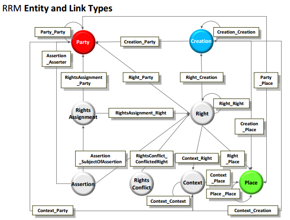

COALA Intellectual Property Specification
============

# Abstract


# Introduction

This section provides context to the following COALA Intelectual Property Specification. It explains technological
concepts that can be used to model a generic, extensible protocol to manage digital rights.
They are described briefly, to give the reader a comprehensive overview of the field. To understand them in their full
spectrum, we advise the reader to study them further on their own. For each section sources on the topic are given.


## The LCC's ten targets


The [Linked Content Coalition](http://linkedcontentcoalition.org/)'s goal is to enable the widest possible access to
appropriate rights information and the automation to rights trading, independent of commercial or free use.
As a general guidance to fulfill their goals, they released a document, called "[Ten targets for the rights data
network](http://doi.org/10.1000/290)" that is composed of the following ten goals:

1. Every Party has a unique global identifier
2. Every Creation as a unique global identifier
3. Every Right has a unique global identifier
4. All identifiers have a URI representation to persistently and predictably resolve them within the Internet
5. Links between identifiers are system agnostic and need to be authorized by participating consortiums
6. Meta data is system agnostic and its schema has to be authorized by participating parties or consortiums
7. The provenance of rights has to be made explicit
8. Any participant is able to make standardized, machine-interpretable statements about rightholdings in creations
9. Conflicts in rights declarations should be automatically identified
10. Digital "fingerprints" or "watermarks" are linked to the registered Creation


For more in-depth information about the goals of the LCC, find the attached link in this section at the top.


**Sources:**

- [LCC: Ten targets for the rights data network](http://doi.org/10.1000/290), May 2016


## The LCC Entity Model

*Note that knowing the definition of the LCC Entity Model is not vital for understand the contents of this
specification. The LCC Entity Model is a meta-model the LCC defined to model their actual ontology - the LCC Rights
Reference Model.*

The [LCC Entity Model](http://doi.org/10.1000/285) (short form: LCC EM) is a generic meta data model used by the LCC as a
"building block" to define more specific data models like the [LCC Rights Reference Model](http://doi.org/10.1000/284)
(short form: LCC RRM).
In a nutshell, the LCC Entity Model specification defines a model called `Entity` that is composed of five attribute types:


- **Category:** Categorizes the Entity (e.g. Language=iso3166-1a2:EN ("English"))
- **Descriptor:** Names the Entity (e.g. Name="Andy Warhol")
- **Quantity:** Quantifies the Entity (e.g. Height=20cm)
- **Time:** Times the Entity (e.g. DateOfCreation=1999)
- **Link:** Links the Entity (e.g. "Andy Warhol" --- isCreator ---> "32 Campbell's Soup Cans")


In the LCC EM specification, all five of these attributes are represented as models as well. Using unidirectional links,
they make up the actual `Entity` model. An `Entity` itself is linked to other `Entities` bidirectionally, as can be seen
in the attached figure:


The `Entity` model's attributes are deliberately chosen to be generic so that more complex data models like the LCC RRM can be
built on top. For in-depth information follow the link to the PDF provided in the beginning of this section.


**Sources:**

- [LCC: Entity Model](http://doi.org/10.1000/285), May 2016


## The LCC Rights Reference Model

The [LCC Rights Reference Model](http://doi.org/10.1000/284) is a formal definition for representing intellectual property
rights digitally. The LCC RRM document is written as a specification for an abstract logical data model, that is built
on top of the LCC EM and is composed of the following seven entities:


- **Party:** A Person or an organization (e.g. "Andy Warhol")
- **Creation:** Something created by a Party (e.g. "32 Campbell's Soup Cans")
- **Place:** A virtual or physical Place (e.g. "New York City, USA")
- **Right:** A set of permissions that entitle a Party to do something with a Creation (e.g. "Andy Warhol controls all
  rights to 32 Campbell's Soup Cans")
- **RightsAssignment:** A decision as a result of which a Right comes into existence (e.g. "According to the 1976 US
  Copyright Act, Andy Warhol controls all rights to 32 Campbell's Soup Cans")
- **Assertion:** A claim made about the substance of a Right (e.g. "I, the Museum of Modern Art, New York, claim that
  Andy Warhol is the righteous creator of 32 Campbell's Soup Cans")
- **RightsConflict:** A statement of disagreement over a Right (e.g. "I, Malory, claim that Andy Warhol is NOT the
  righteous creator of 32 Campbell's Soup Cans")


*Note that for the sake of simplicity, the Entity `Context` was left out of the above described definition. In essence
though, it is just defined as a parent/categorizing class of Right, RightsAgreement, Assertion and RightsConflict and
has hence no significant value.*

As these seven entities are supposed to be building blocks of a global digital rights ontology, they are linked
unidirectional, as can be seen in the attached figure:




**Sources:**

- [LCC: Rights Reference Model](http://doi.org/10.1000/284), May 2016


## JSON Linked Data

[JSON-Linked Data](https://www.w3.org/TR/json-ld/) (short form: JSON-LD) is a data structure merging the concepts of the
[Resource Description Framework](https://www.w3.org/TR/rdf11-concepts/) (short form: RDF) with [JSON](https://tools.ietf.org/html/rfc7159).
Using the concept of a "context", it allows to provide additional mappings by linking JSON-object properties to schemata 
in an ontology.


### Example

Lets assume we have the following set of data:


```javascript
{
    "givenName": "Andy",
    "familyName": "Warhol",
    "birthDate": "1987-02-22"
}
```


Now, for a human it's obvious that this set of data is about a person named "Andy Warhol" who was born on the 22th
February 1987. For a machine that is lacking the intuition and _context_ of a human, resolving this representation is rather
difficult.

JSON-LD solves this problem by introducing the concept of a "context" into JSON documents. On a high level, this allows
to link data to already defined schemata.
In order to include "context" into a JSON-object a key called `@context`, needs to be included that defines or
references the schema of the underlying data. Using JSON-LD to define our previously mentioned example, it would look
like this:


```javascript
{
    "@context": "http://schema.org/Person",
    "givenName": "Andy",
    "familyName": "Warhol",
    "birthDate": "1987-02-22"
}
```


Using the JSON-LD-specific keyword `@context` - pointing to a resource that defines how our data should look like - a
JSON-LD parser could `GET http://schema.org/Person` the schema and validate the attached data against it.
Additionally - and this might be the greatest benefit of JSON-LD -, if some other application developer were to be
handling this kind of data for their users, they could rely on the same schema definition. In turn, this would unify data
representation across services, which is a **GREAT** improvement for the world (wide web).

Think of it like this: Twitter, Facebook, Github, Instagram - they all have the notion of a user model for example.
Some of them might name the key of the user's birthday `birthDay`, while others name it `dayOfBirth`, while again others
would name it `birth_day`. All those keys however, have the same semantic meaning for a user model, as they define when
the user was born. So if all services were to rely on a unified schema for defining their data models, applications that talk across services
would be so much more easier to implement. "Cross-Standard Links" (as the LCC calls it), would come for free actually.

Going back to the example, one question that remains though is: How does JSON-LD know how to map our self-defined key (`givenName`,
`familyName` and `birthDate`) names to the properties of schema.org's Person?
Well, turns out we didn't choose those key names randomly. They're already part of the schema.org's Person definition,
hence a JSON-LD parser is capable to map them automatically and then execute validation against it.

For more clarity, let's see how a JSON-LD parser would look at this example:


1. `GET http://schema.org/Person`
2. For each of the user-defined keys, check if they map to the keys provided in the schema
    2.1 If this is the case, traverse the schema until a leaf node (the JSON-LD specification calls this an
    `identifying blank node`) is found
    2.2 "Expand" the data, replacing a keys name with an URI to its more granular schema definition


To give a practical example, this is how our previously defined set of data would look like:


```javascript
{
    "http://schema.org/givenName": [
        {
            "@value": "Andy"
        }
    ],
    "http://schema.org/familyName": [
        {
            "@value": "Warhol"
        }
    ],
    "http://schema.org/birthDay": [
        {
            "@value": "1987-02-22"
        }
    ],
}
```


So essentially, what we end up with is a much more verbose form of our set of data. In fact, the JSON-LD specification
gives certain forms names. The form that is shown above is called _expanded_ form, as it was expanded using Person's
schema.org definition defined in `@context`.
The form in the example we gave earlier (where we defined `@context`) is called _compacted_ form.

So essentially, what happens is that the JSON-LD parser assumes we defined the correctly named keys for Person already, so
when expanding the compacted version of our JSON-object, it just individually looks them up at
`http://schema.org/Person` and if they're defined, replaces them with more detailed URIs to their schema definition.
What we end up with is a automatically mapped set of data by simply using what is already out there.
Since every key of a given value now points to a leaf node of a schema ontology and since leaf nodes are only allowed to
define the most basic types (like string, boolean, number), the parser can then easily traverse the document and
validate each occurrence of `@value`.


### Final thoughts

With this example, we've just shown you the tip of the ice berg.
JSON-LD has tremendous powers (Aliasing, Self-Referencing, Built-in types, Indexing, ...) to do all kinds of crazy things.
Since this specification will make use of JSON-LD heavily, we encourage to learn more about JSON-LD before continuing
reading this document. Useful links can be found in the **Sources** section below.
*As a side note: The authors of the JSON-LD RFC have done a tremendous job writing anapprochable specification.
It features great examples and is easy to read. :+1:*


**Sources:**

- [W3C Recommendation: JSON Linked Data 1.0](https://www.w3.org/TR/json-ld/), May 2016
- [Wikipedia: JSON-LD](https://en.wikipedia.org/w/index.php?title=JSON-LD&oldid=715712992), May 2016
- [Codeship: JSON-LD: Building Meaningful Data APIs](http://blog.codeship.com/json-ld-building-meaningful-data-apis/),
  May 2016


## schema.org

schema.org is a collaborative initiative with the mission to create, maintain and promote schemata for structured data on
the Internet. It's vocabulary is defined as an ontology, connecting different concepts using links. It can be
used with different encodings, including RDFa, Microdata and _JSON-LD_.

### Available Schemas

Schema.org includes the following schemata that could be helpful in defining a digital intellectual property
specification based on LCC's EM/RRM:


- [schema.org/Person](http://schema.org/Person): See LCC RRM `Party`
- [schema.org/Organization](http://schema.org/Organization): See LCC RRM `Party` (A `Person` can be member of an
  `Organization`)
- [schema.org/CreativeWork](http://schema.org/CreativeWork): See LCC RRM `Creation`
    - [schema.org/Article](http://schema.org/Article)
    - [schema.org/Blog](http://schema.org/Blog)
    - [schema.org/Book](http://schema.org/Book)
    - [schema.org/Clip](http://schema.org/Clip)
    - [schema.org/Dataset](http://schema.org/Dataset)
    - [schema.org/Game](http://schema.org/Game)
    - [schema.org/MediaObject](http://schema.org/MediaObject)
        - [schema.org/AudioObject](http://schema.org/AudioObject)
        - [schema.org/ImageObject](http://schema.org/ImageObject)
        - [schema.org/VideoObject](http://schema.org/VideoObject)
    - [schema.org/Movie](http://schema.org/Movie)
    - [schema.org/MusicComposition](http://schema.org/MusicComposition)
    - [schema.org/Painting](http://schema.org/Painting)
    - [schema.org/Photograph](http://schema.org/Photograph)
    - [schema.org/SoftwareApplication](http://schema.org/SoftwareApplication)
    - [schema.org/Thesis](http://schema.org/Thesis)
    - [schema.org/VisualArtwork](http://schema.org/VisualArtwork)
- [schema.org/Action](http://schema.org/Action)
    - [schema.org/AssessAction](http://schema.org/AssessAction): See LCC RRM `Assertion`
        - [schema.org/ReviewAction](http://schema.org/ReviewAction)
        - [schema.org/ReactAction](http://schema.org/ReactAction)
            - [schema.org/AgreeAction](http://schema.org/AgreeAction)
            - [schema.org/DisagreeAction](http://schema.org/DisagreeAction)
    - [schema.org/TradeAction](http://schema.org/TradeAction)
        - [schema.org/BuyAction](http://schema.org/BuyAction)
        - [schema.org/SellAction](http://schema.org/SellAction)
        - [schema.org/RentAction](http://schema.org/RentAction)
    - [schema.org/TransferAction](http://schema.org/TransferAction)
- [schema.org/Place](http://schema.org/Place): See LCC RRM `Place`


*A full list of all core schema.org schemata can be found [here](https://schema.org/docs/full.html)*


### Extensibility of schema.org

As it is the goal of this specification to convert LCC's RRM to a linked data ontology, using JSON-LD and schema.org, we
need to be able to model the seven main LCC RRM entities: Party, Creation, Place, Right, RightsAssignment, Assertion,
RightsConflict using schema.org and JSON-LD.
While enumerating schema.org's schemata in the previous section, for schemata that have similarities to the LCC's
definition we already marked them. For clarity though, we're listing them in this section again to also highlight what
schema.org **doesn't** provide yet:


**What schema.org helps us with:**


- **LCC Party:** [schema.org/Organization](http://schema.org/Organization) and [schema.org/Person](http://schema.org/Person)
- **LCC Creation:** [schema.org/CreativeWork](http://schema.org/CreativeWork) and all its subschemata could be used
- **LCC Place:** [schema.org/Place](http://schema.org/Place)
- **LCC Assertion:** [schema.org/AssessAction](http://schema.org/AssessAction)


**What schema.org _doesn't_ help us with (yet?):**


- **LCC Right**
- **LCC RightsAssignment**
- **LCC RightsConflict**


So even though schema.org already helps us by defining some of the LCC models some do not even exist at all (specificatlly
Rights, RightsAssignment and RightsConflict). Although, this seems like a problem at first, it is not. schema.org's
schemata are easily extensible. schema.org [even encourages](http://schema.org/docs/extension.html) subclassing their 'core'
schemata into so called 'hosted' and 'external' extensions. In general, there are three types of schemata on schema.org:


- **Core:** A basic vocabulary for describing the kind of entities the most common web applications need
- **Hosted:** Subclassed models from Core that have their own namespace (e.g. http://health-lifesci.schema.org/) and
  were reviewed by the schema.org community. Hosted extensions should be application-agnostic
- **External:** Subclassed models from Core/Hosted that do have an application-specific namespace (e.g.
  http://schema.bigchaindb.com). External extensions may be application-specific


Applied to the contents of this specification, this would mean that application-agnostic schemata (so everything contained
in LCC RRM) would ideally become a Hosted extension, while application-specific schemata (data models that are specific for
a certain copyright society or in our case ascribe.io) would become External schemata.
Fortunately, using schema.org in this way it also complies with rule five and six of the ten LCC targets for the rights
data network, which say:

- Rule 5: Links between identifiers are system agnostic and need to be authorized by participating consortiums
- Rule 6: Meta data is system agnostic and its schema has to be authorized by participating parties or consortiums


**Sources:**

- [Schema.org](http://schema.org), May 2016
- [Schema.org: Full Hierarchy](http://schema.org/docs/full.html), May 2016
- [Schema.org: Schema.org Extension](http://schema.org/docs/extension.html), May 2016
