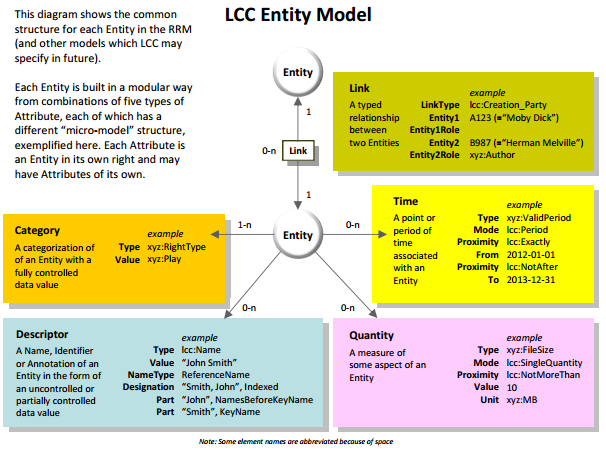

SPOOL-Schema
============

# Abstract

# Introduction

## The LCC Entity Model

The [LCC Entity Model](http://doi.org/10.1000/285) (short form: LCC EM) is a generic meta data model used by the LCC as a
'building block' to define more specific data models like the [LCC Rights Reference Model](http://doi.org/10.1000/284)
(short form: LCC RRM).
In a nutshell, the LCC Entity Model specification defines a model called `Entity` that is composed of five attribute types:

- **Category**: Categorizes the Entity (e.g. Language=iso3166-1a2:EN ("English")
- **Descriptor**: Names the Entity (e.g. Name="Andy Warhol")
- **Quantity**: Quantifies the Entity (e.g. Height=20cm)
- **Time**: Times the Entity (e.g. DateOfCreation=1999)
- **Link**: Links the Entity (e.g. "Andy Warhol" --- isCreator ---> "32 Campbell's Soup Cans")

As these five attributes make up the actual `Entity` model, they are linked unidirectional. `Entity`s are linked
bidirection, as can be seen in the attached figure:

The Entity model's attributes are deliberately chosen to be generic so that more complex data models like the LCC RRM can be
built on top. For in-depth information follow the link to the PDF provided in the beginning of this section.

## The LCC Rights Reference Model

The [LCC Rights Reference Model](http://doi.org/10.1000/284) is a formal definition for
representing intellectual property rights. The document is written as a specification for an abstract logical data model.
The LCC Rights Reference Model is built on top of LCC EM, and is composed of the following seven entities:

- **Party**: A Person or an organization (e.g. "Andy Warhol")
- **Creation**: Something created by a Party (e.g. "32 Campbell's Soup Cans")
- **Place**: A virtual or physical Place (e.g. "New York City, USA")
- **Right**: A set of permissions that entitle a Party to do something with a creation (e.g. "Andy Warhol controls all
  rights to 32 Campbell's Soup Cans")
- **RightsAssignment**: A decision as a result of which a Right comes into existence (e.g. "According to the 1976 US
  Copyright Act, Andy Warhol controls all rights to 32 Campbell's Soup Cans")
- **Assertion**: A claim made about the substance of a Right (e.g. "I, the Museum of Modern Art, New York, claim that
  Andy Warhol is the righteous creator of 32 Campbell's Soup Cans")
- **RightsConflict**: A statement of disagreement over a Right (e.g. "I, Malory, claim that Andy Warhol is NOT the
  righteous creator of 32 Campbell's Soup Cans")

*Note that for the sake of simplicity, the Entity `Context` was left out of the above described definition. In essence
though, it is just defined as a parent/categorizing class of Right, RightsAgreement, Assertion and RightsConflict and
has no significant value.*

As these seven entities are supposed to be building blocks of a global digital rights ontology, they are linked
unidirectional, as can be seen in the attached figure:

